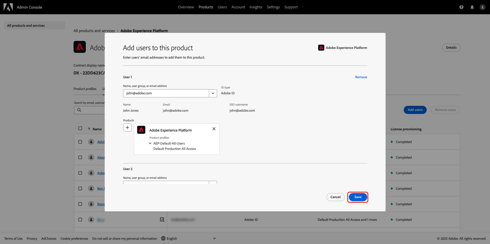
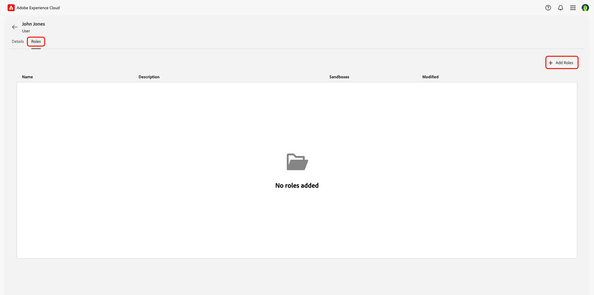
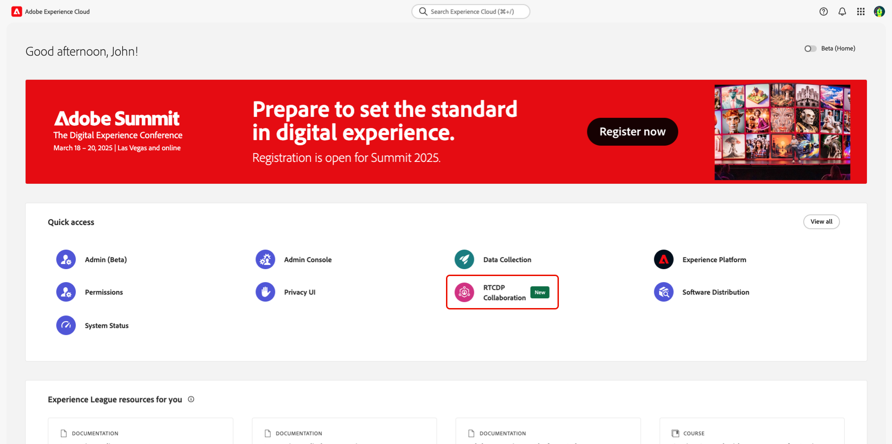

# Verwalten des Benutzerzugriffs über Berechtigungen {#manage-user-access}

{{limited-availability-release-note}}

Verwalten Sie die Berechtigungen und den Benutzerzugriff auf die einzelnen Komponenten in Adobe Real-Time CDP Collaboration über die Benutzeroberfläche von Experience Cloud [Berechtigungen](https://experienceleague.adobe.com/de/docs/experience-platform/access-control/abac/permissions-ui/browse){target="_blank"}. Mit Berechtigungen können System- und Produktadministratoren [Rollen](./manage-roles.md) definieren, um den Benutzerzugriff auf bestimmte Funktionen und Ressourcen zu verwalten.

## Zugriff auf Berechtigungen konfigurieren {#permissions-access}

Um auf Berechtigungen zugreifen zu können, müssen Sie sowohl über einen Produktadministrator als auch über Benutzerzugriff auf das Adobe Experience Platform-Produkt verfügen. Ein Systemadministrator ist erforderlich, um Produktadministratorberechtigungen zu konfigurieren, während Benutzerberechtigungen von einem System- oder Produktadministrator konfiguriert werden können. Weitere Informationen zu den Administratorrollen finden Sie im Handbuch [Hierarchie der Zugriffssteuerung](./overview.md#hierarchy).

>[!TIP]
>
>In diesem Handbuch bezieht sich **ein Administrator** sowohl auf **System- als auch auf Produktadministratoren**.

### Systemadministratoren: Produktadministratorzugriff konfigurieren {#admin-access}

Gewähren Sie einem Produktbenutzer oder einer Produktadministratorin Zugriff, um ihm bzw. ihr Verwaltungsfunktionen innerhalb des Experience Platform-Produkts zu gewähren, indem Sie die folgenden Schritte ausführen:

>[!IMPORTANT]
>
>Als System-Admin haben Sie vorkonfigurierten Zugriff auf bestimmte Experience Cloud-Produkte wie Adobe Admin Console. Um jedoch Berechtigungen verwenden zu können, müssen Sie sich selbst Produktadministrator und Benutzer Zugriff auf das Experience Platform-Produkt gewähren. Folgen Sie der unten stehenden schrittweisen Anleitung, um sich als System-Admin Zugriff zu verschaffen.

Melden Sie sich mit Ihren Anmeldeinformationen bei [Adobe Experience Cloud](https://experience.adobe.com/){target="_blank"} an. Die Startansicht wird mit einer Liste Ihrer verfügbaren Produkte im Abschnitt **[!UICONTROL Schnellzugriff]** angezeigt. Wählen Sie **[!UICONTROL Admin Console]** aus.

Startansicht von {zoomable="yes"}

Das Übersichts-Dashboard von [Adobe Admin Console](https://adminconsole.adobe.com/) wird angezeigt. Wählen Sie **[!UICONTROL Adobe Experience Platform]** aus der Liste **[!UICONTROL Produkte]** unter **[!UICONTROL Produkte und Services]** aus.

Das Übersichts-Dashboard von {zoomable="yes"}

Das Adobe Experience Platform-Dashboard wird angezeigt. Wählen Sie die Registerkarte **[!UICONTROL Administratoren]** und dann **[!UICONTROL Administrator hinzufügen]** aus.

{zoomable="yes"}

Das Dialogfeld **[!UICONTROL Produktadministratoren hinzufügen]** wird angezeigt. Geben Sie die Benutzer-E-Mail oder den Benutzernamen in das Textfeld **[!UICONTROL E-Mail oder Benutzername]** ein und wählen Sie dann aus der Dropdown-Liste das richtige Konto aus. Wählen Sie **[!UICONTROL Speichern]**, um das Hinzufügen des Benutzers als Produktadministrator abzuschließen.

{zoomable="yes"}

Der Benutzer verfügt jetzt über Produktadministratorrechte und kann administrative Funktionen ausführen, z. B. Benutzer oder andere Administratoren hinzufügen, um das Produkt in der Admin Console zu verwalten. Als Nächstes benötigen sie Benutzerzugriff auf das Experience Platform-Produkt, um auf Berechtigungen zugreifen und Funktionen ausführen zu können.

### Administratoren: Konfigurieren des Benutzerzugriffs auf Experience Platform {#user-access}

Nachdem Sie dem Benutzer bzw. der Benutzerin jetzt Produktadministratorzugriff gewährt haben, müssen Sie ihm bzw. ihr Benutzerzugriff auf das Experience Platform-Produkt gewähren. Im Rahmen der Zugriffskonfigurationen weisen Sie den Benutzenden bestimmte [Produktprofile](https://helpx.adobe.com/de/enterprise/using/manage-product-profiles.html) zu.

>[!TIP]
>
>Wenn Sie dem vorherigen Abschnitt folgen, sind Sie bereits Teil des Adobe Experience Platform-Produkts und können den ersten Schritt überspringen.

Navigieren Sie zur [Admin Console](https://adminconsole.adobe.com/){target="_blank"} und wählen Sie **[!UICONTROL Adobe Experience Platform]** aus der Liste **[!UICONTROL Produkte]** unter **[!UICONTROL Produkte und Services]** aus.

Startansicht von {zoomable="yes"}

Wählen Sie die Registerkarte **[!UICONTROL Benutzer]** und dann **[!UICONTROL Benutzer hinzufügen]** aus.

{zoomable="yes"}

Das Dialogfeld **[!UICONTROL Benutzer zu diesem Produkt hinzufügen]** wird angezeigt. Geben Sie den Namen oder die E-Mail-Adresse des Benutzers in das Textfeld **[!UICONTROL Name, Benutzergruppe oder E-Mail-Adresse]** ein und wählen Sie dann das richtige Konto aus der Dropdown-Liste aus. Wählen Sie als Nächstes die Option **[!UICONTROL Produkte]** hinzufügen aus.

{zoomable="yes"}

Das Dialogfeld **[!UICONTROL Produktprofile auswählen]** wird angezeigt. Wählen Sie **[!UICONTROL AEP-Default-All-Users]** und **[!UICONTROL Default Production All Access]** aus und wählen Sie dann **[!UICONTROL Anwenden]**.

{zoomable="yes"}

Bestätigen Sie, dass die Informationen korrekt sind, und wählen Sie **[!UICONTROL Speichern]**.

{zoomable="yes"}

Die Benutzenden sollten jetzt Produktadministrator- und Produktzugriff auf Experience Platform haben, um Zugriff auf Berechtigungen zu erhalten. Als Nächstes müssen Sie dem Benutzer zwei grundlegende Rollen zuweisen, um ihm Zugriff auf die Experience Platform-Benutzeroberfläche zu gewähren.

### Administratoren: Konfigurieren des Zugriffs auf die Experience Platform-Benutzeroberfläche {#product-access}

In Real-Time CDP Collaboration arbeiten Administratoren und Endbenutzer mit Daten aus Experience Platform, z. B. Zielgruppen und Auditprotokolle. Diese Daten werden in Instanzen von Experience Platform gespeichert, die als Sandboxes bezeichnet werden. Um sicherzustellen, dass Benutzer mit diesen Daten interagieren können, müssen Sie dem Benutzer [Standardrollen](https://experienceleague.adobe.com/de/docs/experience-platform/access-control/home#default-roles){target="_blank"} zuweisen.

Navigieren Sie zunächst zu [Adobe Experience Cloud](https://experience.adobe.com/). Sie sollten jetzt **[!UICONTROL Experience Platform]** und **[!UICONTROL Berechtigungen]** innerhalb von **[!UICONTROL Schnellzugriff]** sehen.

Startansicht von {zoomable="yes"}

>[!NOTE]
>
> Es kann mehrere Minuten dauern, bis die Produkte aufgerufen werden können. Sie erhalten dann eine E-Mail, in der Sie über den Zugriff informiert werden. Wenn Sie Experience Platform oder Berechtigungen in Adobe Experience Cloud nach Erhalt der E-Mail nicht sehen, melden Sie sich ab und wieder bei Ihrem Konto an.

In dieser Phase können Sie jetzt auf **[!UICONTROL Berechtigungen]** zugreifen. Wenn Sie versuchen, auf **[!UICONTROL Experience Platform]** zuzugreifen, erhalten Sie eine Warnung, dass keine Sandboxes aktiviert sind, wie unten dargestellt. Um dies zu beheben, müssen Sie Ihrem Benutzer die Standardrollen zuweisen. Wählen Sie zunächst **[!UICONTROL Berechtigungen]** aus.

Die Startansicht von {zoomable="yes"}

Das Dashboard **[!UICONTROL Berechtigungen]** wird angezeigt. Wählen Sie **Benutzer** im linken Bedienfeld aus und wählen Sie dann den Namen des Benutzers aus.

{zoomable="yes"}

Wählen Sie die Registerkarte **[!UICONTROL Rollen]** und dann **[!UICONTROL Rollen hinzufügen]** aus.

{zoomable="yes"}

Das Dialogfeld **[!UICONTROL Rollen hinzufügen]** wird angezeigt. Wählen Sie **[!UICONTROL Standardzugriff für alle Produktionen]** und **[!UICONTROL Sandbox-Administratoren]** aus und wählen Sie dann **[!UICONTROL Speichern]**.

{zoomable="yes"}

Sie haben jetzt Zugriff auf Experience Platform und Berechtigungen. Im letzten Schritt gewähren Sie Zugriff auf Real-Time CDP Collaboration.

### Admins: Konfigurieren von Zugriff auf Real-Time CDP Collaboration {#RTCDP-collaboration-access}

>[!CONTEXTUALHELP]
>id="rtcdp_collaboration_organization_permissions"
>title="Handbuch zum Verwalten von Benutzerzugriff"
>abstract=""

Um Benutzenden Zugriff auf Collaboration zu gewähren, verwenden Sie ein Zugriffssteuerungskonzept namens Rollen . Rollen definieren die Zugriffsebene eines Administrators oder Benutzers auf [Ressourcen](https://experienceleague.adobe.com/de/docs/experience-platform/access-control/home#permissions) in Ihrer Organisation.

Beim Konfigurieren des individuellen Zugriffs auf Collaboration weisen Sie Benutzerrollen zu, die Berechtigungen aus der Ressource Zusammenarbeit enthalten. Sie können das Handbuch [Rollen verwalten](./manage-roles.md) verwenden, um Informationen zu folgenden Themen zu erhalten:

- Die [zwei Standardrollen](./manage-roles.md#standard-roles) und die Zugriffsebenen, die sie Collaboration gewähren
- Erstellen von [benutzerdefinierten Rollen](./manage-roles.md#specific-access-roles) mithilfe der Collaboration-Ressource
- die Liste der in der Ressource „Zusammenarbeit“ enthaltenen Berechtigungen

>[!NOTE]
>
>Darüber hinaus muss ein Benutzer einer Rolle zugewiesen werden, die die Berechtigung **[!UICONTROL PROD]** in den **[!UICONTROL Sandboxes]** enthält. Beide Standardrollen enthalten diese Berechtigung. Wenn Sie einem Benutzer eine benutzerdefinierte Rolle anstelle einer Standardrolle zuweisen, müssen Sie sicherstellen, dass eine der ihnen zugewiesenen Rollen diese Berechtigung enthält.

Nachdem Sie eine Rolle ausgewählt oder erstellt haben, die die Zugriffsebene Ihrer Benutzeranforderungen umfasst, müssen Sie den Benutzer dieser Rolle zuweisen.

#### Zuweisen einer Rolle

Sie können einem einzelnen Benutzer mehrere Rollen zuweisen oder einer Rolle mehrere Benutzer zuweisen. Der erste Fall wurde bereits beim [Zuweisen der Standardrollen](#product-access) behandelt, um einem Benutzer Zugriff auf Experience Platform zu gewähren. In den nächsten Schritten weisen Sie der ausgewählten Rolle Benutzer direkt zu.

Wählen Sie in **[!UICONTROL Berechtigungen]** im linken Bereich **[!UICONTROL Rollen]** und wählen Sie dann Ihre Rolle aus der Liste aus.

{zoomable="yes"}

Die Detailseite der Rolle wird angezeigt. Wählen Sie die Registerkarte **[!UICONTROL Benutzer]** und dann **[!UICONTROL Benutzer hinzufügen]** aus.

{zoomable="yes"}

Das Dialogfeld **[!UICONTROL Benutzer hinzufügen]** wird angezeigt. Wählen Sie die Benutzer in der Liste aus und klicken Sie auf **[!UICONTROL Speichern]**.

{zoomable="yes"}

Der/die Benutzende sollte jetzt **[!UICONTROL RTCDP Collaboration]** als Produkt unter **[!UICONTROL Schnellzugriff]** in Experience Cloud aufgeführt sehen.

## Nächste Schritte

Nachdem Benutzer Zugriff auf Real-Time CDP Collaboration haben, können sie mit der Verwendung des Produkts beginnen. Weitere Informationen zum Produkt als Ganzes finden Sie im [Handbuch zur Übersicht](../home.md).
