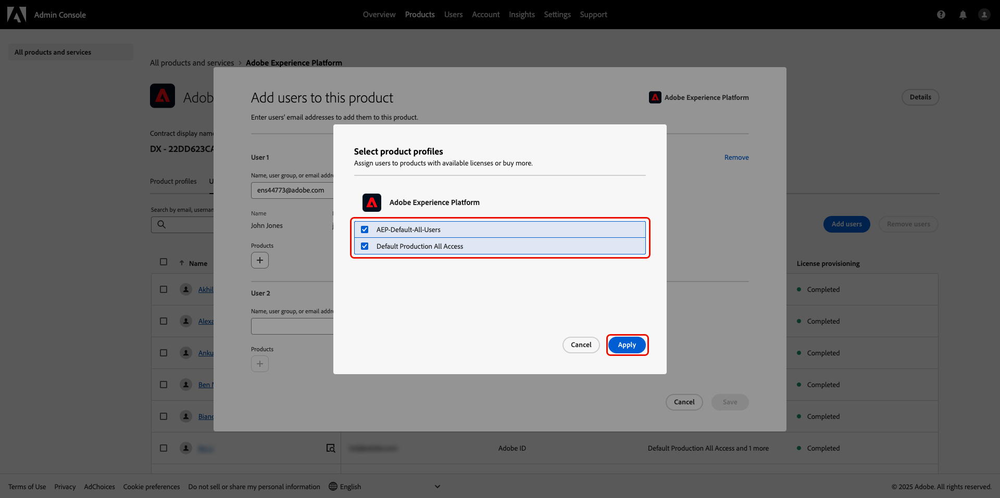
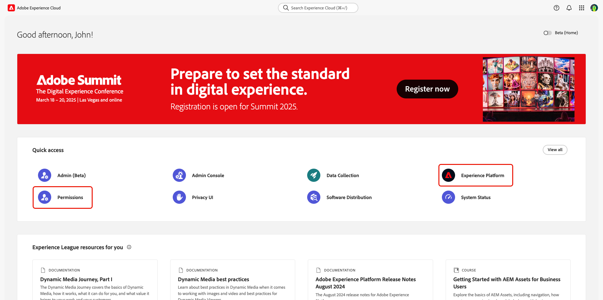

# Zugriff auf User über Berechtigungen verwalten {#manage-user-access}

{{limited-availability-release-note}}

Verwalten Sie Berechtigungen und User Zugriff auf Kontakt Komponenten in Real-Zeit CDP Collaboration über die Experience Cloud [Permissions-Schnittstelle](https://experienceleague.adobe.com/en/docs/experience-platform/access-control/abac/permissions-ui/browse) . Mit Berechtigungen können System- und Produktadministratoren Rollen](./manage-roles.md) definieren, um den User Zugriff auf bestimmte Funktionen und Ressourcen zu managen[.

## Zugriff auf Berechtigungen konfigurieren {#permissions-access}

Um auf Berechtigungen zugreifen zu können, müssen Sie sowohl über Produktadministrator- als auch über User Zugriff auf das Adobe Experience Platform Produkt verfügen. Ein Systemadministrator ist erforderlich, um Produktadministratorberechtigungen zu konfigurieren, während User Berechtigungen von einem System- oder Produktadministrator konfiguriert werden können. Weitere Informationen zu den administrativen Rollen finden Sie im [Handbuch zur Zugriffskontrolle Hierarchie](./overview.md#hierarchy) .

>[!TIP]
>
>In diesem Handbuch bezieht sich ein **** Administrator sowohl auf **System- als auch auf Produktadministratoren**.

### Systemadministratoren: Produktadministratorzugang konfigurieren {#admin-access}

Gewähren Sie einem User Produktadministrator Zugriff auf administrative Funktionen innerhalb des Experience Platform Produkts, indem Sie die folgenden Schritte ausführen:

>[!IMPORTANT]
>
>Als Systemadministrator haben Sie direkten Zugriff auf bestimmte Experience Cloud Produkte, z. B. Adobe Admin Console. Um jedoch Berechtigungen verwenden zu können, müssen Sie sich selbst Produktadministrator und Benutzer Zugriff auf das Experience Platform-Produkt gewähren. Folgen Sie der unten stehenden schrittweisen Anleitung, um sich als System-Admin Zugriff zu verschaffen.

Melden Sie sich mit Ihren Anmeldeinformationen bei ](https://experience.adobe.com/)0}Adobe Experience Cloud&quot; an. [ Die Startansicht wird mit einer Liste Ihrer verfügbaren Produkte im Bereich **[!UICONTROL Schnellzugriff]** angezeigt. Wählen Sie **[!UICONTROL Admin Console]** aus.

Startansicht von 

Das Übersichts-Dashboard ](https://adminconsole.adobe.com/) [Adobe Admin Console&#39; wird angezeigt. Wählen Sie **[!UICONTROL Adobe Experience Platform]** aus der Liste **[!UICONTROL Produkte]** unter **[!UICONTROL Produkte und Services]** aus.

Übersichts-Dashboard von 

Das Adobe Experience Platform-Dashboard wird angezeigt. Wählen Sie die Registerkarte **[!UICONTROL Administratoren]** und dann **[!UICONTROL Administrator hinzufügen]** aus.

Das **[!UICONTROL Produktadministratoren hinzufügen]** wird angezeigt. Geben Sie die Benutzer-E-Mail oder den Benutzernamen in das Textfeld **[!UICONTROL E-Mail oder]**) ein und wählen Sie dann das richtige Konto aus der Dropdown-Liste aus. Wählen Sie **[!UICONTROL Speichern]**, um das Hinzufügen des Benutzers als Produktadministrator abzuschließen.

Der Benutzer verfügt jetzt über Produktadministratorrechte und kann administrative Funktionen ausführen, z. B. Benutzer oder andere Administratoren hinzufügen, um das Produkt in der Admin Console zu verwalten. Als Nächstes benötigen sie Benutzerzugriff auf das Experience Platform-Produkt, um auf Berechtigungen zugreifen und Funktionen ausführen zu können.

### Administratoren: Konfigurieren des Benutzerzugriffs auf Experience Platform {#user-access}

Nachdem Sie dem Benutzer bzw. der Benutzerin jetzt Produktadministratorzugriff gewährt haben, müssen Sie ihm bzw. ihr Benutzerzugriff auf das Experience Platform-Produkt gewähren. Im Rahmen der Zugriffskonfigurationen weisen Sie den Benutzer spezifische [Produktprofile“ ](https://helpx.adobe.com/de/enterprise/using/manage-product-profiles.html).

>[!TIP]
>
>Wenn Sie dem vorherigen Abschnitt folgen, sind Sie bereits Teil des Adobe Experience Platform-Produkts und können den ersten Schritt überspringen.

Navigieren Sie zur [Admin Console](https://adminconsole.adobe.com/) und wählen Sie **[!UICONTROL Adobe Experience Platform]** aus der **[!UICONTROL Produkte]**-Liste unter **[!UICONTROL Produkte und Services]** aus.

Startansicht von 

Wählen Sie die Registerkarte **[!UICONTROL Benutzer]** und dann **[!UICONTROL Benutzer hinzufügen]** aus.

Das **[!UICONTROL Benutzer zu diesem Produkt hinzufügen]** wird angezeigt. Geben Sie den Namen oder die E-Mail-Adresse des Benutzers in das Textfeld **[!UICONTROL Name, Benutzergruppe oder E-Mail]** ein und wählen Sie dann das richtige Konto aus dem Dropdown-Menü aus. Wählen Sie als Nächstes die Option **[!UICONTROL Produkte]** Hinzufügen aus.

Das **[!UICONTROL Produktprofile auswählen]** wird angezeigt. Wählen Sie **[!UICONTROL AEP-Default-All-Users]** und **[!UICONTROL Default Production All Access]** aus und klicken Sie dann auf **[!UICONTROL Apply]**.

Bestätigen die Informationen korrekt sind, und wählen Sie **[!UICONTROL dann Speichern]**.

Die Benutzenden sollten jetzt Produktadministrator- und Produktzugriff auf Experience Platform haben, um Zugriff auf Berechtigungen zu erhalten. Als Nächstes müssen Sie dem Benutzer zwei grundlegende Rollen zuweisen, um ihm Zugriff auf die Experience Platform-Benutzeroberfläche zu gewähren.

### Administratoren: Konfigurieren des Zugriffs auf die Experience Platform-Benutzeroberfläche {#product-access}

In Real-Time CDP Collaboration arbeiten Administratoren und Endbenutzer mit Daten aus Experience Platform, z. B. Zielgruppen und Auditprotokolle. Diese Daten werden in Instanzen von Experience Platform gespeichert, die als Sandboxes bezeichnet werden. Um sicherzustellen, dass Benutzende mit diesen Daten interagieren können, müssen Sie [ Benutzenden &quot;](https://experienceleague.adobe.com/en/docs/experience-platform/access-control/home#default-roles) Rollen“ zuweisen.

Navigieren Sie zunächst zu [Adobe Experience Cloud](https://experience.adobe.com/). Sie sollten jetzt **[!UICONTROL Experience Platform]** und **[!UICONTROL Permissions]** innerhalb von **[!UICONTROL Schnellzugriff]** sehen.

Startansicht von 

>[!NOTE]
>
> Es kann mehrere Minuten dauern, bis die Produkte aufgerufen werden können. Sie erhalten dann eine E-Mail, in der Sie über den Zugriff informiert werden. Wenn Sie Experience Platform oder Berechtigungen in Adobe Experience Cloud nach Erhalt der E-Mail nicht sehen, melden Sie sich ab und wieder bei Ihrem Konto an.

In dieser Phase können Sie jetzt auf **[!UICONTROL Berechtigungen]** zugreifen. Wenn Sie versuchen, auf **[!UICONTROL Experience Platform]** zuzugreifen, erhalten Sie eine Warnung, dass keine Sandboxes aktiviert sind, wie unten dargestellt. Um dies zu beheben, müssen Sie Ihrem Benutzer die Standardrollen zuweisen. Wählen Sie zunächst &quot;**[!UICONTROL &quot;]**.

Startansicht von 

Das **[!UICONTROL Berechtigungen]**-Dashboard wird angezeigt. Wählen **Benutzer** im linken Bereich aus und wählen Sie dann den Namen des Benutzers aus.

Wählen Sie die **[!UICONTROL Tab &quot;Roles]**&quot; und dann &quot;hinzufügen Roles ]**&quot; aus**[!UICONTROL .

Das **[!UICONTROL Rollen hinzufügen]** wird angezeigt. Wählen Sie **[!UICONTROL Standardzugriff für alle Produktionen]** und **[!UICONTROL Sandbox-]**) und dann **[!UICONTROL Speichern]** aus.

Sie haben jetzt Zugriff auf Experience Platform und Berechtigungen. Im letzten Schritt gewähren Sie Zugriff auf Real-Time CDP Collaboration.

### Administratoren: Konfigurieren des Real-Zeit CDP Collaboration-Zugriffs {#RTCDP-collaboration-access}

Um Benutzern Zugriff auf Real-Zeit CDP Collaboration zu gewähren, verwenden Sie ein Zugriffskontrolle Konzept, das als Rollen bezeichnet wird. Rollen definieren die Zugriffsebene, die ein Administrator oder User auf [Ressourcen](https://experienceleague.adobe.com/en/docs/experience-platform/access-control/home#permissions) in Ihrem Unternehmen hat.

Wenn Sie Kontakt Zugriff auf Real-Zeit CDP Collaboration konfigurieren, weisen Sie Benutzerrollen zu, die Berechtigungen aus der Collaborations-Ressource enthalten. Im Leitfaden zu managen](./manage-roles.md) Rollen finden [Sie Informationen zu folgenden Themen:

- die [beiden Standardrollen](./manage-roles.md#standard-roles) und die Zugriffsebenen, die sie Real-Zeit CDP Collaboration gewähren
- Erstellung [benutzerdefinierter Rollen](./manage-roles.md#specific-access-roles) mithilfe der Kollaborationsressource
- die Liste der Berechtigungen, die in der Kollaborationsressource enthalten sind

>[!NOTE]
>
>Darüber hinaus muss ein User einer Rolle zugewiesen werden, die die Berechtigung &quot; **[!UICONTROL Prod]** &quot; in den **[!UICONTROL Sandboxes-Ressourcen]** enthält. Beide Standardrollen enthalten diese Berechtigung. Wenn Sie einer User eine benutzerdefinierte Rolle anstelle einer Standard Rolle zuweisen möchten, müssen Sie sicherstellen, dass eine der Rollen, die ihnen zugewiesen sind, diese Berechtigung enthält.

Nachdem Sie eine Rolle ausgewählt oder erstellt haben, die die Zugriffsebene umfasst, die Ihre User benötigt, müssen Sie die User dieser Rolle zuweisen.

#### Zuweisen einer Rolle

Sie können einem einzelnen Benutzer mehrere Rollen zuweisen oder einer Rolle mehrere Benutzer zuweisen. Der erste Fall wurde bereits bei der Zuweisung [ Standardrollen behandelt](#product-access) um einem Benutzer Zugriff auf Experience Platform zu gewähren. In den nächsten Schritten weisen Sie der ausgewählten Rolle Benutzer direkt zu.

Wählen **[!UICONTROL unter]** im linken Bereich die Option **[!UICONTROL Rollen]** und wählen Sie dann Ihre Rolle aus der Liste aus.

Die Detailseite der Rolle wird angezeigt. Wählen Sie die Registerkarte **[!UICONTROL Benutzer]** und dann **[!UICONTROL Benutzer hinzufügen]** aus.

Das **[!UICONTROL „Benutzer hinzufügen]** wird angezeigt. Wählen Sie die Benutzer in der Liste aus und klicken Sie auf **[!UICONTROL Speichern]**.

Der/die Benutzende sollte jetzt **[!UICONTROL RTCDP Collaboration]** als Produkt unter „Schnellzugriff **[!UICONTROL in Experience Cloud]** sehen.

## Nächste Schritte

Nachdem Benutzer Zugriff auf Real-Time CDP Collaboration haben, können sie mit der Verwendung des Produkts beginnen. Weitere Informationen zum Produkt als Ganzes finden Sie im [Übersichtshandbuch](../home.md).
