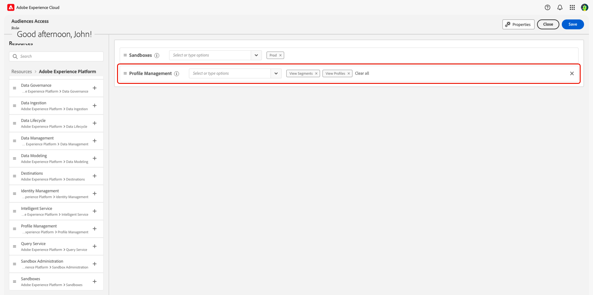

# Zugriffskontrolle – Übersicht

{{limited-availability-release-note}}

>[!IMPORTANT]
>
> Wenn Sie ein Endbenutzer sind und auf Adobe Real-Time CDP Collaboration zugreifen möchten, wenden Sie sich an Ihren System- oder Produktadministrator, um zu prüfen, ob bereits Zugriff vorhanden ist. Wenn Sie nicht wissen, wer Ihr Systemadministrator ist, wenden Sie sich an den Adobe-Support.

Die Zugriffssteuerung für Adobe Real-Time CDP Collaboration wird über die Admin Console und Berechtigungen in [Adobe Experience Cloud](https://experience.adobe.com/){target="_blank"} bereitgestellt. In diesem Handbuch erfahren Sie, wie Sie sich selbst oder anderen Mitgliedern Ihres Teams je nach Anwendungsfall Zugriff gewähren.

## Zugriffssteuerungshierarchie {#hierarchy}

Um die Zugriffssteuerung für Collaboration zu konfigurieren **müssen Sie über**- oder Produktadministratorrechte verfügen. Ein Systemadministrator hat keine Einschränkungen und wird während des Onboarding-Prozesses bereitgestellt. In der Zwischenzeit kann ein Produktadministrator administrative Funktionen für alle Produkte bereitstellen, denen er zugewiesen wurde. Einem Produktadministrator muss von einem Systemadministrator Produkt- und Administratorzugriff gewährt werden.

In diesen Handbüchern wird die Konfiguration des Zugriffs für Systemadministratoren, Produktadministratoren und Endbenutzer beschrieben. Anhand der folgenden Tabelle können Sie den Hauptunterschied zwischen den Rollen verstehen.

| Rolle | Beschreibung |
| --- | --- |
| Systemadministrator | Der Hauptbenutzer für die Organisation. Sie können alle Verwaltungsaufgaben in der Admin Console ausführen und haben die Berechtigung, Verwaltungsfunktionen an andere Benutzer zu delegieren. |
| Produkt-Administrator | Administriert die ihnen zugewiesenen Produkte und alle zugehörigen Verwaltungsfunktionen, z. B. das Hinzufügen von Benutzern zu Organisationen, das Hinzufügen oder Entfernen von Benutzern aus Produktprofilen und das Hinzufügen oder Entfernen anderer Produktadministratoren aus einem Produkt. |
| Endbenutzer | Die Benutzer in Ihrer Organisation, die die Produkte verwenden. |

{style="table-layout:auto"}

Weitere Informationen zu Administratorrollen finden Sie im [Adobe Help Center](https://helpx.adobe.com/de/enterprise/using/admin-roles.html).

>[!TIP]
>
>Die Verwendung von **Administratoren** in diesen Handbüchern bezieht sich auf **System- und**.

## Zusätzliche Produkte {#products}

Bevor Sie Zugriff auf Collaboration gewähren, benötigen Sie Zugriff auf mehrere Produkte, je nach [&#x200B; Anwendungsfall](#use-cases). Die Handbücher zur Zugriffssteuerung können während des Fortschritts mehrere Benutzeroberflächen durchlaufen, die jeweils einem bestimmten Zweck im Zugriffskonfigurationsprozess dienen. Die nachstehende Tabelle gibt einen Überblick darüber, wofür die einzelnen Produkte verwendet werden.

| Produkt | Verwendet |
| --- | --- |
| [Admin Console](https://adminconsole.adobe.com/) | Administratoren verwenden diese Option, um Benutzer mit Produkt- und/oder Administratorzugriff zuzuweisen. |
| [Berechtigungen](https://experience.adobe.com/) | Administratoren verwenden diese Option, um Rollen von Administratoren oder Endbenutzern zuzuweisen. |
| [Experience Platform](https://platform.adobe.com/) | Admins und Endbenutzenden muss Zugriff auf Experience Platform-Produkte gewährt werden, damit sie Rollen zuweisen können. |

## Wo beginnen soll {#use-cases}

Nachdem Sie nun über ein tieferes Verständnis der Benutzer- und Administratorrollen sowie der verschiedenen Experience Cloud-Produkte verfügen, können Sie beginnen, Zugriff auf Collaboration zu gewähren. Es gibt zwei Hauptfaktoren, die die erforderlichen Schritte beeinflussen:

- Wenn Sie Admin- oder Endbenutzerzugriff zuweisen
- Wenn die Benutzer bereits Zugriff auf das Experience Platform-Produkt haben

Anhand der folgenden Tabelle können Sie ermitteln, wer die Berechtigungen konfigurieren muss und wo Sie basierend auf Ihrem Anwendungsfall der Zugriffskontrolle beginnen möchten. **Vergewissern Sie sich, dass Sie das Tutorial bis zum Ende des Handbuchs von Ihrem Ausgangspunkt aus durchlaufen.**

>[!TIP]
>
> Ein Superuser bezeichnet die höchste Zugriffsebene, die vom Systemadministrator erlangt werden kann. Ein Superuser kann alle administrativen Aufgaben und Benutzerfunktionen ausführen. Ein Systemadministrator verfügt nicht über vorkonfigurierte Produktfunktionen und muss sich selbst den entsprechenden Zugriff gewähren, wie in der folgenden Tabelle dargestellt.

| Anwendungsfall | Erforderliche Rolle | Wo beginnen soll |
| --- | --- | --- |
| Superuser ohne vorhandenen Experience Platform-Produktzugriff. | Einen Systemadministrator. | [Konfigurieren des Produktadministratorzugriffs](./manage-user-access.md#admin-access) |
| Superuser für einen bestehenden Experience Platform-Systemadministrator **mit** Benutzeroberflächenzugriff für Experience Platform. | Einen Systemadministrator. | [Konfigurieren des Collaboration-Zugriffs](./manage-user-access.md#RTCDP-collab-access) |
| Superuser für einen bestehenden Experience Platform-Systemadministrator **ohne** auf die Experience Platform-Benutzeroberfläche. | Einen Systemadministrator. | [Konfigurieren des Produktadministratorzugriffs](./manage-user-access.md#admin-access) |
| Produktadministratorrechte und Collaboration-Zugriff für einen neuen Produktadministrator. | Einen Systemadministrator. | [Konfigurieren des Produktadministratorzugriffs](./manage-user-access.md#admin-access) |
| Zugriff auf Collaboration für einen bestehenden Experience Platform-Produktadministrator **mit** Zugriff auf die Experience Platform-Benutzeroberfläche. | Einen System- oder Produktadministrator. | [Konfigurieren des Collaboration-Zugriffs](./manage-user-access.md#RTCDP-collab-access) |
| Zugriff auf Collaboration für einen bestehenden Experience Platform-Produktadministrator **ohne** auf die Experience Platform-Benutzeroberfläche. | Einen System- oder Produktadministrator. | [Konfigurieren des Benutzerzugriffs](./manage-user-access.md#user-access) |
| Zugriff auf Collaboration für einen neuen Endbenutzer. | Einen System- oder Produktadministrator. | [Konfigurieren des Benutzerzugriffs](./manage-user-access.md#user-access) |
| Collaboration-Zugriff für einen bestehenden Benutzer mit Experience Platform-Zugriff. | Einen System- oder Produktadministrator. | [Konfigurieren des Collaboration-Zugriffs](./manage-user-access.md#RTCDP-collab-access) |

{style="table-layout:auto"}

## Zusätzliche Berechtigungen

Nachdem Sie Zugriff auf Collaboration erhalten haben, benötigen Sie möglicherweise einige zusätzliche Experience Platform-Berechtigungen für bestimmte Funktionen.

### Zielgruppen-Sourcing {#audience-sourcing}

Bevor Sie Zielgruppen an Mitwirkende senden können, müssen Sie Zielgruppen in Collaboration beschaffen. Derzeit ist die einzige Self-Service-Datenverbindung, die für den Import von Zielgruppen unterstützt wird, Experience Platform. Zunächst muss den Benutzenden, die das Onboarding von Audiences verwalten, eine Rolle zugewiesen werden, die die folgenden Ressourcenberechtigungen **[!UICONTROL Profilverwaltung]** enthält:

| Berechtigung | Beschreibung |
| ---- | ---- |
| [!UICONTROL Anzeigen von Segmenten] | Ermöglicht dem Benutzer, die Liste der verfügbaren Zielgruppen in einer Sandbox anzuzeigen. |
| [!UICONTROL Anzeigen von Profilen] | Ermöglicht es dem Benutzer, die für die Zuordnung zu Kooperationsfeldern verfügbaren Felder anzuzeigen. |

Below, you can see an example role with the above permissions added. For more information on creating or assigning roles, refer to the [manage roles](./manage-roles.md) guide.

>[!NOTE]
>
>Users are able to work with audiences within Collaboration after they&#39;ve been sourced without any of the above permissions.

## Nächste Schritte

Once you&#39;ve determined where to begin, follow your use case&#39;s link to get started configuring access. If you&#39;re wanting to learn about configuring access to Collaboration as an administrator beyond those use cases, refer to the [manage user access](manage-user-access.md) guide. To learn about roles and their part in configuring access to various components of Collaboration, refer to the [manage roles](manage-roles.md) guide.
