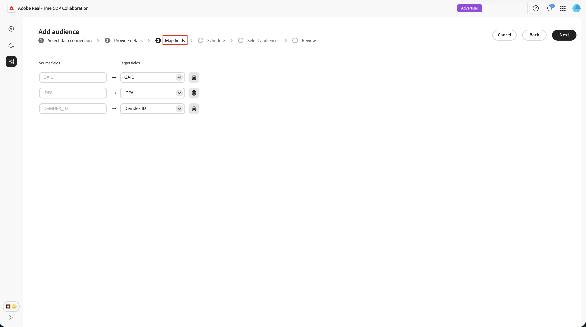

# Konfigurieren von Adobe Audience Manager für die Zielgruppen-Beschaffung

Erfahren Sie, wie Sie Ihre Adobe Audience Manager (AAM)-Instanz mit Adobe Real-Time CDP Collaboration verbinden, damit Sie geeignete First-Party-Segmente in Platform beziehen können. Nachdem Sie die Verbindung erstellt haben, ruft Collaboration die Zielgruppenzugehörigkeit von Adobe Audience Manager nach einem wiederkehrenden Zeitplan ab und stellt diese Zielgruppen für die Überschneidungsanalyse und -aktivierung in Ihren Collaboration-Projekten zur Verfügung.

>[!NOTE]
>
> Zielgruppen, die aus Audience Manager bezogen werden, folgen denselben Governance- und Datenverarbeitungsregeln wie Zielgruppen, die aus Adobe Experience Platform bezogen werden. Nur Segmente, die aus First-Party-Datenquellen erstellt wurden, sind zulässig. Segmente, die Drittanbieterdaten oder Audience Marketplace-Quellen enthalten, werden nicht unterstützt.

## Voraussetzungen {#prerequisites}

Füllen Sie alle Elemente in diesem Abschnitt aus, bevor Sie den Konfigurations-Workflow starten. Unvollständige Voraussetzungen sind der häufigste Grund dafür, dass die Einrichtung fehlschlägt oder Zielgruppen nach der Beschaffung nicht angezeigt werden. Bevor Sie dieses Handbuch befolgen, müssen Sie das [Onboarding und Einrichten von Konten“ &#x200B;](./onboard-account.md) haben.

### Zugriff auf Adobe Audience Manager und Berechtigungen {#aam-access-and-permissions}

Bevor Sie fortfahren, vergewissern Sie sich, dass Sie über Folgendes verfügen:

* Ein aktiver Adobe Audience Manager-Vertrag und eine bereitgestellte Audience Manager-Instanz.
* Zugriff auf die Audience Manager-Benutzeroberfläche mit der Berechtigung zum Anzeigen der Segmente, die Sie beschaffen möchten.
* Ihre Audience Manager-Instanz und Ihr Collaboration-Konto, die unter derselben Adobe IMS-Organisation bereitgestellt wurden. Die unternehmensübergreifende Beschaffung wird nicht unterstützt.

### Segmenteignungsanforderungen {#aam-segments-requirements}

Wenn Sie die Verbindung konfigurieren, filtert Collaboration die Segmentliste automatisch anhand der folgenden Regeln.

**Nur First-Party-Daten**

Für die Beschaffung sind nur Segmente verfügbar, die auf Ihren eigenen First-Party-Daten basieren. Segmente, die Eigenschaften von Drittanbietern von Daten oder AAM Audience Marketplace enthalten, sind ausgeschlossen.

**Filter „Aktualität**

Nur Segmente, die (innerhalb der **13 Monate) erstellt oder aktualisiert**, können bezogen werden. Ältere Segmente werden bei der Verbindungseinrichtung und bei jeder nachfolgenden Aktualisierung ausgeschlossen.

### Einverständnisanforderungen {#consent-requirements}

Alle AAM-Segmente, die aus Collaboration bezogen werden, müssen nach dem Einverständnis gefiltert werden. Wenn zum Exportzeitpunkt eine Opt-out-Markierung für ein Profil vorhanden ist, wird dieses Profil ausgeschlossen, bevor es Collaboration erreicht.

>[!IMPORTANT]
>
>Sie sind dafür verantwortlich sicherzustellen, dass das Einverständnis in Ihrer Audience Manager-Instanz korrekt konfiguriert und durchgesetzt wird, bevor Sie eine Verbindung zu Collaboration herstellen. Adobe wendet die Einverständnisregeln nicht erneut an, nachdem Daten Audience Manager verlassen haben.

## Konfigurieren der Audience Manager-Verbindung {#configure-aam-connection}

Der Konfigurations-Workflow ist ein mehrstufiger Assistent im **[!UICONTROL Setup]**-Arbeitsbereich. Führen Sie die einzelnen Schritte nacheinander aus. Sie können zu jedem Schritt zurückkehren, indem Sie auf dem letzten Überprüfungsbildschirm das Stiftsymbol verwenden, bevor Sie die Verbindung erstellen.

### Hinzufügen einer Datenverbindung {#add-data-connection}

Wählen Sie auf der Registerkarte **[!UICONTROL Meine]**&quot; im **[!UICONTROL Setup]**-Arbeitsbereich das Symbol zum Hinzufügen aus () und wählen Sie dann **[!UICONTROL Audience]** aus.

Wenn dies Ihre erste Zielgruppe ist, können Sie auch die Option **[!UICONTROL Zielgruppe hinzufügen]** auswählen.

Der Workflow „Zielgruppe hinzufügen“ wird angezeigt. Wählen Sie **[!UICONTROL Neue Datenverbindung hinzufügen]** und dann **[!UICONTROL Weiter]** aus.

{zoomable="yes"}

### Adobe Audience Manager als Datenverbindung auswählen {#select-aam}

Im Bildschirm zur Auswahl der Datenquelle werden alle verfügbaren Verbindungstypen aufgelistet. Wählen Sie **[!UICONTROL Adobe Audience Manager]** als Datenverbindung aus und klicken Sie dann auf **[!UICONTROL Weiter]**.

### Einverständnis und Datennutzung bestätigen {#confirm-consent-data-use}

Bevor Sie fortfahren, bestätigen Sie, dass Sie alle gesetzlich vorgeschriebenen Opt-outs auf die Zielgruppendaten angewendet haben, die Sie an Collaboration senden. Wenn Sie sich nicht sicher sind, ob Ihre Daten diese Anforderung erfüllen, lesen Sie das Handbuch [Governance-Richtlinie und Durchsetzungsaktionen](./onboard-audiences.md#governance-policy-and-enforcement-actions) , bevor Sie fortfahren. Aktivieren Sie das Bestätigungs-Kontrollkästchen und klicken Sie dann auf **[!UICONTROL OK]**, um fortzufahren.

### Angeben von Verbindungsdetails {#provide-connection-details}

Geben Sie als Nächstes einen Namen und eine optionale Beschreibung für diese Datenverbindung ein. Nachdem die Verbindung erstellt wurde, wird der von Ihnen angegebene Name auf der Registerkarte **[!UICONTROL Meine Datenverbindungen]** angezeigt und hilft Ihnen, diese Quelle in Zukunft zu identifizieren.

* **[!UICONTROL Name der Datenverbindung]** (erforderlich)
* **[!UICONTROL Beschreibung der Datenverbindung]** (optional)

Wenn Sie fertig sind, wählen Sie **[!UICONTROL Weiter]** aus.

### Überprüfen der Identitätszuordnung {#review-identity-mapping}

Der **[!UICONTROL Zuordnung]** ist schreibgeschützt. Collaboration ordnet unterstützte Identitätsausgaben aus Ihren AAM-Segmenten automatisch Collaboration-Identitätsfeldern zu. Weitere Informationen finden Sie in der folgenden Tabelle.

| AAM-Identitätsausgabe | Collaboration-Identitätsfeld | Anmerkungen |
| ------------------- | ---------------------------- | ----- |
| `Demdex ID` | `DEMDEX_ID` | Unterstützte Identitätsausgabe für diese Integration. Collaboration übersetzt die Demdex-ID beim Sourcing nicht in ECID. |
| `GAID` | `GAID` | Unterstützte Identitätsausgabe für diese Integration. |
| `IDFA` | `IDFA` | Unterstützte Identitätsausgabe für diese Integration. |

{style="table-layout:auto"}

Sie können die Zuordnung überprüfen, sie jedoch zu diesem Zeitpunkt nicht ändern. Klicken Sie auf **[!UICONTROL Weiter]**, um fortzufahren.

### Datenaktualisierung planen {#schedule-data-refresh}

Legen **[!UICONTROL in der Ansicht]** Zeitplan“ die Aktualisierungshäufigkeit fest, mit der Collaboration aktualisierte Daten zur Zielgruppenzugehörigkeit aus Ihren AAM-Segmenten abruft, und definieren Sie den aktiven Datumsbereich für die Beschaffung.

Verwenden Sie das **[!UICONTROL Häufigkeit]**-Dropdown, um ein Aktualisierungsintervall zwischen einem und sechs Tagen auszuwählen. Verwenden Sie dann den Kalender, um Start- und Enddaten für die Zielgruppen-Beschaffung festzulegen. Wenn das Enddatum erreicht ist, wird der Sourcing-Vorgang gestoppt und zuvor bezogene Zielgruppen laufen ab.

>[!IMPORTANT]
>
>Audience Manager-Segmente werden in der Regel alle 24 bis 48 Stunden aktualisiert, basierend auf Regeln zur Eigenschaftsaktualität und Häufigkeit. Wenn Sie ein kürzeres Collaboration-Aktualisierungsintervall festlegen, werden möglicherweise Collaboration-Guthaben verbraucht, ohne dass Ergebnisse aktualisiert werden. Informationen zur Überwachung der Kreditnutzung finden Sie unter [Verfolgen der Kreditkonsumaktivität](./my-activity.md).

Klicken Sie abschließend auf **[!UICONTROL Weiter]**.

### Zielgruppen auswählen {#select-audiences}

Sie können eine Liste der geeigneten Segmente anzeigen, die First-Party-Datenquelleneigenschaften verwenden und in den letzten 13 Monaten erstellt oder aktualisiert wurden.

Wählen Sie die Segmente aus, die Sie in Collaboration beziehen möchten. Sie können nach Namen suchen oder scrollen, um bestimmte Segmente zu finden. Klicken Sie **[!UICONTROL Weiter]** wenn Sie fertig sind.

>[!TIP]
>
>Wenn ein erwartetes Segment nicht aufgeführt ist, stellen Sie sicher, dass es in den letzten 13 Monaten aktualisiert wurde und nur First-Party-Datenquelleneigenschaften verwendet. Segmente mit Drittanbieter- oder Audience Marketplace-Eigenschaften sind ausgeschlossen.

### Überprüfen und Abschließen der Verbindung {#review-and-complete}

Lesen Sie die vollständige Konfigurationszusammenfassung, bevor Sie die Verbindung erstellen. Der Bildschirm Zusammenfassung zeigt die folgenden Abschnitte:

* **[!UICONTROL Details]**: Name und optionale Beschreibung dieser Datenverbindung.
* **[!UICONTROL Zielgruppenauswahl]**: Die ausgewählten AAM-Segmente.
* **[!UICONTROL Zuordnung]**: Die Identitätsfeldzuordnung von AAM-Quellfeldern zu Collaboration-Identitätsfeldern.
* **[!UICONTROL Zeitplan]**: Aktualisierungshäufigkeit und aktiver Datumsbereich.

Klicken Sie auf das Stiftsymbol () neben einem beliebigen Abschnitt, wenn Sie Änderungen vornehmen müssen. Klicken Sie **[!UICONTROL Fertig stellen]**, um alle Abschnitte zu bestätigen.

Es wird ein Bestätigungsdialogfeld angezeigt, das angibt, dass die Datenverbindung erstellt wurde und dass die Zielgruppen-Beschaffung in Bearbeitung ist.

## Überprüfen der Quellzielgruppen {#review-sourced-audiences}

Nach Abschluss des Assistenten beginnt Collaboration mit dem asynchronen Abrufen der Daten zur Zielgruppenzugehörigkeit aus den ausgewählten AAM-Segmenten. Navigieren Sie zu **[!UICONTROL Setup] > [!UICONTROL Meine Zielgruppen]**, um den Fortschritt zu überwachen.

### Fortschritt der Zielgruppenbeschaffung überwachen {#monitor-progress}

Während Collaboration Ihre AAM-Segmentdaten abruft, zeigt ein Banner oben im Arbeitsbereich **[!UICONTROL Meine Zielgruppen]** an, dass die Beschaffung in Bearbeitung ist. Einzelne Zielgruppen werden in der Liste angezeigt, da die Beschaffung für jedes Segment abgeschlossen ist.

### Anzeigen von Details zur Quellzielgruppe {#view-sourced-audience-details}

Nach Abschluss der Beschaffung werden Ihre AAM-Segmente auf der Registerkarte **[!UICONTROL Meine Zielgruppen]** angezeigt. Die Spalte **[!UICONTROL Source]** identifiziert sie als **[!UICONTROL Adobe Audience Manager]**.

Wählen Sie eine Zeile oder die Option **[!UICONTROL Zielgruppe anzeigen]** aus, um die Detailansicht einer bestimmten Zielgruppe zu öffnen.

Die Detailansicht zeigt Folgendes an:

* **[!UICONTROL Identitäten]**: Die Gesamtzahl der Identitäten und alle verfügbaren Aufschlüsselungsinformationen.
* **[!UICONTROL Kategorien]**: Alle Tags, die Sie zum Organisieren oder Filtern der Zielgruppe angewendet haben.
* **[!UICONTROL Verbindungszugriff]**: Ob die Zielgruppe privat, öffentlich oder für bestimmte Mitarbeiter freigegeben ist.
* **[!UICONTROL Metadatensichtbarkeit]**: Welche Zielgruppeninformationen für Mitwirkende sichtbar sind.

Verwenden Sie diese Ansicht, um die Einstellungen für die Zielgruppenkonfiguration und Sichtbarkeit zu bestätigen, bevor Sie die Zielgruppe in Kooperationsprojekten verwenden. Informationen zum Aktualisieren von Kategorien, Verbindungszugriff oder Metadatensichtbarkeit finden Sie unter [Anzeigen und Verwalten einzelner Zielgruppen](./onboard-audiences.md#view-individual-audiences).

## Bekannte Einschränkungen

Beachten Sie die folgenden Einschränkungen beim Konfigurieren und Verwenden des Audience Manager-Quell-Connectors:

* **Nur Erstanbieterdaten:** Segmente, die Eigenschaften von Drittanbietern oder Adobe Audience Marketplace enthalten, können nicht bezogen werden. Nur Segmente, die vollständig aus Ihren eigenen First-Party-Datenquellen erstellt wurden, sind zulässig.
* **Fenster mit 13-monatiger Segmentaktualität:** Nur Segmente, die in den letzten 13 Monaten erstellt oder aktualisiert wurden, können während der Einrichtung und bei jeder geplanten Aktualisierung ausgewählt werden.
* **Keine On-Demand-Aktualisierung:** Zielgruppendaten werden nach dem von Ihnen konfigurierten Zeitplan aktualisiert. Eine manuelle, sofortige Aktualisierung wird nicht unterstützt.
* **Eine aktive AAM-Verbindung pro Organisation:** Pro IMS-Organisation wird nur eine aktive AAM-Datenverbindung unterstützt.
* **Einschränkungen für Übereinstimmungsschlüssel:** Sobald ein Übereinstimmungsschlüssel für eine Datenverbindung aktiviert ist, kann er nicht mehr entfernt werden. Um aktive Übereinstimmungsschlüssel zu ändern, löschen Sie die Verbindung und erstellen Sie eine neue.

## Fehlerbehebung {#troubleshooting}

Lesen Sie diesen Abschnitt, um häufige Probleme nach dem Herstellen der ersten Verbindung zu beheben.

**Zielgruppen werden nicht angezeigt oder die Beschaffung dauert länger als erwartet**

* Die Beschaffungszeit skaliert anhand der Anzahl der ausgewählten Segmente und der Größe der einzelnen Segmentpopulation.
* Wenn Zielgruppen nicht innerhalb von 24 Stunden angezeigt werden, stellen Sie sicher, dass die ausgewählten Segmente weiterhin in Audience Manager aktiv sind und eine Populationsanzahl ungleich null aufweisen.
* Überprüfen Sie die Registerkarte **[!UICONTROL Meine Datenverbindungen]** auf Fehleranzeigen für die Verbindung.
* Wenn das Problem weiterhin besteht, wenden Sie sich mit Ihrem Datenverbindungsnamen und den Namen der Segmente, die nicht angezeigt werden, an den Kunden-Support von Adobe.

**Ein Segment, das ich auswählen sollte, war während des Setups nicht verfügbar**

Bestätigen Sie, dass das Segment:

* wurde in den letzten 13 Monaten erstellt oder zuletzt aktualisiert. Ältere Segmente werden nicht angezeigt.
* Verwendet nur First-Party-Eigenschaften. Segmente mit Drittanbieter- oder Audience Marketplace-Eigenschaften sind ausgeschlossen.
* Gehört zur für die Verbindung konfigurierten IMS-Organisation.

**Die Datenverbindung zeigt nach anfänglichem Erfolg den Status Fehlgeschlagen an**

* Bestätigen Sie, dass sich die IMS-Organisationsbeziehung zwischen Ihrer AAM-Instanz und dem Collaboration-Konto nicht geändert hat.
* Bestätigen Sie, dass die ausgewählten Segmente weiterhin in AAM vorhanden sind und nicht gelöscht wurden.
* Wenn das Problem weiterhin besteht[&#x200B; (löschen Sie die Verbindung](./manage-data-connection.md#delete-data-connection) und erstellen Sie eine neue oder wenden Sie sich an den Kunden-Support von Adobe.

## Nächste Schritte {#next-steps}

Sie haben jetzt Audience Manager als Datenquelle in Collaboration konfiguriert. Nach Abschluss der Beschaffung sind Ihre Zielgruppen im Arbeitsbereich **[!UICONTROL Meine Zielgruppen]** verfügbar und können in Kooperationsprojekten verwendet werden. Wenn Ihre Zielgruppen nach Abschluss des ursprünglichen Beschaffungsprozesses nicht angezeigt werden, lesen Sie den Abschnitt [Fehlerbehebung](#troubleshooting) auf dieser Seite.

Hier sind die folgenden Aktionen möglich:

* [Erstellen und Verwalten von Kollaborationsprojekten](../collaborate/manage-projects.md)
* [Aktivieren von Audiences in einem Projekt](../collaborate/activate.md)
* [Überschneidungen überprüfen und Leistung messen](../collaborate/measure.md)
* [Verwalten von Zielgruppeneinstellungen und Sichtbarkeit](./onboard-audiences.md)
* [Verwalten von Datenverbindungen](./manage-data-connection.md)

Weitere Methoden zur Zielgruppen-Beschaffung finden Sie unter:

* [Konfigurieren  [!DNL Amazon S3]  Zielgruppen-Sourcing](./configure-aws-s3-audience-sourcing.md)
* [Konfigurieren  [!DNL Google Cloud Storage]  Zielgruppen-Sourcing](./configure-gcs-audience-sourcing.md)
* [Konfigurieren  [!DNL Snowflake]  Zielgruppen-Sourcing](./configure-snowflake-audience-sourcing.md)
* [Source-Zielgruppen aus Experience Platform](./onboard-audiences.md)
* [Hochladen einer CSV-Datei für die Zielgruppen-Beschaffung](./upload-csv-audience-sourcing.md)
