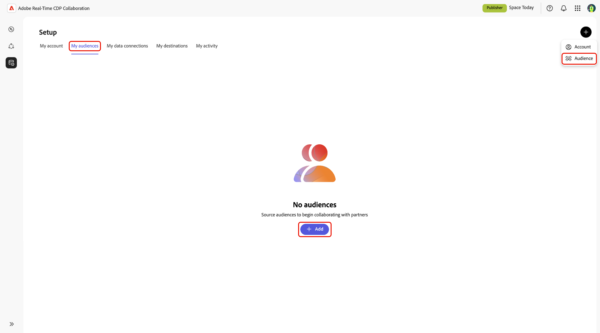
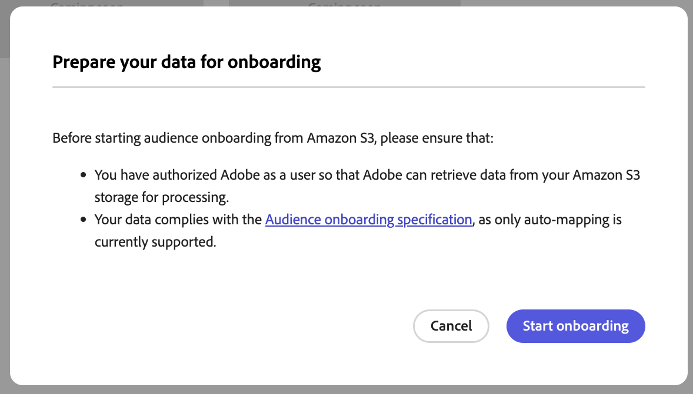
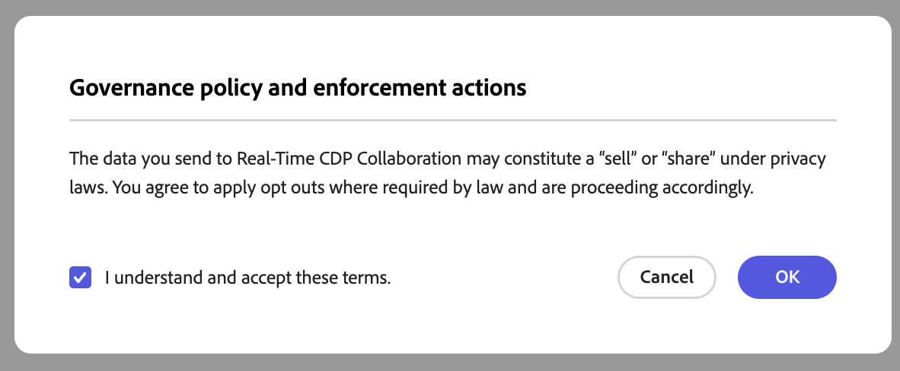
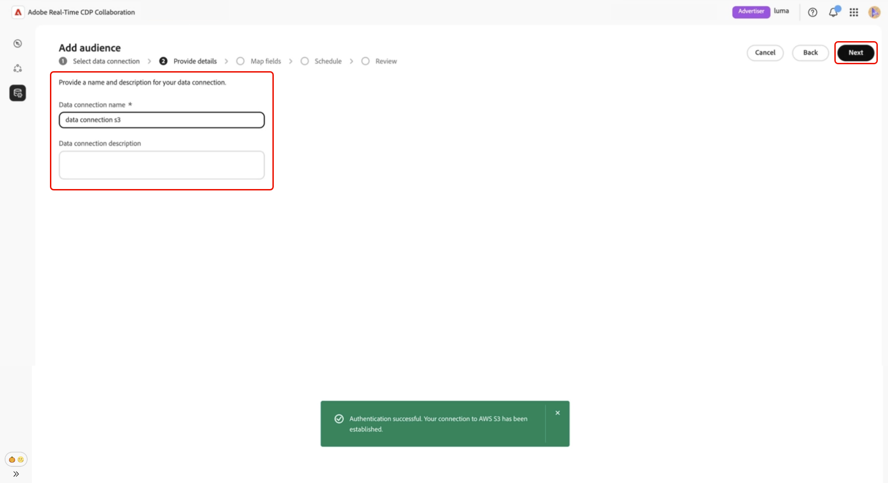
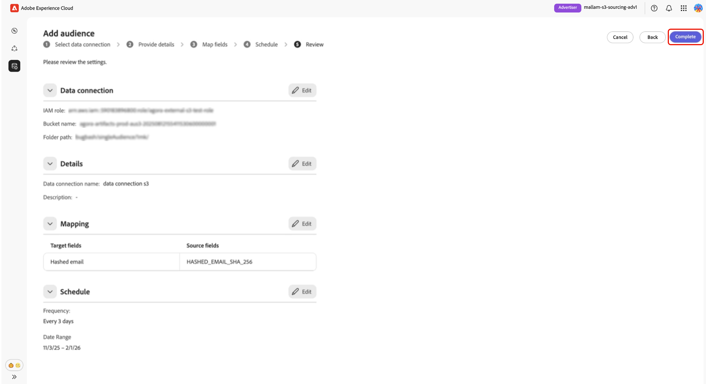

# [!DNL Amazon S3] für die Zielgruppen-Beschaffung konfigurieren

Erfahren Sie, wie Sie Ihren [!DNL Amazon S3]-Speicher in der Adobe Real-Time CDP Collaboration-Benutzeroberfläche konfigurieren und verbinden, um Zielgruppendaten für die Aktivierung und Überschneidungsanalyse zu beziehen.

>[!IMPORTANT]
>
>Bevor Sie dieses Handbuch befolgen, müssen Sie die Schritte ausgeführt haben, um die IAM-Rolle von Adobe in Ihrem AWS-Konto zu autorisieren.\
>Eine schrittweise Setup-Anleitung finden Sie im Handbuch **[Konfigurieren von AWS-Berechtigungen für die Zielgruppen-Beschaffung](./configure-aws-permissions-audience-sourcing.md)**.

## Überblick {#overview}

Verwenden Sie diesen Workflow, um Erstanbieter-Zielgruppen direkt aus [!DNL Amazon S3] zu beziehen und zu verwalten. Nach der Konfiguration bezieht Collaboration Zielgruppen automatisch aus Ihrem S3-Bucket und stellt sie für Einblicke und Aktivierungen zur Verfügung.

Zielgruppen, die über S3 bezogen werden, folgen denselben Governance- und Datenverarbeitungsregeln wie die Zielgruppen, die über Adobe Experience Platform bezogen werden.

## Voraussetzungen {#prerequisites}

Stellen Sie vor dem Konfigurieren Ihrer S3-Datenverbindung Folgendes sicher:

* Sie haben Zugriff auf einen aktiven **[!DNL Amazon S3]-Bucket**, der Zielgruppendateien enthält, die der **[Zielgruppen-Beschaffungsspezifikation (v1.1)](../../assets/quick-start/RTCDP_Collaboration_Audience_Sourcing_Spec_v1.2.pdf)** entsprechen.
* Sie haben in AWS eine **IAM-Rolle** erstellt, die Adobe die Berechtigung erteilt, mithilfe der **angenommenen Rolle** auf Ihren Bucket zuzugreifen (keine Zugriffs-/Geheimschlüssel). Detaillierte Anweisungen finden Sie unter **[Konfigurieren von AWS-Berechtigungen für die Zielgruppen-Beschaffung](./configure-aws-permissions-audience-sourcing.md)**. Die IAM-Rolle muss die folgenden Berechtigungen enthalten:

   * `ListBucket`
   * `GetBucketLocation`
   * `GetObject`

* Sie haben die folgenden Werte bereit:

   * **IAM-Rolle Amazon-Ressourcenname (ARN)**
   * **S3-Bucket-Name**
   * **Ordnerpfad** (das Ordnerpräfix, das Ihre Zielgruppendateien enthält)

>[!NOTE]
>
>Zielgruppendateien müssen sich im **Stammordnerpfad** Ihres autorisierten S3-Buckets befinden. Unterordnerstrukturen werden nicht unterstützt.

## [!DNL Amazon S3] Verbindung konfigurieren {#configure-aws-s3-connection}

Wählen Sie auf der Registerkarte **[!UICONTROL Meine Zielgruppen]** im Arbeitsbereich **[!UICONTROL Setup]** das Symbol zum Hinzufügen aus () und wählen Sie dann **[!UICONTROL Zielgruppe]** aus.

Wenn dies Ihre erste Zielgruppe ist, können Sie auch die Option **[!UICONTROL Hinzufügen]** auswählen.

Der Workflow „Zielgruppe hinzufügen“ wird angezeigt. Wählen Sie **[!UICONTROL Neue Datenverbindung hinzufügen]** und wählen Sie **[!UICONTROL Weiter]**.

{zoomable="yes"}

### [!DNL Amazon S3] als Datenverbindung auswählen {#select-aws-s3}

Wählen Sie **[!UICONTROL Amazon S3]** als Datenverbindung aus, gefolgt von **[!UICONTROL Weiter]**.

![Der Bildschirm zur Auswahl der Datenverbindung, wobei [!DNL Amazon S3] als auswählbare Option verfügbar ist.](../../assets/setup/aws-audience-sourcing/select-s3-data-connection.png)

### Überprüfen der Anforderungen für Zielgruppendateien {#review-audience-requirements}

>[!CONTEXTUALHELP]
>id="rtcdp_collaboration_audience_sourcing_specifications"
>title="Daten für das Onboarding vorbereiten"
>abstract="Lesen Sie das Handbuch zur Spezifikation der Zielgruppenerfassung, um zu erfahren, wie Sie Zielgruppendaten aus Amazon S3 für Collaboration formatieren und strukturieren."
>additional-url="https://www.adobe.com/go/rtcdp-collaboration-audience-sourcing" text="Siehe Handbuch"

Es wird ein Dialogfeld angezeigt, in dem erläutert wird, wie Ihre Zielgruppendateien strukturiert sein müssen. Verwenden Sie den Link zur **[[!UICONTROL Zielgruppen-Beschaffungsspezifikation]](../../assets/quick-start/RTCDP_Collaboration_Audience_Sourcing_Spec_v1.2.pdf)**, um zu erfahren, wie Sie Zielgruppendaten aus [!DNL Amazon S3] formatieren und strukturieren, damit Collaboration sie korrekt liest.

>[!IMPORTANT]
>
>Sie müssen Adobe als [!DNL Amazon S3]-Benutzer autorisiert haben, damit Adobe Daten aus Ihrem [!DNL Amazon S3]-Speicher zur Verarbeitung abrufen kann.

Ihre Zielgruppendateien müssen der Zielgruppen-Beschaffungsspezifikation entsprechen. Die Übereinstimmungsschlüssel werden automatisch auf der Grundlage des erforderlichen Formats zugeordnet.

Zu den wichtigsten Aspekten gehören:

* Dateien müssen im CSV-Format sein und mehrere Werte durch Kommas als Trennzeichen und senkrechte Striche (`|`) voneinander trennen.
* Stellen Sie beim Hochladen mehrerer Dateien sicher, dass alle Dateien identische Spalten enthalten.
* Jeder Zielgruppen-Datensatz muss einen `AUDIENCE_ID` und mindestens einen Übereinstimmungsschlüssel enthalten, z. B. `HASHED_EMAIL_SHA_256`, `HASHED_PHONE_SHA_256`, `HASHED_IPV4_SHA_256`, `CRM_ID`, `LOYALTY_ID` oder `ADFIXUS_ID`.
* Datenaktualisierungen erfolgen alle 1-6 Tage basierend auf Ihrer Auswahl während der Einrichtung der Beschaffung in Collaboration.

### Authentifizieren Ihrer S3-Verbindung {#authenticate-s3-connection}

>[!CONTEXTUALHELP]
>id="rtcdp_collaboration_sources_s3_folderpath"
>title="Format des Ordnerpfads"
>abstract="Geben Sie den Ordnerpfad (Präfix) innerhalb Ihres [!DNL Amazon S3]-Buckets ein, in dem Ihre Zielgruppendateien gespeichert sind. <ul><li>Beginnen Sie Pfade nicht mit einem Schrägstrich (/).</li><li>Fügen Sie am Ende des Pfads einen abschließenden Schrägstrich hinzu.</li><ul> Gültiges Beispiel: `base/path/` Ungültiges Beispiel: `/base/path`"

>[!CONTEXTUALHELP]
>id="rtcdp_collaboration_audience_sharing_amazon_s3"
>title="Hinzufügen einer Zielgruppe für Amazon S3"
>abstract="Um Ihren Amazon S3-Speicher zu verbinden, autorisieren Sie den Adobe-Dienstbenutzenden, Zielgruppendaten zur Verarbeitung abzurufen. Befolgen Sie die in Experience League beschriebenen Schritte, um Adobe Zugriff auf Ihren Amazon S3-Speicher zu gewähren."

Geben Sie als Nächstes Ihre [!DNL Amazon S3]-Anmeldeinformationen ein, um Ihren S3-Bucket mit Collaboration zu verbinden.

Führen Sie die unter **[Konfigurieren von AWS-Berechtigungen für die Zielgruppen-Beschaffung](./configure-aws-permissions-audience-sourcing.md)** beschriebenen Schritte aus, um Adobe Zugriff auf Ihre zu gewähren.
[!DNL Amazon S3] Speicher. Geben Sie nach Abschluss des Vorgangs Ihre Werte in die folgenden Benutzeroberflächenfelder ein:

* IAM-Rolle
* S3-Bucketname
* Ordnerpfad

![Das [!DNL Amazon S3]-Verbindungsformular mit Feldern für IAM-Rolle, S3-Behälternamen und Ordnerpfad.](../../assets/setup/aws-audience-sourcing/s3-authentication-credentials-form.png)

### Einverständnisbestätigung bestätigen {#confirm-consent}

Sie müssen dann bestätigen, dass die Einverständnis-Opt-outs entfernt wurden, bevor Sie fortfahren. Aktivieren Sie das Bestätigungsfeld und dann **[!UICONTROL OK]** zur Bestätigung.

### Authentifizierungsergebnisse überprüfen {#validate-authentication}

Nach dem Verbinden validiert das System Ihre Anmeldeinformationen und zeigt eine der folgenden Meldungen an:

| Status | Nachricht | Beschreibung |
|---| ---|---|
| **Erfolg** | **[!UICONTROL Authentifizierung erfolgreich]** | Ihre Verbindung mit [!DNL Amazon S3] wurde erfolgreich hergestellt. |
| **Fehlgeschlagen** | **[!UICONTROL Authentifizierung fehlgeschlagen]** | Bitte überprüfen Sie Ihre Anmeldedaten und versuchen Sie es erneut. |
| **Zugriff verweigert** | **[!UICONTROL Zugriff verweigert]** | Ihre Anmeldedaten verfügen nicht über die erforderlichen Berechtigungen, um auf diesen [!DNL Amazon S3]-Bucket zuzugreifen. Überprüfen Sie die Zugriffseinstellungen oder wenden Sie sich an Ihren Administrator. |
| **Ungültiges Dateiformat** | **[!UICONTROL Ungültiges Dateiformat]** | Die Zielgruppendaten stimmen nicht mit der erwarteten Struktur überein. Stellen Sie sicher, dass Ihre Dateien den Spezifikationen für die Zielgruppenbeschaffung entsprechen. |
| **Keine Zielgruppendateien gefunden** | **[!UICONTROL Keine Zielgruppendateien gefunden]** | Bestätigen Sie, dass sich Ihre Zielgruppendateien im angegebenen Ordnerpfad befinden und dass auf den Pfad zugegriffen werden kann. |
| **Interner Fehler** | **[!UICONTROL Ein interner Fehler ist aufgetreten]** | Bitte erneut versuchen. Wenn das Problem weiterhin besteht, wenden Sie sich an den Support. |

### Angeben von Verbindungsdetails {#provide-connection-details}

Geben Sie einen beschreibenden Namen und eine optionale Beschreibung für Ihre S3-Datenverbindung ein. Geben Sie Ihre Werte in die folgenden Benutzeroberflächenfelder ein:

* **[!UICONTROL Name der Datenverbindung]** (erforderlich)
* **[!UICONTROL Beschreibung der Datenverbindung]** (optional)

### Überprüfen der automatisch zugeordneten Identitätsfelder {#auto-mapped-fields}

Der Bildschirm **[!UICONTROL Zuordnung]** ist schreibgeschützt. Sie können keine Umwandlungen hinzufügen, löschen oder anwenden. Collaboration ordnet Quell-Identitätsfelder aus Ihren Zielgruppendateien basierend auf der Zielgruppen-Beschaffungsspezifikation automatisch Zielfeldern zu.

Bestätigen Sie die zugeordneten Felder visuell und wählen Sie **[!UICONTROL Weiter]** aus, um fortzufahren.

### Aktualisierungshäufigkeit und Datumsbereich planen {#schedule-refresh}

Die Ansicht **[!UICONTROL Zeitplan]** wird angezeigt. Wählen Sie im Dropdown-Menü eine Aktualisierungshäufigkeit zwischen einem und sechs Tagen aus und legen Sie dann den aktiven Datumsbereich fest. Verwenden Sie das Kalendersymbol, um Start- und Enddatum anzugeben.

>[!IMPORTANT]
>
>Um Ihre Collaboration-Credits effektiv zu verwalten, legen Sie die Aktualisierungshäufigkeit so fest, dass sie mit der Aktualisierungshäufigkeit Ihrer zugrunde liegenden S3-Daten übereinstimmt oder diese überschreitet. Das unterstützte Mindestaktualisierungsintervall beträgt einmal alle sechs Tage.

### Überprüfen und Abschließen der Verbindung {#review-and-complete}

Überprüfen Sie abschließend Ihre Konfigurationseinstellungen im Bildschirm Zusammenfassung . Diese Ansicht enthält eine Zusammenfassung der folgenden Abschnitte:

* **[!UICONTROL Datenverbindung]**: Zeigt die IAM-Rolle, den S3-Behälternamen und den Ordnerpfad an, den Sie konfiguriert haben.
* **[!UICONTROL Details]**: Zeigt den Namen und die optionale Beschreibung Ihrer Datenverbindung an, um deren spätere Identifizierung zu erleichtern.
* **[!UICONTROL Zuordnung]**: Listet auf, wie die Quellfelder aus Ihren hochgeladenen Zielgruppendateien (z. B. `HASHED_EMAIL`) den in Collaboration verwendeten Zielfeldern (z. B. Hash-E-Mails) zugeordnet werden.
* **[!UICONTROL Zeitplan]**: Fasst zusammen, wie oft die Verbindung Zielgruppendaten aktualisiert, und beschreibt den aktiven Datumsbereich für die Beschaffung.

Wählen Sie das Stiftsymbol aus, wenn Sie einen Abschnitt bearbeiten müssen. Wählen Sie **[!UICONTROL Abschließen]**, um alle Abschnitte zu bestätigen.

Es wird ein Bestätigungsdialogfeld angezeigt, in dem angegeben wird, dass die Datenverbindung erfolgreich erstellt wurde und dass die Zielgruppen-Beschaffung in Bearbeitung ist.

## Überprüfen der Quellzielgruppen {#review-sourced-audiences}

Nach Abschluss der Konfiguration beginnt Collaboration mit der Beschaffung von Zielgruppen aus Ihrem S3-Bucket. Audiences, die über einen [!DNL Amazon S3]-Bucket bezogen werden, werden auf der Registerkarte **[!UICONTROL Meine Audiences]** angezeigt und verfügen über dieselben Funktionen und Informationen wie Audiences, die aus Experience Platform bezogen werden.

Wenn die Zielgruppen-Beschaffung bereits läuft, wird oben auf dem Bildschirm ein Banner angezeigt. Einzelne Zielgruppen werden erst nach Abschluss der Beschaffung angezeigt.

![Die Registerkarte „Zielgruppen“, auf der angezeigt wird, dass für [!DNL Amazon S3] Zielgruppen ein Sourcing läuft.](../../assets/setup/aws-audience-sourcing/s3-audiences-sourcing-in-progress.png)

Sobald die S3-Zielgruppen bezogen wurden, wird Ihre Liste der verfügbaren Zielgruppen in einer tabellarischen oder Kartenansicht bereitgestellt.

>[!TIP]
>
>Die Zeit für die Zielgruppenbeschaffung hängt von der Größe Ihrer S3-Daten und der konfigurierten Aktualisierungshäufigkeit ab. Es kann länger dauern, bis größere Datensätze oder weniger häufig aktualisierte Zeitpläne im Arbeitsbereich **[!UICONTROL Meine Zielgruppen]** angezeigt werden.

Wählen Sie in der Rasteransicht oder Tabellenansicht ein Zeilenelement oder **[!UICONTROL Zielgruppe anzeigen]**, um eine Übersicht über eine bestimmte Zielgruppe zu erhalten. Darin werden der Status, die Quelle und der Name der Datenverbindung der Zielgruppe zusammen mit detaillierten Bedienfeldern für Folgendes angezeigt:

**[!UICONTROL Identitäten]**: Zeigt die Gesamtzahl der Identitäten und ihre Aufschlüsselung an, sobald Daten verfügbar sind.
**[!UICONTROL Kategorien]**: Listet alle Tags auf, die zum Organisieren oder Filtern der Zielgruppe verwendet werden.
**[!UICONTROL Verbindungszugriff]**: Gibt an, ob die Zielgruppe privat, öffentlich oder für bestimmte Mitarbeiter freigegeben ist.
**[!UICONTROL Metadaten-Sichtbarkeit]**: Definiert, welche Zielgruppeninformationen (wie Identitätsanzahl, Überschneidungsprozentsatz und Index) für Mitwirkende sichtbar sind.

Verwenden Sie diese Ansicht, um die Einstellungen für die Zielgruppenkonfiguration und Sichtbarkeit zu bestätigen, bevor Sie die Zielgruppe in Kooperationsprojekten verwenden.

Weitere Informationen finden Sie in der Dokumentation zum [Dashboard für Zielgruppen anzeigen](https://experienceleague.adobe.com/en/docs/real-time-cdp-collaboration/using/setup/onboard-audiences#view-audiences-dashboard).

## Anzeigen der S3-Datenverbindung {#view-s3-connection}

Die neu hinzugefügte [!DNL Amazon S3]-Verbindung ist sofort auf der Registerkarte **[!UICONTROL Meine Datenverbindungen]** verfügbar. Die Zielgruppenquelle wird als [!UICONTROL Amazon S3] angezeigt.

Ihre S3-Datenverbindung enthält dieselben Funktionen und Details wie andere Zielgruppendaten-Verbindungen, mit dem Unterschied, dass Sie Zielgruppen nicht direkt über diese Ansicht hinzufügen oder bearbeiten können.

>[!NOTE]
>
>[!DNL Amazon S3] Datenverbindungen können nicht bearbeitet werden. Einstellungen wie die Aktualisierungshäufigkeit können nach der Erstellung der Verbindung nicht mehr geändert werden. Um die Konfiguration zu aktualisieren, müssen Sie die vorhandene Verbindung löschen und eine neue erstellen.

![Die Registerkarte „Meine Datenverbindungen“ mit den [!DNL Amazon S3] Datenverbindungen mit Informationen zum Beschaffungsstatus.](../../assets/setup/aws-audience-sourcing/s3-data-connections-tab.png)

## Nächste Schritte {#next-steps}

Sie haben jetzt Ihren [!DNL Amazon S3]-Speicher erfolgreich als Datenquelle in Collaboration konfiguriert und verbunden. Durch Abschluss dieses Workflows haben Sie die sichere Beschaffung von First-Party-Zielgruppendaten für die Aktivierung und Überschneidungsanalyse aktiviert.

Nach Abschluss der Beschaffung erscheinen Ihre Zielgruppen im Arbeitsbereich **[!UICONTROL Meine Zielgruppen]**, bereit für die Zusammenarbeit und Aktivierung. Detaillierte Verwaltungsoptionen finden Sie in der Dokumentation zu [Quelle und Verwalten von Zielgruppen](./onboard-audiences.md).
