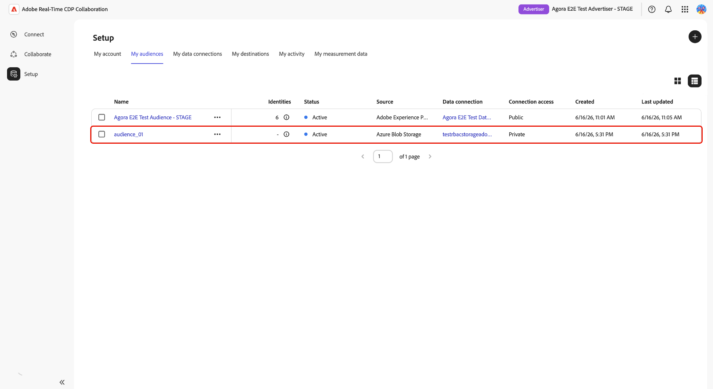

# Source-Zielgruppen aus dem Azure-Speicher

Verbinden Sie [!DNL Azure Blob Storage] oder [!DNL Azure Data Lake Storage] (ADLS) Gen2 mit Adobe Real-Time CDP Collaboration, um First-Party-Zielgruppendaten für die Aktivierung und Überschneidungsanalyse zu beziehen.

Verwenden Sie dieses Handbuch, um eine wiederverwendbare [!DNL Azure] Datenverbindung zu erstellen und einen einmaligen Import vom konfigurierten -Speicherort auszuführen. Bevor Sie beginnen, überprüfen Sie, ob Ihre Zielgruppendateien die [Zielgruppen-Beschaffungsspezifikation](../../assets/quick-start/RTCDP_Collaboration_Audience_Sourcing_Spec_v1_3.pdf) erfüllen. Während des Einrichtungsprozesses gewähren Sie Adobe Lesezugriff auf Ihren Azure-Speicher.

## [!DNL Azure] Quelltyp auswählen {#choose-source-type}

Collaboration unterstützt zwei [!DNL Azure]. Verwenden Sie die nachstehende Tabelle, um den Anleitungspfad auszuwählen, der dem Speicherort Ihrer Zielgruppendateien entspricht.

| | **[!DNL Azure Blob Storage]** | **[!DNL Azure Data Lake Storage]Gen2** |
|---|---|---|
| **Verwendung** | Dateien befinden sich in einem Standard-Blob **Container** in einem Speicherkonto (kein hierarchischer Namespace erforderlich). | Dateien befinden sich in einem **Dateisystem** in einem Speicherkonto mit aktiviertem **hierarchischem Namespace (ADLS Gen2)**. |
| **Source-Option in Collaboration** | **[!DNL Azure Blob Storage]** | **[!DNL Azure Data Lake Storage]Gen2** |
| **Erforderliche Felder in Collaboration** | Speicherkonto, **[!UICONTROL Container]**, **[!UICONTROL Pfad]** | Speicherkonto, **[!UICONTROL Container]** (ADLS Gen2-Dateisystem), **[!UICONTROL Pfad]** |
| **Abschnitt „Berechtigungen“** | [[!DNL Azure Blob] Berechtigungen](#set-up-azure-blob-storage-permissions) | [[!DNL Azure Data Lake Storage] Gen2-Berechtigungen](#set-up-adls-gen2-permissions) |

Sie können nur **einen Quelltyp pro Datenverbindung** konfigurieren. Erstellen Sie separate Datenverbindungen, um Daten sowohl aus [!DNL Blob] als auch aus ADLS zu beziehen.

## Voraussetzungen {#prerequisites}

Bevor Sie diese Anleitung befolgen, schließen Sie [Onboarding und Einrichtung von Konten](./onboard-account.md) ab. Schließen Sie dann die Voraussetzungen in diesem Abschnitt ab, bevor Sie den Konfigurations-Workflow starten.

Einige Schritte erfordern eine Aktion durch einen **[!DNL Azure]Administrator**. Wenn Sie nicht der [!DNL Azure]-Administrator für Ihre Organisation sind, ermitteln Sie die entsprechende Person, bevor Sie beginnen.

### [!DNL Azure] und Berechtigungen {#azure-access-and-permissions}

Bevor Sie die Verbindung in Collaboration konfigurieren, müssen Sie oder Ihr [!DNL Azure]-Administrator Adobe Lesezugriff auf den Speicher-Container oder das ADLS Gen2-Dateisystem gewähren, der/das Ihre Zielgruppendateien enthält. Nachdem die Berechtigungseinrichtung abgeschlossen ist, validiert der Collaboration-Konfigurations-Workflow den Zugriff während des **[!UICONTROL Einverständnis]**.

### Zielgruppendaten vorbereiten {#prepare-audience-data}

Ihre Zielgruppendateien müssen der **[Zielgruppen-Beschaffungsspezifikation (v1.2) entsprechen](../../assets/quick-start/RTCDP_Collaboration_Audience_Sourcing_Spec_v1_3.pdf)** bevor die Beschaffung beginnt.

Zu den wichtigsten Anforderungen gehören:

* **Dateiformat:** CSV, wobei Kommas als Feldtrennzeichen und senkrechte Striche (`|`) als Trennzeichen für mehrere Werte innerhalb eines einzelnen Felds verwendet werden.
* **Erforderliche Felder** Jeder Datensatz muss eine `AUDIENCE_ID` Spalte und mindestens eine unterstützte Spalte für Übereinstimmungsschlüssel enthalten.
* **Unterstützte Übereinstimmungsschlüssel:** `HASHED_EMAIL_SHA_256`, `HASHED_PHONE_SHA_256`, `HASHED_IPV4_SHA_256`, `CRM_ID`, `LOYALTY_ID`, `ADFIXUS_ID`.
* **Hash-Anforderungen:** Alle Übereinstimmungsschlüsselwerte müssen vor dem Hochladen gekürzt, in Kleinbuchstaben geschrieben und SHA256-gehasht werden. Collaboration hasht oder normalisiert Daten nicht vor der Aufnahme.
* **Spaltenkonsistenz:** Alle Dateien unter Ihrem konfigurierten Pfad müssen identische Spaltenstrukturen verwenden.

Alle Übereinstimmungsschlüssel, die in Ihren Zielgruppendateien vorhanden sind, müssen auch für Ihr Collaboration-Konto aktiviert werden. Eine Anleitung [ Sie unter „Einrichten ](https://experienceleague.adobe.com/de/docs/real-time-cdp-collaboration/using/setup/onboard-account#set-up-match-keys) Übereinstimmungsschlüsseln“.

>[!IMPORTANT]
>
> Übereinstimmungsschlüssel, die für eine Datenverbindung aktiviert sind, können nach der Erstellung der Verbindung nicht entfernt werden. Um den aktiven Satz von Übereinstimmungsschlüsseln zu ändern, müssen Sie die Verbindung löschen und eine neue erstellen. Bestätigen Sie Ihre vollständige Konfiguration des Übereinstimmungsschlüssels, bevor Sie den Einrichtungs-Workflow starten.

### Vor dem Start erforderliche Werte {#values-required}

Halten Sie die folgenden Werte bereit, bevor Sie den Konfigurations-Workflow starten.

| Wert | Beschreibung | Beispiel für Azure Blob Storage | ADLS Gen2-Beispiel |
| ------------------- | ------------------------ | -------------------------------------- | -------------------------------------- |
| **Speicherkonto** | Der Name des [!DNL Azure] Speicherkontos, das Ihre Zielgruppendateien hostet. | `customerdatastore` | `datalake-prod` |
| **Container** | [!DNL Azure Blob Storage] der Speicher-Container, der Ihre Zielgruppendateien enthält. Für [!DNL Azure Data Lake Storage] Gen2 geben Sie den Namen des ADLS Gen2-Dateisystems in das Feld **[!UICONTROL Container]** ein. | `audience-ingest` | `audiences` |
| **Pfad** | Der Ordnerpfad innerhalb des Containers oder Dateisystems, der die aufzunehmenden Zielgruppendateien enthält. Collaboration nimmt nur Dateien direkt unter dem konfigurierten Pfad auf, keine Dateien aus verschachtelten Unterordnern. | `sourcing/audiences/path1/` | `sourcing/inbound/` |
| **Mandanten-ID** | Die Microsoft Entra-Mandanten-ID, die mit Ihrem [!DNL Azure]-Speicherkonto verknüpft ist. | `00000000-0000-0000-0000-000000000000` | `00000000-0000-0000-0000-000000000000` |

## Einrichten von [!DNL Azure] {#set-up-azure-permissions}

Führen Sie die Schritte in diesem Abschnitt aus, um Ihre [!DNL Azure]-Umgebung vorzubereiten. Adobe erfordert Lesezugriff auf Ihren Speicher-Container, bevor der Collaboration-Konfigurations-Workflow eine Verbindung herstellen kann. Diese Arbeit wird im [!DNL Azure] Portal ausgeführt und muss möglicherweise von Ihrem [!DNL Azure] abgeschlossen werden.

Nachdem Sie diesen Abschnitt abgeschlossen haben, fahren Sie mit [Konfigurieren Ihrer  [!DNL Azure] -Verbindung](#configure-your-azure-connection) fort.

### Abrufen der [!DNL Azure]-Prinzipalkennung von Adobe {#obtain-principal-identifier}

Bevor Sie die unten genannten Schritte zur Rollenzuweisung ausführen können, wenden Sie sich an Ihr Adobe-Account-Team, um die Prinzipalkennung des [!DNL Azure]-Services für Ihre Region (Nordamerika, EMEA oder Australien und Neuseeland) zu erhalten. Mit dieser Kennung gewähren Sie Adobe Lesezugriff auf Ihren Speicher.

### Einrichten von [!DNL Azure Blob Storage] {#set-up-azure-blob-storage-permissions}

>[!IMPORTANT]
>
> Sie benötigen die Berechtigung zum Zuweisen von Rollen für das -Speicherkonto oder den -Container (z **B. &quot;**&quot; oder &quot;**-Administrator** oder Ähnliches).

1. Öffnen Sie [[!DNL Azure] Portal](https://portal.azure.com/) das -Speicherkonto, navigieren Sie zu **[!UICONTROL Container]** und wählen Sie den Container aus, der Ihre Zielgruppendateien enthält.
2. Wählen Sie **[!DNL Access control (IAM)]** und dann **[!DNL Add role assignment]** aus.
3. Weisen Sie dem Adobe-Prinzipal die Rolle **[!DNL Storage Blob Data Reader]** im Container-Bereich zu.
4. Wählen Sie **Speichern** aus.

### Einrichten von ADLS Gen2-Berechtigungen {#set-up-adls-gen2-permissions}

Bei ADLS Gen2-Verbindungen entspricht **[!UICONTROL Feld &quot;]**&quot; in Collaboration dem ADLS Gen2-Dateisystem in [!DNL Azure]. Verwenden Sie das Dateisystem, das Ihre Zielgruppendateien enthält.

Bevor Sie Berechtigungen zuweisen, stellen Sie sicher, dass für das Speicherkonto **hierarchischer Namespace aktiviert** und dass die Firewall- oder privaten Endpunktregeln den Zugriff auf Adobe zulassen.

1. Öffnen Sie [[!DNL Azure] Portal](https://portal.azure.com/) das -Speicherkonto, das Ihr ADLS Gen2-Dateisystem enthält.
2. Öffnen Sie das Dateisystem, das Ihre Zielgruppendateien enthält.
3. Wählen Sie **[!UICONTROL Zugriffssteuerung (IAM))]** dann **[!UICONTROL Rollenzuweisung hinzufügen]** aus.
4. Weisen Sie dem Adobe-Prinzipal die Rolle **[!DNL Storage Blob Data Reader]** im Dateisystem- oder Verzeichnisbereich zu.
5. Wählen Sie **[!UICONTROL Speichern]** aus.

Nachdem Sie die Berechtigungseinrichtung für Ihren Quelltyp abgeschlossen haben, fahren Sie mit dem Schritt [Konfigurieren Ihrer  [!DNL Azure] -Verbindung](#configure-your-azure-connection) fort.

## Konfigurieren der [!DNL Azure] {#configure-your-azure-connection}

Verwenden Sie den Collaboration-Konfigurations-Workflow, um Ihre [!DNL Azure]-Speicherdetails zu validieren, den Adobe-Zugriff zu bestätigen, automatisch zugeordnete Identitätsfelder zu überprüfen und die Datenverbindung zu erstellen.

### Neue Datenverbindung hinzufügen {#add-new-data-connection}

Navigieren Sie zu **[!UICONTROL Setup]** > **[!UICONTROL Meine Zielgruppen]** und wählen Sie dann das Symbol zum Hinzufügen aus () und wählen Sie **[!UICONTROL Zielgruppe]**.

{zoomable="yes"}

Der **[!UICONTROL Zielgruppe hinzufügen]** wird angezeigt. Wählen Sie **[!UICONTROL Neue Datenverbindung hinzufügen]** und klicken Sie dann auf **[!UICONTROL Weiter]**.

{zoomable="yes"}

### [!DNL Azure] Datenquelle auswählen {#select-azure-data-source}

Wählen Sie **[!UICONTROL Azure Blob Storage]** oder **[!UICONTROL Azure Data Lake Storage Gen2]** aus und klicken Sie dann auf **[!UICONTROL Weiter]**.

![Der Workflow „Zielgruppe hinzufügen“ , der [!DNL Azure Blob Storage] als Datenverbindungstyp ausgewählt zeigt, und die Onboarding-Schritte Anmeldedaten, Einverständnis, Feldzuordnung und Überprüfung.](../../assets/setup/azure-sourcing/azure-source-selection-step.png){zoomable="yes"}

Führen Sie die verbleibenden Schritte aus, um Ihre Azure-Verbindung zu validieren, den Adobe-Zugriff zu bestätigen, Feldzuordnungen zu überprüfen und die Datenverbindung zu erstellen.

### Anmeldedaten für die Verbindung eingeben {#enter-connection-credentials}

Geben **[!UICONTROL im Schritt]** die Informationen an, die für den Zugriff auf Ihren [!DNL Azure] Speicherort erforderlich sind.

| Feld | Beschreibung |
|---|---|
| **[!UICONTROL Speicherkonto]** | Das [!DNL Azure] Speicherkonto, das Ihre Zielgruppendateien enthält. |
| **[!UICONTROL Container]** | Der Speicher-Container oder das ADLS Gen2-Dateisystem, der/die Ihre Zielgruppendateien enthält. |
| **[!UICONTROL Pfad]** | Der Ordnerpfad innerhalb des Containers, in dem Ihre Zielgruppendateien gespeichert werden. |
| **[!UICONTROL Mandanten-ID]** | Die [!DNL Azure] Mandantenkennung, die mit Ihrem Speicherkonto verknüpft ist. |

Nachdem Sie die erforderlichen Werte eingegeben haben, wählen Sie **[!UICONTROL Mit Azure verbinden]** aus.

Eine Bestätigungsmeldung weist darauf hin, dass die Verbindung erfolgreich hergestellt wurde. Klicken Sie auf **[!UICONTROL Weiter]**, um fortzufahren.

![Der Schritt „Anmeldeinformationen“, der ausgefüllte Felder für Speicherkonto, Container, Pfad und Mandanten-ID mit der Bestätigungsmeldung „Mit [!DNL Azure] verbunden“ anzeigt.](../../assets/setup/azure-sourcing/azure-credentials-step.png){zoomable="yes"}

### Adobe Zugriff auf [!DNL Azure] Speicher gewähren {#grant-adobe-access}

Im Schritt **[!UICONTROL Einverständnis]** validiert Collaboration die [!DNL Azure] Berechtigungen, die Sie zuvor konfiguriert haben.

Wählen Sie das Launch-Symbol neben **[!UICONTROL Einverständnis-URL]** aus, um den Autorisierungs-Workflow in [!DNL Azure] zu öffnen. Melden Sie sich mit einem Konto an, das berechtigt ist, das Einverständnis für den Speicherort zu erteilen, und führen Sie dann die Azure-Autorisierungsaufforderungen aus, die Adobe Zugriff auf den konfigurierten Speicherort gewähren. Kehren Sie nach Abschluss der Autorisierung zu Collaboration zurück und klicken Sie auf **[!UICONTROL Einverständnis bestätigen]** um den Zugriff von Adobe zu überprüfen.

>[!NOTE]
>
>Es kann mehrere Minuten dauern, bis [!DNL Azure] Rollenzuweisungen propagiert werden. Wenn die Einverständnisvalidierung nicht sofort erfolgreich ist, warten Sie einige Minuten, stellen Sie sicher, dass der Service-Prinzipal von Adobe über die erforderliche Rollenzuweisung verfügt, und versuchen Sie es dann erneut.

Wenn die Einverständnisvalidierung erfolgreich ist, wird **[!UICONTROL Bestätigungsmeldung]** Einverständnis erteilt“ angezeigt. Klicken Sie auf **[!UICONTROL Weiter]**, um fortzufahren.

![Der Schritt „Einverständnis“ mit einer Einverständnis-URL, der [!DNL Azure\]-Anwendungs-ID und einer Bestätigungsnachricht für das erteilte Einverständnis.](../../assets/setup/azure-sourcing/azure-consent-granted-step.png){zoomable="yes"}

### Feldzuordnungen überprüfen {#review-field-mappings}

Im Schritt **[!UICONTROL Feldzuordnung]** ordnet Collaboration automatisch unterstützte Identitätsfelder aus Ihren Quelldateien zu.

Es ist keine manuelle Konfiguration erforderlich.

>[!IMPORTANT]
>
> Collaboration ordnet Identitätsfelder automatisch auf der Grundlage der Zielgruppen-Beschaffungsspezifikation zu. Wenn die angezeigten Zuordnungen falsch sind, aktualisieren Sie Ihre Quelldateien, bevor Sie den Onboarding-Workflow abschließen.

Überprüfen Sie die angezeigten Zuordnungen und stellen Sie sicher, dass die Quellfelder mit den Identitätsspalten in Ihren Zielgruppendateien übereinstimmen. Klicken Sie auf **[!UICONTROL Weiter]**, um fortzufahren.

{zoomable="yes"}

### Überprüfen und Abschließen der Verbindung {#review-and-complete}

Überprüfen **[!UICONTROL im Schritt]**&#x200B;Überprüfen“ das Speicherkonto, den Container, den Quellpfad, die Mandanten-ID und die Feldzuordnungen.

Auf der Überprüfungsseite wird auch angegeben, dass der aktuelle [!DNL Azure]-Workflow nur eine einzige Sourcing-Ausführung durchführt und keinen wiederkehrenden Zeitplan konfiguriert.

Wenn die Konfiguration korrekt ist, wählen Sie **[!UICONTROL Abschließen]**.

{zoomable="yes"}

## Verbindung bestätigen und Zielgruppen aus der Quelle überwachen {#confirm-connection-and-monitor-audiences}

Nachdem Sie auf **[!UICONTROL Abschließen]** geklickt haben, erstellt Collaboration die Datenverbindung und navigiert Sie zu **[!UICONTROL Setup]** > **[!UICONTROL Meine Datenverbindungen]**.

### Bestätigen Sie, dass die Verbindung erstellt wurde {#confirm-connection-created}

Die Verbindungskarte in **[!UICONTROL Meine Datenverbindungen]** bestätigt, dass die Verbindung erfolgreich erstellt wurde. Die Karte zeigt den Quelltyp (**[!UICONTROL Azure Blob Storage]** oder **[!UICONTROL Azure Data Lake Storage] Gen2**), das Erstellungsdatum, Übereinstimmungsschlüssel, Zielgruppengröße und den aktuellen Verbindungsstatus an.

![Die Ansicht Meine Datenverbindungen zeigt eine neu erstellte [!DNL Azure Blob Storage] mit Verbindungsdetails, Übereinstimmungsschlüsseln, Zielgruppengröße und Statusinformationen.](../../assets/setup/azure-sourcing/azure-data-connection-card.png){zoomable="yes"}

### Anzeigen von Quellzielgruppen {#view-sourced-audiences}

Nachdem die Verbindung erstellt wurde, beginnt Collaboration automatisch mit dem Bezug von Zielgruppen aus dem konfigurierten [!DNL Azure]. Navigieren Sie zu **[!UICONTROL Setup]** > **[!UICONTROL Meine Zielgruppen]**, um den Beschaffungsfortschritt zu überwachen und die Zielgruppen aus der Quelle zu überprüfen.

Die Zielgruppen der Quelle werden in der Tabelle **[!UICONTROL Meine Zielgruppen]** angezeigt. Verwenden Sie den Zielgruppenstatus, die Identitätsanzahl, die Quelle, die Datenverbindung und das Datum der letzten Aktualisierung, um zu bestätigen, dass die erwarteten Zielgruppen von Ihrer [!DNL Azure]-Verbindung bezogen wurden.

>[!TIP]
>
>Die Beschaffungszeit hängt vom Datenvolumen ab. Wenn Zielgruppen nach 24 Stunden nicht angezeigt wurden, finden Sie weitere Informationen unter [Fehlerbehebung](#troubleshooting).

## Bekannte Einschränkungen {#known-limitations}

Überprüfen Sie die folgenden Einschränkungen, bevor Sie eine Azure-Datenverbindung erstellen oder verwalten.

* **Einschränkungen für Übereinstimmungsschlüssel:** Übereinstimmungsschlüssel können nicht aus einer vorhandenen Verbindung entfernt werden. Um die aktiven Übereinstimmungsschlüssel zu ändern, löschen Sie die Verbindung und erstellen Sie eine neue.
* **Eine aktive Verbindung pro [!DNL Azure] Quelltyp:** Sie können pro Konto eine aktive Blob-Verbindung und eine aktive ADLS Gen2-Verbindung haben. Um den Speicherort zu ändern, löschen Sie die vorhandene Verbindung und erstellen Sie eine neue.
* **Unterstützung von Unterordnern:** Collaboration nimmt nur Dateien direkt unter dem konfigurierten Pfad auf. Es werden keine Dateien aus verschachtelten Unterordnern aufgenommen.
* **Separate Quelltypen:** Blob und ADLS Gen2 sind unterschiedliche Verbindungen - mischen Sie die Konfiguration nicht in einem einzigen Assistenten-Durchlauf zwischen ihnen.

## Fehlerbehebung {#troubleshooting}

### Zielgruppen werden nicht angezeigt oder die Quelle ist langsam {#audiences-not-appearing}

Wenn nach dem Erstellen der Verbindung keine Zielgruppen aus Quellen angezeigt werden, führen Sie die folgenden Aktionen aus.

* Vergewissern Sie sich, dass die Zielgruppendateien direkt unter dem konfigurierten Pfad vorhanden sind und der Zielgruppen-Beschaffungsspezifikation entsprechen.
* Überprüfen Sie **[!UICONTROL Meine Datenverbindungen]** auf Fehler.
* Wenden Sie sich mit dem Verbindungsnamen, dem Speicherkonto und den Container-Details an den Adobe-Support, wenn die Probleme nach 24 Stunden weiterhin bestehen.

### Zielgruppen stammen, aber keine oder unerwartete Identitäten anzeigen {#zero-identities}

Wenn Zielgruppen nach der Beschaffung angezeigt werden, die Anzahl der Identitäten jedoch null oder niedriger als erwartet ist, führen Sie die folgenden Aktionen aus.

* Stellen Sie sicher, dass alle Übereinstimmungsschlüsselwerte in Ihren Zielgruppendateien vor dem Hochladen gekürzt, in Kleinbuchstaben geschrieben und SHA256-gehasht wurden. Collaboration hasht oder normalisiert Daten bei der Aufnahme nicht.
* Vergewissern Sie sich, dass die in Ihren Dateien vorhandenen Übereinstimmungsschlüssel für Ihr Collaboration-Konto aktiviert sind. Siehe [Übereinstimmungsschlüssel einrichten](https://experienceleague.adobe.com/de/docs/real-time-cdp-collaboration/using/setup/onboard-account#set-up-match-keys).

### Verbindung nach anfänglichem Erfolg fehlgeschlagen {#connection-failed}

Verwenden Sie diese Prüfungen, wenn eine Verbindung erfolgreich erstellt wurde, aber später einen fehlgeschlagenen Status erhält.

* Stellen Sie sicher, dass die [!DNL Azure] RBAC-Rollenzuweisung für den Prinzipal von Adobe nicht entfernt oder eingeschränkt wurde.
* Bestätigen Sie, dass unter dem Pfad noch Dateien vorhanden sind, die der Spezifikation entsprechen.

### Importieren oder Formatieren von Fehlern {#format-errors}

Verwenden Sie diese Prüfungen, wenn die Beschaffung aufgrund von Problemen mit der Dateistruktur, dem Hashing oder dem Spaltenformat fehlschlägt.

* Stellen Sie sicher, dass alle Dateien dieselbe Spaltenstruktur und dieselben Hash-Regeln wie die ursprüngliche Aufnahme beibehalten.

## Nächste Schritte {#next-steps}

Nach Abschluss der Beschaffung stehen Zielgruppen in &quot;**[!UICONTROL Zielgruppen“]** Aktivierungs-, Überschneidungs- und Mess-Workflows zur Verfügung. Informationen zum Aktivieren von Zielgruppen aus Quellen mit Partnern finden Sie unter [Aktivieren von Zielgruppen](../collaborate/activate.md).

Andere verfügbare Beschaffungsmethoden umfassen Experience Platform, [!DNL Amazon S3], [!DNL Google Cloud Storage], [!DNL Snowflake] und CSV-Datei-Upload. Weitere Methoden zur Zielgruppen-Beschaffung finden Sie unter:

* [Konfigurieren des Google Cloud-Speichers für die Zielgruppen-Beschaffung](./configure-gcs-audience-sourcing.md)
* [Konfigurieren von Snowflake für die Zielgruppen-Beschaffung](./configure-snowflake-audience-sourcing.md)
* [Konfigurieren von AWS S3 für die Zielgruppen-Beschaffung](./configure-aws-s3-audience-sourcing.md)
* [Source-Zielgruppen aus Experience Platform](./onboard-audiences.md)
* [Hochladen einer CSV-Datei für die Zielgruppen-Beschaffung](./upload-csv-audience-sourcing.md)
