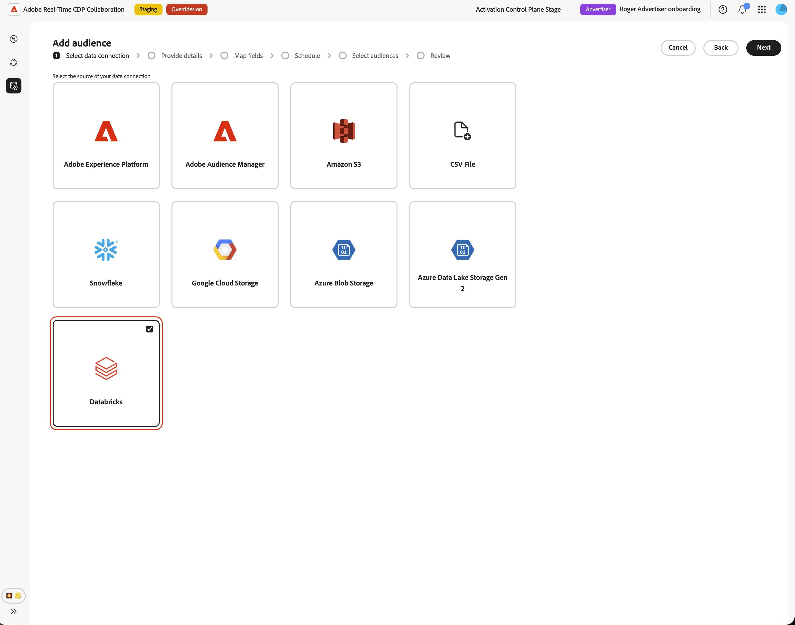
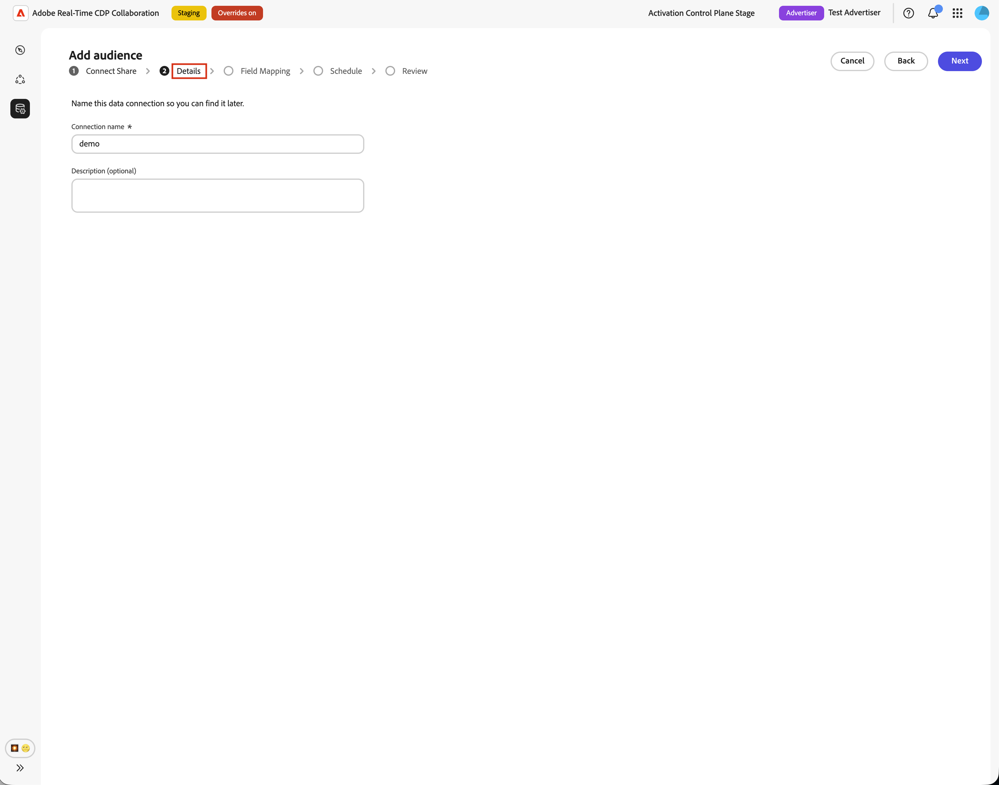

# Konfigurieren von [!DNL Databricks Delta Share] für die Zielgruppen-Beschaffung

Verwenden Sie dieses Handbuch, um [!DNL Databricks Delta Share] über die Benutzeroberfläche mit Adobe Real-Time CDP Collaboration zu verbinden und Erstanbieter-Zielgruppen zu beziehen.

Wenn Sie [!DNL Databricks Delta Share] verbinden, liest Collaboration Zielgruppendaten direkt aus Ihrer Unity-Katalogfreigabe. Nach Abschluss der Beschaffung können Sie die Zielgruppen für die Aktivierung und Überschneidungsanalyse in Kooperationsprojekten verwenden.

In diesem Handbuch wird erläutert, wie Sie Voraussetzungen vorbereiten, Ihre [!DNL Delta Share] verbinden, Quelltabellen angeben, Identitätsfelder zuordnen und überprüfen, ob die Zielgruppen-Beschaffung erfolgreich gestartet wird.

Zielgruppen, die von [!DNL Databricks] bezogen werden, folgen denselben Governance- und Datenverarbeitungsregeln wie Zielgruppen, die von Adobe Experience Platform und anderen unterstützten Cloud-Quellen bezogen werden.

Andere verfügbare Beschaffungsmethoden sind [Experience Platform](./onboard-audiences.md), [Amazon S3](./configure-aws-s3-audience-sourcing.md), [Google Cloud Storage](./configure-gcs-audience-sourcing.md), [Snowflake](./configure-snowflake-audience-sourcing.md), [Azure Storage](./configure-azure-storage-audience-sourcing.md) und [CSV-Datei-Upload](./upload-csv-audience-sourcing.md). Weitere Informationen zu allen verfügbaren Quellen in Collaboration finden Sie unter [Quellen - Übersicht](./source-overview.md).

## Voraussetzungen {#prerequisites}

Sie müssen die Voraussetzungen in diesem Abschnitt erfüllen, bevor Sie den Konfigurations-Workflow starten. Fehlende Voraussetzungen sind ein häufiger Grund dafür, dass die Einrichtung fehlschlägt oder Zielgruppen nach der Beschaffung nicht angezeigt werden. Bevor Sie diese Anleitung befolgen, schließen Sie [Onboarding und Einrichten von Konten](./onboard-account.md) ab.

Für einige Aufgaben in diesem Handbuch ist die Hilfe eines [!DNL Databricks]-Administrators erforderlich. Wenn Sie keine [!DNL Databricks] für Ihr Unternehmen verwalten, wenden Sie sich an den entsprechenden Administrator, bevor Sie beginnen.

### [!DNL Databricks Delta Share] {#databricks-delta-share-access}

Bevor Sie fortfahren, bestätigen Sie Folgendes mit Ihrem [!DNL Databricks]:

* Ihr Unternehmen hat ein [!DNL Delta Share] im [!DNL Databricks]-Konto von Adobe veröffentlicht, in dem native Datenblöcke-zu-Datenblöcke-Freigaben (Unity-Katalog) verwendet werden. Collaboration unterstützt für diesen Workflow nicht den Eintrag von Bearer-Token oder OIDC-Anmeldeinformationen in der Benutzeroberfläche.
* Sie kennen den Provider-Namen, der im Metastore des Adobe-Unity-Katalogs registriert ist, den Freigabenamen und das Schema, das Ihre Zielgruppentabellen enthält.
* [!DNL Databricks Delta Share] Zielgruppen-Sourcing ist für Ihr Collaboration-Konto und Ihre Region verfügbar. Wenn Databricks-Beschaffung in Ihrer Region noch nicht verfügbar ist, wenden Sie sich an Ihren Adobe-Kundenbetreuer, um einen Zeitplan zu bestätigen.

Eine schrittweise Anleitung zum Veröffentlichen einer Freigabe in Adobe finden Sie im Abschnitt [Veröffentlichen Ihrer Delta-Freigabe in Adobe](#publish-delta-share) in diesem Handbuch.

### Zielgruppendaten vorbereiten {#prepare-audience-data}

Strukturieren Sie Ihre Zielgruppentabellen so, dass Collaboration Zielgruppen erkennen und Identitäten korrekt zuordnen kann.

* **Mitgliedschaftstabelle (erforderlich):** Eine Tabelle innerhalb Ihres freigegebenen Schemas, die eine Zeile pro Profil-Zielgruppen-Paar enthält. Diese Tabelle muss eine Spalte enthalten, die `AUDIENCE_ID` zugeordnet werden kann, und mindestens eine unterstützte Spalte für Übereinstimmungsschlüssel. Collaboration verwendet diese Tabelle für die Vorschau von Quelldaten und die Feldzuordnung.
* **Metadatentabelle (optional):** Wenn Sie einen separaten Zielgruppenkatalog verwalten (eine Zeile pro Zielgruppe mit der Zielgruppen-ID, dem Namen, der Anzahl oder ähnlichen Metadaten), können Sie diese Tabelle bereitstellen, damit Collaboration Zielgruppendefinitionen daraus liest, anstatt einzelne Zielgruppen-IDs nur aus der Mitgliedschaftstabelle abzuleiten.
* **Unterstützte Übereinstimmungsschlüssel:** `HASHED_EMAIL_SHA_256`, `HASHED_PHONE_SHA_256`, `HASHED_IPV4_SHA_256`, `CRM_ID`, `LOYALTY_ID`, `ADFIXUS_ID` und andere Übereinstimmungsschlüssel, die für Ihr Collaboration-Konto aktiviert sind.
* **Hash-Anforderungen:** Alle Übereinstimmungsschlüsselwerte müssen gekürzt, in Kleinbuchstaben geschrieben und SHA256-gehasht werden, bevor sie in [!DNL Databricks] gespeichert werden. Collaboration hasht oder normalisiert Daten nicht vor der Aufnahme.
* **Spaltenkonsistenz:** Die Mitgliedschaftstabelle muss stabile Spaltennamen bereitstellen, die Collaboration Ihren aktivierten Übereinstimmungsschlüsseln zuordnen kann.

Alle in Ihrer Mitgliedschaftstabelle vorhandenen Übereinstimmungsschlüssel müssen auch für Ihr Collaboration-Konto aktiviert werden. Informationen zum Hinzufügen oder Aktivieren von Übereinstimmungsschlüsseln finden Sie [Einrichten von Übereinstimmungsschlüsseln](./onboard-account.md#set-up-match-keys).

### Vor dem Start erforderliche Werte {#required-values}

Halten Sie die folgenden Werte bereit, bevor Sie den Konfigurationsassistenten starten.

| Wert | Beschreibung |
| ----- | ----------- |
| Anbietername | Die Provider-Kennung, die Adobe im Unity-Katalog für den Zugriff auf Ihre [!DNL Delta Share] verwendet. Dieser Wert kann von Ihrem [!DNL Databricks]-Administrator oder Adobe-Onboarding-Kontakt bereitgestellt werden. Dieser Wert ist nicht identisch mit Ihrer [!DNL Databricks] Workspace-URL. |
| Freigabename | Der Name des in Adobe veröffentlichten [!DNL Delta Share]. |
| Schema | Das Schema innerhalb der Freigabe, das Ihre Zielgruppentabellen enthält. |
| Mitgliedstabelle | Der Tabellenname innerhalb des Schemas, das Zeilen zur Zielgruppenzugehörigkeit enthält (eine Zeile pro Profil in einer Zielgruppe). |
| Metadatentabelle (optional) | Der Tabellenname innerhalb des Schemas, das Zielgruppen auflistet (eine Zeile pro Zielgruppe), wenn Sie einen metadatengesteuerten Zielgruppenkatalog verwenden. |

{style="table-layout:auto"}

## Konfigurieren der [!DNL Databricks] {#configure-databricks-connection}

Der Konfigurations-Workflow ist ein mehrstufiger Assistent im **[!UICONTROL Setup]**-Arbeitsbereich. Führen Sie die einzelnen Schritte nacheinander aus.

### Neue Datenverbindung hinzufügen {#add-data-connection}

Wählen Sie auf der Registerkarte **[!UICONTROL Meine]**&quot; im **[!UICONTROL Setup]**-Arbeitsbereich das Symbol zum Hinzufügen aus () und wählen Sie dann **[!UICONTROL Audience]** aus.

Wenn dies Ihre erste Zielgruppe ist, können Sie auch die Option **[!UICONTROL Hinzufügen]** auswählen.

Der Workflow „Zielgruppe hinzufügen“ wird angezeigt. Wählen Sie **[!UICONTROL Neue Datenverbindung hinzufügen]** und dann **[!UICONTROL Weiter]** aus.

{zoomable="yes"}

### Auswählen von [!DNL Databricks Delta Share] als Datenquelle {#select-databricks-delta-share}

Im Bildschirm zur Auswahl der Datenquelle werden alle verfügbaren Verbindungstypen aufgelistet. Wählen Sie **[!UICONTROL Databricks Delta Share]** und dann **[!UICONTROL Weiter]** aus.

### [!DNL Delta Share] verbinden {#connect-delta-share}

>[!CONTEXTUALHELP]
>id="rtcdp_collaboration_audience_sharing_databricks"
>title="Experience League"
>abstract="Anweisungen zum Konfigurieren Ihrer Freigabe für die Zielgruppen-Beschaffung finden Sie im Handbuch zur [!DNL Databricks Delta Share]-Beschaffung ."

Geben Sie die Details an, die erforderlich sind, damit Collaboration auf Ihre [!DNL Delta Share] zugreifen kann. Geben Sie den Provider, die Freigabe, das Schema und die Tabellendetails aus Ihrer [!DNL Databricks Delta Share] ein. Die erforderliche Mitgliedschaftstabelle muss im freigegebenen Schema verfügbar sein. Wenn Sie eine Metadatentabelle verwenden, muss sie auch im selben freigegebenen Schema verfügbar sein.
Klicken Sie nach Eingabe der erforderlichen Informationen auf **[!UICONTROL Verbinden]**.

Collaboration validiert die Freigabe und mountet sie in Adobe Workspace. Dieser Schritt kann bis zu einer Minute dauern. Während der Verbindungsherstellung wird eine Fortschrittsanzeige angezeigt.

| Feld | Beschreibung |
| --- | --- |
| **[!UICONTROL Anbietername]** | Der Name des Unity-Kataloganbieters, den Adobe verwendet, um Ihre Freigabe zu nutzen. Siehe [Vor Beginn erforderliche Werte](#required-values). |
| **[!UICONTROL Freigabename]** | Der Name des in Adobe veröffentlichten [!DNL Delta Share]. |
| **[!UICONTROL Schema]** | Das Schema innerhalb der Freigabe, das Ihre Zielgruppentabellen enthält. |
| **[!UICONTROL Datentabelle]** | Der Tabellenname innerhalb des Schemas, das Zeilen zur Zielgruppenzugehörigkeit enthält (eine Zeile pro Profil in einer Zielgruppe). |
| **[!UICONTROL Metadatentabelle]** | Die Tabelle, die Zielgruppen auflistet (eine Zeile pro Zielgruppe). |

Wenn die Freigabe nicht gefunden werden kann oder das Schema noch nicht sichtbar ist, wird eine Fehlermeldung angezeigt. Überprüfen Sie die Werte mit Ihrem [!DNL Databricks] und versuchen Sie es erneut.

### Einverständnis und Bestätigung der Datennutzung bestätigen {#confirm-consent}

Bevor Sie fortfahren, bestätigen Sie, dass Sie alle gesetzlich vorgeschriebenen Opt-outs auf die Zielgruppendaten angewendet haben, die Sie an Collaboration senden. Wenn Sie sich nicht sicher sind, ob Ihre Daten diese Anforderung erfüllen, lesen Sie das Handbuch [Governance-Richtlinie und Durchsetzungsaktionen](./onboard-audiences.md#governance-policy-and-enforcement-actions) , bevor Sie fortfahren. Aktivieren Sie das Bestätigungs-Kontrollkästchen und klicken Sie dann auf **[!UICONTROL OK]**, um fortzufahren.

### Angeben von Verbindungsdetails {#provide-connection-details}

Geben Sie einen Namen und eine optionale Beschreibung für diese Datenverbindung ein. Der von Ihnen angegebene Name wird auf der Registerkarte **[!UICONTROL Meine Datenverbindungen]** angezeigt und hilft bei der Unterscheidung dieser Quelle, wenn Sie mehrere Datenverbindungen verwalten.

* **[!UICONTROL Name der Datenverbindung]** (erforderlich)
* **[!UICONTROL Beschreibung der Datenverbindung]** (optional)

Klicken Sie auf **[!UICONTROL Weiter]**, um fortzufahren.

### Identitätsfelder zuordnen {#map-identity-fields}

Der Bildschirm **[!UICONTROL Zuordnung]** zeigt, wie Collaboration Quellspalten aus Ihrer Mitgliedschaftstabelle Ziel-Identitätsfeldern zuordnet. Collaboration ordnet Felder automatisch anhand der Spaltennamen und der für Ihr Konto aktivierten Übereinstimmungsschlüssel zu.

>[!TIP]
>
>Wählen Sie **[!UICONTROL Vorschau der Quelldaten]** aus, um ein Beispiel Ihrer Mitgliedschaftstabelle im Tabellenformat zu überprüfen, und wählen Sie dann **[!UICONTROL Schließen]** aus, um zum Zuordnungsbildschirm zurückzukehren.

Bestätigen Sie, dass die angezeigten Zuordnungen die Spalten in Ihrer Mitgliedschaftstabelle widerspiegeln. Klicken Sie auf **[!UICONTROL Weiter]**, um fortzufahren.

### Aktualisierungshäufigkeit und Datumsbereich planen {#schedule-refresh}

Die **[!UICONTROL Zeitplan]**-Ansicht wird angezeigt. Wählen Sie im Dropdown-Menü eine Aktualisierungshäufigkeit zwischen einem und sechs Tagen aus und legen Sie dann den aktiven Datumsbereich fest. Verwenden Sie das Kalendersymbol, um Start- und Enddatum anzugeben.

>[!IMPORTANT]
>
>Um Ihre Collaboration-Credits effektiv zu verwalten, legen Sie die Aktualisierungshäufigkeit fest, um der Aktualisierungshäufigkeit Ihrer zugrunde liegenden Datenaktualisierung zu entsprechen oder sie zu überschreiten.

### Überprüfen und Abschließen der Verbindung {#review-and-complete}

Prüfen Sie die Konfigurationsübersicht, bevor Sie die Verbindung erstellen. Der Bildschirm Zusammenfassung zeigt die folgenden Abschnitte an:

* **[!UICONTROL Datenverbindung]**: Der Verbindungsname, der Anbietername, der Freigabename und das von Ihnen konfigurierte Schema.
* **[!UICONTROL Zuordnung]**: Die Quell- und Zielidentitätsfeld-Zuordnungen.
* **[!UICONTROL Zeitplan]**: Aktualisierungshäufigkeit und aktiver Datumsbereich.

Stellen Sie sicher, dass alle Abschnitte korrekt sind, und wählen Sie **[!UICONTROL Fertig stellen]**.

Es wird ein Bestätigungsdialogfeld angezeigt, das angibt, dass Collaboration die Datenverbindung erstellt hat und dass die Zielgruppen-Beschaffung in Bearbeitung ist.

## Überprüfen der Quellzielgruppen {#review-sourced-audiences}

Nach Abschluss des Konfigurationsassistenten beginnt Collaboration mit der asynchronen Beschaffung von Zielgruppen aus Ihren [!DNL Databricks]. Navigieren Sie zu **[!UICONTROL Setup] > [!UICONTROL Meine Zielgruppen]**, um den Fortschritt zu überwachen. Die Beschaffung wird nicht sofort abgeschlossen. Der Zeitaufwand hängt von der Größe Ihrer Daten ab.

### Fortschritt der Zielgruppenbeschaffung überwachen {#monitor-sourcing-progress}

Während Collaboration Ihre Zielgruppendaten abruft, zeigt ein Banner oben im Arbeitsbereich **[!UICONTROL Meine Zielgruppen]** an, dass die Beschaffung gerade läuft. Einzelne Zielgruppen werden erst in der Liste angezeigt, nachdem die Beschaffung für jede Zielgruppe abgeschlossen ist.

>[!TIP]
>
>Die Zeit für die Zielgruppen-Beschaffung hängt von der Größe Ihrer Mitgliedschaftstabelle und davon ab, ob Sie eine Metadatentabelle zur Zielgruppenerkennung verwenden. Es kann länger dauern, bis größere Datensätze im Arbeitsbereich &quot;**[!UICONTROL Zielgruppen“]** werden.

### Anzeigen von Details zur Quellzielgruppe {#view-audience-details}

Nach Abschluss der Beschaffung werden Ihre [!DNL Databricks] Zielgruppen auf der Registerkarte **[!UICONTROL Meine Zielgruppen]** neben Zielgruppen angezeigt, die aus anderen Verbindungen bezogen wurden. Wählen Sie ein Zeilenelement oder **[!UICONTROL Zielgruppe anzeigen]** aus, um die Detailansicht für eine bestimmte Zielgruppe zu öffnen.

In der Detailansicht werden der Status, die Quelle und der Name der Datenverbindung der Zielgruppe zusammen mit den folgenden Bedienfeldern angezeigt:

* **[!UICONTROL Identitäten]**: Die Gesamtzahl der Identitäten und die Aufschlüsselung für die Zielgruppe, sobald Daten verfügbar sind.
* **[!UICONTROL Kategorien]**: Alle Tags, die zum Organisieren oder Filtern der Zielgruppe angewendet werden.
* **[!UICONTROL Verbindungszugriff]**: Ob die Zielgruppe privat, öffentlich oder für bestimmte Mitarbeiter freigegeben ist.
* **[!UICONTROL Metadatensichtbarkeit]**: Welche Zielgruppeninformationen, wie z. B. Anzahl der Identitäten, Überschneidungsprozentsatz und Index, für Mitwirkende sichtbar sind.

Überprüfen Sie diese Einstellungen, bevor Sie die Zielgruppe in einem Collaboration-Projekt verwenden. Informationen zum Aktualisieren von Kategorien, Verbindungszugriff oder Metadatensichtbarkeit finden Sie unter [Anzeigen und Verwalten einzelner Zielgruppen](./onboard-audiences.md#view-individual-audiences).

### Audience-Einstellungen bearbeiten {#edit-audience-settings}

Sie können Zielgruppen-Metadaten direkt in der Listenansicht **[!UICONTROL Meine Zielgruppen]** bearbeiten, ohne die Detailansicht zu öffnen. Aktivieren Sie das Kontrollkästchen einer Audience, um die Aktionssymbolleiste anzuzeigen, und wählen Sie dann eine Aktion aus: **[!UICONTROL Bearbeiten der Metadatensichtbarkeit]**, **[!UICONTROL Bearbeiten des Verbindungszugriffs]**, **[!UICONTROL Bearbeiten des Namens und der Beschreibung]**, **[!UICONTROL Bearbeiten der Kategorien]** oder **[!UICONTROL Löschen]**.

### [!DNL Databricks] Datenverbindung anzeigen {#view-databricks-connection}

Um die Verbindung selbst einschließlich ihrer Übereinstimmungsschlüssel zu überprüfen, navigieren Sie zu **[!UICONTROL Setup]** > **[!UICONTROL Meine Datenverbindungen]**. Dort ist Ihre neue [!DNL Databricks]-Verbindung verfügbar. Die Zielgruppenquelle wird als **[!UICONTROL Databricks Delta Share]** angezeigt.

![Die Registerkarte „Meine Datenverbindungen“, auf der die [!DNL Databricks Delta Share] Datenverbindung mit Informationen zum Beschaffungsstatus angezeigt wird.](../../assets/setup/databricks-audience-sourcing/databricks-my-data-connections-tab.png)

## Bekannte Einschränkungen {#known-limitations}

Beachten Sie die folgenden Einschränkungen bei der Konfiguration und Verwendung [!DNL Databricks Delta Share] Zielgruppen-Sourcing:

* **Nur native Freigabe:** Die Benutzeroberfläche unterstützt nur native Datenblöcke-zu-Datenblöcke-[!DNL Delta Sharing]. Die Authentifizierungsflüsse für Bearer-Token und OIDC sind im Konfigurationsassistenten nicht verfügbar.
* **Kein Tabellen-Browser im Assistenten:** Sie müssen Tabellennamen manuell eingeben. Collaboration validiert Tabellennamen, wenn Sie Tabellen in der Vorschau anzeigen. Nicht alle Tabellen in Ihrer Freigabe werden automatisch aufgelistet.
* **Zeilenbeschränkung für Metadatentabellen:** Wenn Sie eine Metadatentabelle zur Zielgruppenerkennung verwenden, importiert Collaboration bis zu 100.000 Zielgruppenzeilen aus dieser Tabelle. Wenden Sie sich an den Adobe-Support, wenn Ihr Katalog dieses Limit überschreitet.
* **Einschränkungen für Übereinstimmungsschlüssel:** Sobald ein Übereinstimmungsschlüssel für eine Datenverbindung aktiviert ist, kann er nicht mehr entfernt werden. Sie können Übereinstimmungsschlüssel zu einer vorhandenen Verbindung hinzufügen, sie jedoch nicht deaktivieren oder löschen. Um die aktiven Übereinstimmungsschlüssel zu ändern, müssen [die Datenverbindung löschen](./manage-data-connection.md#delete-data-connection) und eine neue erstellen.
* **Mitgliedschaftstabelle erforderlich:** Selbst wenn Sie eine Metadatentabelle zur Zielgruppenerkennung verwenden, müssen Sie eine Mitgliedschaftstabelle angeben. Collaboration liest Identitätszeilen während der Aufnahme aus der Mitgliedschaftstabelle.

## Fehlerbehebung {#troubleshooting}

Verwenden Sie diesen Abschnitt, um Probleme zu beheben, die während oder nach der Konfiguration auftreten. Überprüfen Sie bei Fehlern während der Freigabe der Verbindung Ihren Anbieternamen, den Freigabenamen und das Schema mit Ihrem [!DNL Databricks].

**Freigabe der Verbindung schlägt fehl oder es kommt zu einer Zeitüberschreitung**

* Stellen Sie sicher, dass Ihr [!DNL Delta Share] im [!DNL Databricks]-Konto von Adobe veröffentlicht wurde und dass der Anbietername, der Freigabename und das Schema korrekt sind.
* Vergewissern Sie sich, dass das Schema in der Freigabe sichtbar ist. Es kann einige Zeit dauern, bis neu veröffentlichte Freigaben propagiert werden.
* Wenn die Verbindung nach einigen Minuten immer noch fehlschlägt, starten Sie das Setup neu und versuchen Sie es erneut, oder wenden Sie sich an den Kunden-Support von Adobe und geben Sie den Anbieternamen, den Freigabenamen, das Schema und alle relevanten Fehlerdetails an. Schließen Sie keine vertraulichen Anmeldeinformationen ein.

**Tabellenvorschau schlägt fehl**

* Vergewissern Sie sich, dass der Tabellenname richtig geschrieben ist und in dem von Ihnen angegebenen Schema vorhanden ist.
* Stellen Sie sicher, dass die Tabelle in den in Adobe veröffentlichten [!DNL Delta Share] enthalten ist.
* Für die metadatengesteuerte Erkennung sollten Sie sowohl die Mitgliedschaftstabelle als auch die Metadatentabelle in der Vorschau anzeigen, bevor Sie fortfahren.

**Die Validierung der Feldzuordnung blockiert den Fortschritt**

* Bestätigen Sie, dass Ihre Mitgliedschaftstabelle eine Spalte enthält, die **`AUDIENCE_ID`** zugeordnet werden kann.
* Stellen Sie sicher, dass mindestens zwei Identitätsfelder vollständig zugeordnet sind (Quelle und Ziel).
* Verwenden Sie **[!UICONTROL Vorschau der Quelldaten]**, um zu überprüfen, ob die Spaltennamen mit den aktivierten Übereinstimmungsschlüsseln übereinstimmen.

**Zielgruppen werden nicht angezeigt oder die Beschaffung dauert länger als erwartet**

* Die Beschaffungszeit skaliert mit dem Datenvolumen. Bei großen Mitgliedstabellen wird eine längere Verarbeitungszeit erwartet.
* Wenn Zielgruppen nicht innerhalb von 24 Stunden angezeigt werden, überprüfen Sie die Registerkarte **[!UICONTROL Meine Datenverbindungen]** auf Fehleranzeigen für die Verbindung.
* Stellen Sie sicher, dass die Struktur Ihrer Mitgliedschaftstabelle und die Feldzuordnungen den Anforderungen in [Vorbereiten Ihrer Zielgruppendaten](#prepare-audience-data) entsprechen.
* Wenn das Problem weiterhin besteht, wenden Sie sich an den Kunden-Support von Adobe und geben Sie den Namen der Datenverbindung und die Tabellendetails an.

**Die Datenverbindung zeigt nach anfänglichem Erfolg den Status Fehlgeschlagen an**

* Vergewissern Sie sich, dass die [!DNL Delta Share] und Tabellen seit der Erstellung der Verbindung in [!DNL Databricks] nicht entfernt oder umbenannt wurden.
* Stellen Sie sicher, dass der Zugriff von Adobe auf die Freigabe nicht widerrufen wurde.
* Wenn das Problem weiterhin besteht, wenden Sie sich an den Kunden-Support von Adobe.

## Veröffentlichen Ihres [!DNL Delta Share] in Adobe {#publish-delta-share}

Mit [!DNL Databricks] Unity Catalog [!DNL Delta Sharing] können Sie Tabellen sicher mit anderen [!DNL Databricks]-Konten teilen, ohne Daten zu kopieren. Damit Collaboration Ihre Zielgruppendaten lesen kann, muss Ihr [!DNL Databricks] eine [!DNL Delta Share] im [!DNL Databricks]-Verbraucherkonto von Adobe veröffentlichen.

### Vor der Veröffentlichung {#before-you-publish}

Wenden Sie sich an Ihren Adobe-Kundenbetreuer oder Onboarding-Ansprechpartner, um Folgendes zu erhalten:

* Bestätigung, dass Adobe bereit ist, Ihren Anteil in Ihrer Region zu erhalten.
* Der Anbietername, den Adobe im Metastore seines Unity-Katalogs verwendet, um Ihr Unternehmen als Freigabeanbieter zu identifizieren.

Bereiten Sie in Ihrem [!DNL Databricks]-Arbeitsbereich Folgendes vor:

* Ein [!DNL Delta Share], das das Schema und die Tabellen enthält, die Collaboration lesen wird.
* Eine Mitgliedschaftstabelle mit einer Zeile pro Profil-Zielgruppen-Paar und Spalten für **`AUDIENCE_ID`** und Übereinstimmungsschlüssel.
* Eine optionale Metadatentabelle, wenn Sie die metadatengesteuerte Zielgruppenerkennung verwenden möchten.

### Freigabe veröffentlichen {#publish}

Befolgen Sie die [!DNL Databricks Delta Sharing] Ihres Unternehmens, um dem Adobe-Verbraucherkonto Zugriff auf die Freigabe zu gewähren. Die genauen Schritte hängen von Ihrem [!DNL Databricks] Bereitstellungs- und Governance-Modell ab. Im Allgemeinen:

1. Erstellen oder identifizieren Sie im Unity-Katalog die Freigabe, die Ihr Zielgruppenschema und Ihre Tabellen enthält.
2. Fügen Sie das Schema (oder einzelne Tabellen) zur Freigabe hinzu.
3. Gewähren Sie die Freigabe für das [!DNL Databricks]-Verbraucherkonto von Adobe mithilfe der nativen Datenblöcke-zu-Datenblöcke-Freigabe.
4. Bestätigen Sie mit Ihrem Adobe-Kontakt, dass die Freigabe auf der Verbraucherseite sichtbar ist, und notieren Sie sich den Anbieternamen und den Freigabenamen für den Collaboration-Konfigurationsassistenten.
5. [!DNL Databricks] Produktdokumentation zu [!DNL Delta Sharing] finden Sie unter [Databricks-Delta-Freigabe-Dokumentation](https://docs.databricks.com/aws/en/delta-sharing).

### Erfassen von [!DNL Databricks] für Collaboration {#collect-databricks-details}

Nachdem Sie die Freigabe veröffentlicht haben, stellen Sie sicher, dass der Anbietername, der Freigabename, das Schema und die Tabellennamen für den Collaboration-Konfigurations-Workflow verfügbar sind.

Sammeln Sie die folgenden Details, bevor Sie den Collaboration-Konfigurationsassistenten starten.

| Feld | Beschreibung | Beispiel |
| ------| ----------- | ------- |
| Anbietername | Provider-Kennung im Metastore des Adobe-Unity-Katalogs (beim Adobe-Onboarding) | `your_org_provider` |
| Freigabename | Name der veröffentlichten [!DNL Delta Share] | `audience_share_prod` |
| Schema | Schema | `collaboration_audiences` |
| Mitgliedstabelle | Tabelle mit Zeilen zur Zugehörigkeit zu Profil und Zielgruppe | `audience_members` |
| Metadatentabelle (optional) | Tabellenauflistung von Zielgruppen (eine Zeile pro Zielgruppe) | `audience_catalog` |

{style="table-layout:auto"}

## Nächste Schritte {#next-steps}

Sie haben [!DNL Databricks Delta Share] als Datenquelle in Collaboration konfiguriert. Nach Abschluss der Beschaffung sind Ihre Zielgruppen im Arbeitsbereich **[!UICONTROL Meine Zielgruppen]** verfügbar und können in Kooperationsprojekten verwendet werden.

Hier sind die folgenden Aktionen möglich:

* [Erstellen und Verwalten von Kollaborationsprojekten](../collaborate/manage-projects.md)
* [Aktivieren von Audiences in einem Projekt](../collaborate/activate.md)
* [Überschneidungen überprüfen und Leistung messen](../collaborate/measure.md)
* [Verwalten von Zielgruppeneinstellungen und Sichtbarkeit](./onboard-audiences.md#view-individual-audiences)
* [Datenverbindungen anzeigen und verwalten](./manage-data-connection.md)

Weitere Methoden zur Zielgruppen-Beschaffung finden Sie unter:

* [Konfigurieren  [!DNL Google Cloud Storage]  Zielgruppen-Sourcing](./configure-gcs-audience-sourcing.md)
* [Konfigurieren  [!DNL Amazon S3]  Zielgruppen-Sourcing](./configure-aws-s3-audience-sourcing.md)
* [Konfigurieren  [!DNL Snowflake]  Zielgruppen-Sourcing](./configure-snowflake-audience-sourcing.md)
* [Source-Zielgruppen aus Experience Platform](./onboard-audiences.md)
* [Hochladen einer CSV-Datei für die Zielgruppen-Beschaffung](./upload-csv-audience-sourcing.md)
