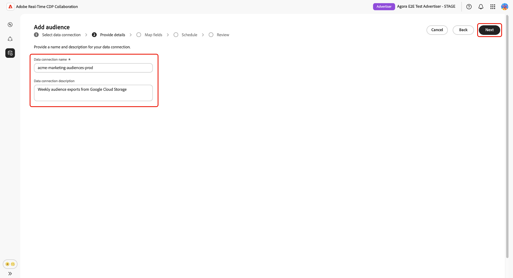

# Konfigurieren von [!DNL Google Cloud Storage] für die Zielgruppen-Beschaffung

Führen Sie die in diesem Handbuch beschriebenen Schritte aus, um Ihren [!DNL Google Cloud Storage] (GCS)-Bucket mit Adobe Real-Time CDP Collaboration zu verbinden und mit der Beschaffung von First-Party-Zielgruppendaten über die Benutzeroberfläche zu beginnen.

Verbinden Sie einen GCS-Bucket mit Collaboration, um First-Party-Zielgruppendaten direkt ohne technischen Support aufzunehmen. Sobald Collaboration verbunden ist, bezieht es Zielgruppen aus Ihrem Bucket in einem wiederkehrenden Zeitplan und stellt sie zur Aktivierung und Analyse von Überschneidungen in Ihren Kollaborationsprojekten bereit. Die Beschaffung Ihrer Zielgruppen ist ein erforderlicher Schritt, bevor Sie sie aktivieren oder in der Überschneidungsanalyse mit Partnern verwenden können.

In diesem Handbuch wird der End-to-End-Konfigurations-Workflow behandelt: Vorbereiten von Voraussetzungen, Authentifizieren Ihres GCS-Buckets, Überprüfen der automatisch zugeordneten Identitätsfelder, Planen der Datenaktualisierung und Bestätigen, dass die Beschaffung erfolgreich abgeschlossen wurde.

Zielgruppen, die von [!DNL Google Cloud Storage] bezogen werden, folgen denselben Governance- und Datenverarbeitungsregeln wie Zielgruppen, die von Adobe Experience Platform bezogen werden.

Andere verfügbare Quellmethoden sind [Experience Platform](./onboard-audiences.md), [Amazon S3](./configure-aws-s3-audience-sourcing.md), [Snowflake](./configure-snowflake-audience-sourcing.md) und [CSV-Datei-Upload](./upload-csv-audience-sourcing.md).

## Voraussetzungen {#prerequisites}

Füllen Sie alle Elemente in diesem Abschnitt aus, bevor Sie den Konfigurations-Workflow starten. Unvollständige Voraussetzungen sind der häufigste Grund dafür, dass die Einrichtung fehlschlägt oder Zielgruppen nach der Beschaffung nicht angezeigt werden. Bevor Sie dieses Handbuch befolgen, müssen Sie das [Onboarding und Einrichten von Konten“ &#x200B;](./onboard-account.md) haben.

Einige Schritte in diesem Abschnitt erfordern eine Aktion durch einen [!DNL Google Cloud]. Wenn Sie nicht der [!DNL Google Cloud]-Administrator für Ihre Organisation sind, ermitteln Sie die entsprechende Person, bevor Sie beginnen.

### GCS-Zugriff und -Berechtigungen {#gcs-access-permissions}

Bevor Sie fortfahren, bestätigen Sie Folgendes mit Ihrem [!DNL Google Cloud]:

* Adobe erhielt die Berechtigungen, die zum Authentifizieren gegenüber Ihrem GCS-Bucket und zum Lesen von Zielgruppendateien erforderlich sind. Schrittweise Anweisungen finden Sie im Abschnitt [Einrichten von Berechtigungen](#setup-gcs-permissions).
* [!DNL Google Cloud Storage] Zielgruppen-Sourcing ist in Ihrer Region verfügbar. Die Verfügbarkeit variiert je nach Region (NA, EMEA, ANZ). Wenn die GCS-Beschaffung in Ihrer Region noch nicht verfügbar ist, wenden Sie sich an Ihren Adobe-Kundenbetreuer, um einen Zeitplan zu bestätigen.

### Zielgruppendaten vorbereiten {#prepare-audience-data}

Ihre Zielgruppendateien müssen der **[Zielgruppen-Beschaffungsspezifikation (v1.2) entsprechen](../../assets/quick-start/RTCDP_Collaboration_Audience_Sourcing_Spec_v1.2.pdf)** bevor die Beschaffung beginnt. Die Spezifikation enthält die vollständige Schemadefinition sowie Beispiele auf Feldebene. Zu den wichtigsten Anforderungen gehören:

* **Dateiformat:** CSV, wobei Kommas als Feldtrennzeichen und senkrechte Striche (`|`) als Trennzeichen für mehrere Werte innerhalb eines einzelnen Felds verwendet werden.
* **Erforderliche Felder** Jeder Datensatz muss eine `AUDIENCE_ID` Spalte und mindestens eine unterstützte Spalte für Übereinstimmungsschlüssel enthalten.
* **Unterstützte Übereinstimmungsschlüssel:** `HASHED_EMAIL_SHA_256`, `HASHED_PHONE_SHA_256`, `HASHED_IPV4_SHA_256`, `CRM_ID`, `LOYALTY_ID`, `ADFIXUS_ID`.
* **Hash-Anforderungen:** Alle Übereinstimmungsschlüsselwerte müssen vor dem Hochladen gekürzt, in Kleinbuchstaben geschrieben und SHA256-gehasht werden. Collaboration hasht oder normalisiert Daten nicht vor der Aufnahme.
* **Spaltenkonsistenz:** Ihr Bucket mehrere Zielgruppendateien enthält, müssen alle Dateien identische Spaltenstrukturen verwenden.

Alle Übereinstimmungsschlüssel, die in Ihren Zielgruppendateien vorhanden sind, müssen auch für Ihr Collaboration-Konto aktiviert werden. Informationen zum Hinzufügen oder Aktivieren von Übereinstimmungsschlüsseln finden Sie [Einrichten von Übereinstimmungsschlüsseln](./onboard-account.md#set-up-match-keys).

### Vor dem Start erforderliche Werte {#required-values}

Halten Sie die folgenden Werte bereit, bevor Sie den Konfigurationsassistenten starten.

| Wert | Beschreibung |
| --- | --- |
| **[!UICONTROL Bucket]** | Der Name des [!DNL Google Cloud Storage]-Buckets, der Ihre Zielgruppendateien enthält. |
| **[!UICONTROL Pfad]** | Das Pfadpräfix innerhalb des Buckets, in dem Ihre Zielgruppendateien gespeichert werden (z. B. `sourcing/testdata/path1/`). |

## Konfigurieren der [!DNL Google Cloud Storage] {#configure-gcs-connection}

Der Konfigurations-Workflow ist ein mehrstufiger Assistent im **[!UICONTROL Setup]**-Arbeitsbereich. Führen Sie die einzelnen Schritte nacheinander aus. Sie können zu jedem Schritt zurückkehren, indem Sie auf dem letzten Überprüfungsbildschirm das Stiftsymbol verwenden, bevor Sie die Verbindung erstellen.

### Neue Datenverbindung hinzufügen {#add-data-connection}

Wählen Sie auf der Registerkarte **[!UICONTROL Meine]**&quot; im **[!UICONTROL Setup]**-Arbeitsbereich das Symbol zum Hinzufügen aus () und wählen Sie dann **[!UICONTROL Audience]** aus.

Wenn dies Ihre erste Zielgruppe ist, können Sie auch die Option **[!UICONTROL Hinzufügen]** auswählen.

Der Workflow „Zielgruppe hinzufügen“ wird angezeigt. Wählen Sie **[!UICONTROL Neue Datenverbindung hinzufügen]** und dann **[!UICONTROL Weiter]** aus.

{zoomable="yes"}

### Auswählen von [!DNL Google Cloud Storage] als Datenquelle {#select-gcs}

>[!CONTEXTUALHELP]
>id="rtcdp_collaboration_audience_sourcing_specifications_gcs"
>title="Daten für das Onboarding vorbereiten"
>abstract="Lesen Sie das Handbuch zur Spezifikation der Zielgruppenerfassung, um zu erfahren, wie Sie Zielgruppendaten aus Google Cloud Storage für Collaboration formatieren und strukturieren."
>additional-url="https://www.adobe.com/go/rtcdp-collaboration-audience-sourcing" text="Siehe das Handbuch zur Spezifikation der Zielgruppenerfassung"

Im Bildschirm zur Auswahl der Datenquelle werden alle verfügbaren Verbindungstypen aufgelistet. Wählen Sie **[!UICONTROL Google Cloud Storage]** und dann **[!UICONTROL Weiter]** aus.

Ein vorausgesetztes Dialogfeld, in dem die erforderlichen Konfigurationsschritte (z. B. GCS-Bucket-Einrichtung und IAM-Rollenzuweisung) beschrieben werden, wird angezeigt. Außerdem wird darauf hingewiesen, dass die Daten der **[[!UICONTROL Audience Sourcing Specification) entsprechen]](../../assets/quick-start/RTCDP_Collaboration_Audience_Sourcing_Spec_v1.2.pdf)**. Wählen Sie **[!UICONTROL Onboarding starten]**, um die Einhaltung der Vorgaben zu bestätigen, bevor Sie fortfahren.

### [!DNL Google Cloud Storage] Verbindungsdetails eingeben {#authenticate-gcs-connection}

>[!CONTEXTUALHELP]
>id="rtcdp_collaboration_audience_sourcing_gcs"
>title="Zielgruppe aus dem Google Cloud-Speicher hinzufügen"
>abstract="Um Ihren Google Cloud-Speicher zu verbinden, autorisieren Sie den Service-Benutzer von Adobe, Ihre Zielgruppendaten zur Verarbeitung abzurufen. Führen Sie die in Experience League beschriebenen Schritte aus, um Adobe Zugriff auf Ihren Google Cloud-Speicher zu gewähren."

Geben Sie die Details an, die erforderlich sind, damit Collaboration auf Ihren [!DNL Google Cloud Storage]-Bucket zugreifen kann. Klicken Sie nach Eingabe der erforderlichen Informationen auf **[!UICONTROL Weiter]**.

| Feld | Beschreibung |
| --- | --- |
| **[!UICONTROL Bucket]** | Der Name Ihres [!DNL Google Cloud Storage]. Siehe [Vor Beginn erforderliche Werte](#required-values). |
| **[!UICONTROL Pfad]** | Das Pfadpräfix innerhalb des Buckets, in dem Ihre Zielgruppendateien gespeichert werden. |

### Einverständnis und Bestätigung der Datennutzung bestätigen {#confirm-consent}

Sie müssen bestätigen, dass Einverständnis-Opt-outs aus den Zielgruppendaten entfernt wurden, bevor Collaboration sie verarbeiten kann. Wenn Sie sich nicht sicher sind, ob Ihre Daten diese Anforderung erfüllen, lesen Sie das Handbuch [Governance-Richtlinie und Durchsetzungsaktionen](./onboard-audiences.md#governance-policy-and-enforcement-actions) , bevor Sie fortfahren. Aktivieren Sie das Bestätigungs-Kontrollkästchen und klicken Sie dann auf **[!UICONTROL OK]**, um fortzufahren.

### Angeben von Verbindungsdetails {#provide-connection-details}

Geben Sie einen Namen und eine optionale Beschreibung für diese Datenverbindung ein. Der von Ihnen angegebene Name wird auf der Registerkarte **[!UICONTROL Meine Datenverbindungen]** angezeigt und hilft bei der Unterscheidung dieser Quelle, wenn Sie mehrere Datenverbindungen verwalten.

* **[!UICONTROL Name der Datenverbindung]** (erforderlich)
* **[!UICONTROL Beschreibung der Datenverbindung]** (optional)

Klicken Sie auf **[!UICONTROL Weiter]**, um fortzufahren.

### Überprüfen der automatisch zugeordneten Identitätsfelder {#auto-mapped-fields}

Der **[!UICONTROL Zuordnung]** ist schreibgeschützt. Collaboration ordnet Quell-Identitätsfelder aus Ihren Zielgruppendateien automatisch Zielfeldern zu, basierend auf den in der Spezifikation für die Zielgruppenbeschaffung definierten Spaltennamen. Zu diesem Zeitpunkt können Sie keine zugeordneten Felder hinzufügen, entfernen oder Umwandlungen auf sie anwenden.

>[!TIP]
>
>Wählen Sie **[!UICONTROL Vorschau der Quelldaten]** aus, um ein Beispiel für Ihre Zielgruppendaten im Tabellenformat zu überprüfen, und wählen Sie dann **[!UICONTROL Schließen]** aus, um zum Zuordnungsbildschirm zurückzukehren.

{zoomable="yes"}

Vergewissern Sie sich, dass die angezeigten Zuordnungen die Felder in Ihren Zielgruppendateien widerspiegeln. Wenn dies nicht der Fall ist, stoppen und korrigieren Sie Ihre Dateien, um die [Audience Sourcing-Spezifikation](../../assets/quick-start/RTCDP_Collaboration_Audience_Sourcing_Spec_v1.2.pdf) einzuhalten, bevor Sie fortfahren. Klicken Sie auf **[!UICONTROL Weiter]**, um fortzufahren.

### Datenaktualisierung planen {#schedule-data-refresh}

Legen Sie in der **[!UICONTROL Zeitplan]**-Ansicht die Häufigkeit fest, mit der Collaboration aktualisierte Zielgruppendaten aus Ihrem GCS-Bucket abruft, und definieren Sie den aktiven Datumsbereich für die Beschaffung.

Verwenden Sie das **[!UICONTROL Häufigkeit]**-Dropdown, um festzulegen, wie oft Collaboration aktualisierte Zielgruppendaten aus Ihrem GCS-Bucket abruft. Die verfügbaren Intervalle reichen von **[!UICONTROL täglich]** bis **[!UICONTROL alle 6 Tage]**.

Geben Sie einen Datumsbereich in das Eingabefeld ein oder wählen Sie das Kalendersymbol aus, um das **[!UICONTROL Startdatum]** und **[!UICONTROL Enddatum]** für den aktiven Beschaffungszeitraum festzulegen. Wenn das Enddatum erreicht ist, wird der Sourcing-Vorgang eingestellt und zuvor bezogene Zielgruppen laufen ab und sind nicht mehr für die Verwendung in Kooperationsprojekten verfügbar.

>[!IMPORTANT]
>
>Legen Sie die Aktualisierungshäufigkeit fest, um mit der Rate abzugleichen oder die Rate nicht zu überschreiten, mit der Ihre zugrunde liegenden GCS-Zielgruppendaten aktualisiert werden. Das unterstützte Mindestaktualisierungsintervall beträgt einmal alle sechs Tage. Wenn Sie Ihre Daten häufiger aktualisieren, werden Collaboration-Guthaben verbraucht, ohne dass aktualisierte Ergebnisse generiert werden. Informationen zur Überwachung der Kreditnutzung finden Sie unter [Verfolgen der Kreditkonsumaktivität](./my-activity.md).

Klicken Sie auf **[!UICONTROL Weiter]**, um fortzufahren.

### Überprüfen und Abschließen der Verbindung {#review-and-complete}

Prüfen Sie die Konfigurationsübersicht, bevor Sie die Verbindung erstellen. Der Bildschirm Zusammenfassung zeigt die folgenden Abschnitte an:

* **[!UICONTROL Datenverbindung]**: Die GCS-Bucket-Anmeldedaten und der Ordnerpfad, die Sie konfiguriert haben.
* **[!UICONTROL Details]**: Name und optionale Beschreibung dieser Datenverbindung.
* **[!UICONTROL Zuordnung]**: Die automatisch zugeordneten Quell- und Zielidentitätsfelder.
* **[!UICONTROL Zeitplan]**: Aktualisierungshäufigkeit und aktiver Datumsbereich.

Wählen Sie das Stiftsymbol aus () neben einem beliebigen Abschnitt, um zu diesem Schritt zurückzukehren und Änderungen vorzunehmen. Wenn alle Abschnitte korrekt sind, wählen Sie **[!UICONTROL Abschließen]**.

Es wird ein Bestätigungsdialogfeld angezeigt, das angibt, dass Collaboration die Datenverbindung erstellt hat und dass die Zielgruppen-Beschaffung in Bearbeitung ist.

## Überprüfen der Quellzielgruppen {#review-sourced-audiences}

Nach Abschluss des Konfigurationsassistenten beginnt Collaboration mit der asynchronen Beschaffung von Zielgruppen aus Ihrem GCS-Bucket. Navigieren Sie zu **[!UICONTROL Setup]** > **[!UICONTROL Meine Zielgruppen]**, um den Fortschritt zu überwachen. Die Beschaffung wird nicht sofort abgeschlossen. Die erforderliche Zeit hängt von der Größe Ihrer Daten und der konfigurierten Aktualisierungshäufigkeit ab.

### Fortschritt der Zielgruppenbeschaffung überwachen {#monitor-sourcing-progress}

Während Collaboration Ihre Zielgruppendaten abruft, zeigt ein Banner oben im Arbeitsbereich **[!UICONTROL Meine Zielgruppen]** an, dass die Beschaffung gerade läuft. Einzelne Zielgruppen werden erst in der Liste angezeigt, nachdem die Beschaffung für jede Zielgruppe abgeschlossen ist.

>[!TIP]
>
>Die Zeit für die Zielgruppenbeschaffung hängt von der Größe Ihrer GCS-Daten und der konfigurierten Aktualisierungshäufigkeit ab. Größere Datensätze oder weniger häufige Aktualisierungszeitpläne können länger dauern, bis sie im Arbeitsbereich &quot;**[!UICONTROL Zielgruppen“]** werden.

### Anzeigen von Details zur Quellzielgruppe {#view-audience-details}

Nach Abschluss der Beschaffung werden Ihre [!DNL Google Cloud Storage] Zielgruppen auf der Registerkarte **[!UICONTROL Meine Zielgruppen]** neben Zielgruppen angezeigt, die aus anderen Verbindungen bezogen wurden. Wählen Sie ein Zeilenelement oder **[!UICONTROL Zielgruppe anzeigen]** aus, um die Detailansicht für eine bestimmte Zielgruppe zu öffnen.

In der Detailansicht werden der Status, die Quelle und der Name der Datenverbindung der Zielgruppe zusammen mit den folgenden Bedienfeldern angezeigt:

* **[!UICONTROL Identitäten]**: Die Gesamtzahl der Identitäten und die Aufschlüsselung für die Zielgruppe, sobald Daten verfügbar sind.
* **[!UICONTROL Kategorien]**: Alle Tags, die zum Organisieren oder Filtern der Zielgruppe angewendet werden.
* **[!UICONTROL Verbindungszugriff]**: Ob die Zielgruppe privat, öffentlich oder für bestimmte Mitarbeiter freigegeben ist.
* **[!UICONTROL Metadatensichtbarkeit]**: Welche Zielgruppeninformationen (z. B. Anzahl der Identitäten, Überschneidungsprozentsatz und Index) für die Mitarbeiter sichtbar sind.

Überprüfen Sie diese Einstellungen, bevor Sie die Zielgruppe in einem Collaboration-Projekt verwenden. Informationen zum Aktualisieren von Kategorien, Verbindungszugriff oder Metadatensichtbarkeit finden Sie unter [Anzeigen und Verwalten einzelner Zielgruppen](./onboard-audiences.md#view-individual-audiences).

### Audience-Einstellungen bearbeiten {#edit-audience-settings}

Sie können Zielgruppen-Metadaten direkt in der Listenansicht **[!UICONTROL Meine Zielgruppen]** bearbeiten, ohne die Detailansicht zu öffnen. Aktivieren Sie das Kontrollkästchen einer Audience, um die Aktionssymbolleiste anzuzeigen, und wählen Sie dann eine Aktion aus: **[!UICONTROL Bearbeiten der Metadatensichtbarkeit]**, **[!UICONTROL Bearbeiten des Verbindungszugriffs]**, **[!UICONTROL Bearbeiten des Namens und der Beschreibung]**, **[!UICONTROL Bearbeiten der Kategorien]** oder **[!UICONTROL Löschen]**.

### Anzeigen der GCS-Datenverbindung {#view-gcs-connection}

Um die Verbindung selbst, einschließlich der Übereinstimmungsschlüssel und der Planung, zu überprüfen oder zu verwalten, navigieren Sie **[!UICONTROL Setup]** > **[!UICONTROL Meine Datenverbindungen]**. Ihre neue GCS-Verbindung ist dort sofort verfügbar. Die Zielgruppenquelle wird als **[!UICONTROL Google Cloud-Speicher]** angezeigt.

## Bekannte Einschränkungen {#known-limitations}

Beachten Sie die folgenden Einschränkungen bei der Konfiguration und Verwendung [!DNL Google Cloud Storage] Zielgruppen-Sourcing:

* **Einschränkungen für Übereinstimmungsschlüssel:** Sobald ein Übereinstimmungsschlüssel für eine Datenverbindung aktiviert ist, kann er nicht mehr entfernt werden. Sie können Übereinstimmungsschlüssel zu einer vorhandenen Verbindung hinzufügen, sie jedoch nicht deaktivieren oder löschen. Um die aktiven Übereinstimmungsschlüssel zu ändern, müssen [die Datenverbindung löschen](./manage-data-connection.md#delete-data-connection) und eine neue erstellen.
* **Eine aktive Datenverbindung pro Quelle:** Es wird jeweils nur eine aktive [!DNL Google Cloud Storage] unterstützt. Wenn Sie Zielgruppen aus einem anderen Bucket beziehen müssen, [&#x200B; Sie (die vorhandene Verbindung löschen](./manage-data-connection.md#delete-data-connection) und erstellen Sie eine neue, die auf den neuen Bucket verweist.
* **Unterstützung von Unterordnern:** Zielgruppendateien müssen sich direkt im angegebenen Ordnerpfad befinden. Collaboration durchläuft keine Unterordner innerhalb dieses Pfads.

## Fehlerbehebung {#troubleshooting}

Verwenden Sie diesen Abschnitt, um Probleme zu beheben, die nach dem Herstellen der ersten Verbindung auftreten. Überprüfen Sie Ihre Anmeldeinformationen und Bucket-Berechtigungen auf Fehler, die während der Authentifizierung auftreten, oder wenden Sie sich an Ihren Administrator.

**Zielgruppen werden nicht angezeigt oder die Beschaffung dauert länger als erwartet**

* Die Beschaffungszeit skaliert anhand des Datenvolumens und der konfigurierten Aktualisierungshäufigkeit. Bei großen Datensätzen ist eine längere Verarbeitungszeit zu erwarten.
* Wenn Zielgruppen nicht innerhalb von 24 Stunden angezeigt werden, stellen Sie sicher, dass Ihre Zielgruppendateien unter dem Ordnerpfad vorhanden sind, den Sie beim Setup angegeben haben, und halten Sie die Zielgruppen-Beschaffungsspezifikation ein.
* Überprüfen Sie die Registerkarte **[!UICONTROL Meine Datenverbindungen]** auf Fehleranzeigen für die Verbindung.
* Wenn das Problem nach Abschluss dieser Schritte weiterhin besteht, wenden Sie sich an den Kunden-Support von Adobe und geben Sie den Namen der Datenverbindung und die Details des Buckets an.

**Die Datenverbindung zeigt nach anfänglichem Erfolg den Status Fehlgeschlagen an**

* Vergewissern Sie sich, dass sich die Berechtigungen und Anmeldeinformationen des GCS-Buckets seit der Erstellung der Verbindung nicht geändert haben. Jede Änderung, die den Zugriff von Adobe auf den Bucket entfernt, führt dazu, dass nachfolgende Sourcing-Ausführungen fehlschlagen.
* Stellen Sie sicher, dass im konfigurierten Ordnerpfad noch Zielgruppendateien vorhanden sind und der Zielgruppen-Beschaffungsspezifikation entsprechen.
* Wenn das Problem nach der Bestätigung der Berechtigungen und der Dateiverfügbarkeit weiterhin besteht, [löschen Sie die Verbindung](./manage-data-connection.md#delete-data-connection) und erstellen Sie eine neue, oder wenden Sie sich an den Adobe-Support.

**Bei einer geplanten Aktualisierung treten Fehler im Zielgruppendateiformat auf**

* Vergewissern Sie sich, dass die aktualisierten Dateien im Bucket die Spaltenstruktur und die Feldanforderungen in der [Zielgruppen-Beschaffungsspezifikation) &#x200B;](../../assets/quick-start/RTCDP_Collaboration_Audience_Sourcing_Spec_v1.2.pdf).
* Stellen Sie sicher, dass alle Dateien im konfigurierten Ordnerpfad identische Spaltenstrukturen verwenden. Dateien mit gemischten Formaten im selben Pfad können zu partiellen Quellfehlern führen.

## Einrichten von [!DNL Google Cloud Storage] {#setup-gcs-permissions}

[!DNL Google Cloud Storage] bietet eine sichere, skalierbare Möglichkeit, Ihre Daten in der Cloud zu speichern und darauf zuzugreifen. Damit Adobe aus Ihren GCS-Buckets lesen kann, müssen Sie die entsprechenden IAM-Berechtigungen (Identity and Access Management) und den Zugriff auf Service-Konten in Ihrem [!DNL Google Cloud]-Konto konfigurieren.

### Erfassen der [!DNL Google Service Account] von Adobe {#collect-account-information}

Um zu beginnen, notieren Sie sich die [!DNL Google Service Account] für Adobe, die Ihrer Region entspricht. Sie benötigen diese Informationen, um Adobe in späteren Schritten Zugriff zu gewähren.

| Region | [!DNL Google Service Account] |
| ------------- | --------------- |
| Nordamerika | `kk9930000@va3-22da.iam.gserviceaccount.com` |
| EMEA | `kze830000@sfc-eufrankfurt-1-g4a.iam.gserviceaccount.com` |
| Australien | `knhv20000@sfc-au-1-nla.iam.gserviceaccount.com` |

{style="table-layout:auto"}

### Einrichten der IAM-Rolle {#setup-iam-role}

>[!IMPORTANT]
>
>Sie müssen **Konto-Admin** in Ihrem [!DNL Google Cloud]-Konto haben, um diese Einrichtung abzuschließen. Wenn Sie nicht über diese Berechtigungen verfügen, wenden Sie sich an Ihren Administrator, bevor Sie fortfahren.

Gehen Sie wie folgt vor, um eine benutzerdefinierte IAM-Rolle mit den erforderlichen Berechtigungen zu erstellen und sie dem Adobe-Service-Konto zuzuweisen. Dadurch wird sichergestellt, dass Adobe sicheren Zugriff auf Ihre GCS-Zielgruppendaten hat.

#### IAM-Rolle erstellen {#create-iam-role}

Erstellen Sie zunächst eine benutzerdefinierte IAM-Rolle in Ihrem [!DNL Google Cloud]-Projekt mit den erforderlichen Berechtigungen, um sie Adobe zuzuweisen.

Navigieren Sie auf der **[!DNL IAM & Admin]** Seite der [[!DNL Google Cloud] Konsole](https://console.cloud.google.com) zu **[!DNL Roles]** und wählen Sie **[!DNL Create role]** aus. Geben Sie die erforderlichen Informationen wie den Titel und die ID für Ihre neue Rolle ein.

Fügen Sie dann der Rolle die folgenden Berechtigungen hinzu:

| Berechtigung | Zweck |
| ------------- | --------------- |
| `storage.buckets.get` | Lesen von Bucket-Metadaten. |
| `storage.objects.get` | Lesen von Objektdaten und Metadaten. |
| `storage.objects.list` | Listen Sie Objekte in einem Bucket auf. |

{style="table-layout:auto"}

Weitere Informationen zu Berechtigungen finden Sie unter [GCS IAM-Berechtigungen](https://cloud.google.com/storage/docs/access-control/iam-permissions). Eine schrittweise Anleitung finden Sie unter [Erstellen benutzerdefinierter Rollen](https://docs.cloud.google.com/iam/docs/creating-custom-roles).

#### Zuweisen der IAM-Rolle zu Adobe {#assign-role}

Öffnen Sie als Nächstes die [**[!DNL Buckets]**&#x200B;Seite &#x200B;](https://console.cloud.google.com/storage/browser) der [!DNL Google Cloud Console] und wählen Sie den Bucket aus, der Ihre Zielgruppendaten enthält.

Navigieren Sie zur Registerkarte **[!DNL Permissions]** , wählen Sie **[!DNL View by principals]** und dann **[!DNL Grant access]** aus.

Fügen Sie im Dialogfeld &quot;**[!DNL Add principals]**&quot; das [Adobe Google-](#collect-account-information) als Prinzipal hinzu und weisen Sie die zuvor erstellte benutzerdefinierte IAM-Rolle zu. Wählen Sie **[!DNL Save]** aus, um die Einrichtung zu bestätigen.

Adobe hat jetzt im ausgewählten GCS-Bucket sicheren Zugriff auf Ihre Zielgruppendaten. Überprüfen Sie alle zusätzlichen [Voraussetzungen](#prerequisites) nach Bedarf oder fahren Sie mit dem [Beschaffen von Zielgruppen aus GCS in Collaboration&quot; &#x200B;](#configure-gcs-connection).

#### [!DNL Google Cloud Storage] erfassen {#collect-gcs-details}

Sammeln Sie abschließend die Details für Ihren GCS-Bucket, wie in der folgenden Tabelle dargestellt. Sie benötigen diese Informationen, um die Verbindung zwischen Ihrem GCS und Collaboration herzustellen.

| Feld | Beschreibung | Beispiel |
|------ |------------ |-------- |
| [!DNL Bucket] | Der genaue Name des [!DNL Google Cloud Storage]-Buckets, der Ihre Zielgruppendateien enthält. | `customer-data-bucket` |
| [!DNL Path] | Das Pfadpräfix innerhalb des Buckets, in dem Ihre Zielgruppendateien gespeichert werden. Muss mit `/` enden, um alle Dateien zu lesen. | `sourcing/testdata/path1/` |

{style="table-layout:auto"}

## Nächste Schritte {#next-steps}

Sie haben [!DNL Google Cloud Storage] als Datenquelle in Collaboration konfiguriert. Nach Abschluss der Beschaffung sind Ihre Zielgruppen im Arbeitsbereich **[!UICONTROL Meine Zielgruppen]** verfügbar und können in Kooperationsprojekten verwendet werden.

Hier sind die folgenden Aktionen möglich:

* [Erstellen und Verwalten von Kollaborationsprojekten](../collaborate/manage-projects.md)
* [Aktivieren von Audiences in einem Projekt](../collaborate/activate.md)
* [Überschneidungen überprüfen und Leistung messen](../collaborate/measure.md)
* [Verwalten von Zielgruppeneinstellungen und Sichtbarkeit](./onboard-audiences.md#view-individual-audiences)
* [Übereinstimmungsschlüssel und Zeitplan dieser Datenverbindung verwalten](./manage-data-connection.md)

Weitere Methoden zur Zielgruppen-Beschaffung finden Sie unter:

* [Konfigurieren  [!DNL Amazon S3]  Zielgruppen-Sourcing](./configure-aws-s3-audience-sourcing.md)
* [Konfigurieren  [!DNL Snowflake]  Zielgruppen-Sourcing](./configure-snowflake-audience-sourcing.md)
* [Source-Zielgruppen aus Experience Platform](./onboard-audiences.md)
* [Hochladen einer CSV-Datei für die Zielgruppen-Beschaffung](./upload-csv-audience-sourcing.md)
