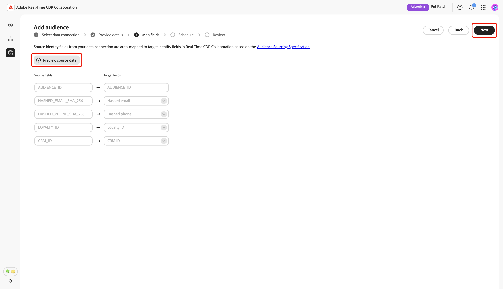
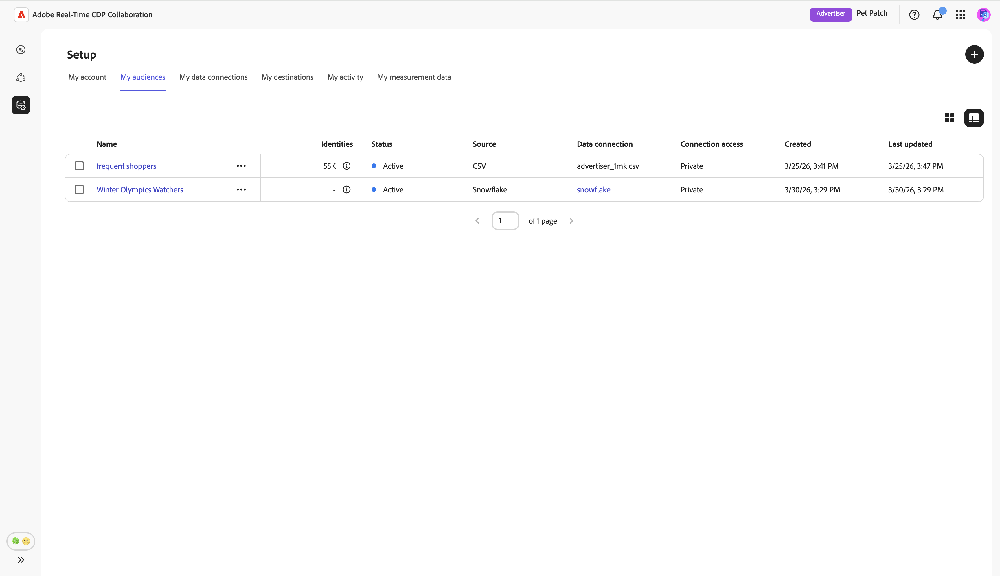

# Konfigurieren von [!DNL Snowflake] für die Zielgruppen-Beschaffung

Erfahren Sie, wie Sie Ihre [!DNL Snowflake Secure Data Share] in der Adobe Real-Time CDP Collaboration-Benutzeroberfläche konfigurieren und verbinden, um Zielgruppendaten für die Aktivierung und Überschneidungsanalyse zu beziehen.

## Überblick {#overview}

[!DNL Snowflake] ist eine der unterstützten Optionen für die Beschaffung von First-Party-Zielgruppendaten in Collaboration. Andere verfügbare Methoden umfassen die Beschaffung von Zielgruppen aus [Experience Platform](./onboard-audiences.md), das Verbinden eines [[!DNL AWS S3] Buckets](./configure-aws-s3-audience-sourcing.md) oder das Hochladen einer [CSV-Datei](./upload-csv-audience-sourcing.md).

Gehen Sie wie folgt vor, um Ihre [!DNL Snowflake Secure Data Share] zu verbinden und Ihre Zielgruppendaten in Collaboration zu beziehen. Nach Abschluss des Setups können Sie Ihre Zielgruppen aus der Quelle für Ihre Kooperationsprojekte überprüfen, aktivieren und verwalten.

## Voraussetzungen {#prerequisites}

Bevor Sie Ihre [!DNL Snowflake]-Verbindung konfigurieren, stellen Sie sicher, dass Sie die folgenden Voraussetzungen erfüllen:

* Sie haben ein [!DNL Snowflake Share] erstellt und in Ihrem [!DNL Snowflake]-Konto die erforderlichen Berechtigungen eingerichtet, um Adobe Zugriff auf Ihre [!DNL Snowflake Secure Data Share] zu gewähren. Erfahren Sie [Konfigurieren von  [!DNL Snowflake] -Berechtigungen](#set-up-snowflake-permissions).
* Sie haben die folgenden [!DNL Snowflake Share]:

   * **Freigabename**
   * **Kontokennung**
   * **Schema**
   * **Ansicht**

* Die Zielgruppendaten in Ihrem [!DNL Snowflake Secure Data Share] müssen die Formatanforderungen erfüllen, die im Handbuch [Zielgruppen-Beschaffungsspezifikation (v1.3)](../../assets/quick-start/RTCDP_Collaboration_Audience_Sourcing_Spec_v1_3.pdf)beschrieben sind.
* Alle Übereinstimmungsschlüssel in Ihrer [!DNL Snowflake] Zielgruppendatei müssen auch für Ihr Collaboration-Konto aktiviert werden. Erfahren Sie, wie [Übereinstimmungsschlüssel aktivieren](./onboard-account.md#set-up-match-keys) oder [neue Übereinstimmungsschlüssel hinzufügen](./onboard-account.md#edit-match-keys) zu Ihrem Konto hinzufügen.

## Einrichten von [!DNL Snowflake] {#setup-snowflake-permissions}

[!DNL Snowflake Secure Data Share] bietet die Möglichkeit, Live- und schreibgeschützte Daten sicher zwischen [!DNL Snowflake] Konten freizugeben, ohne dass die Daten kopiert oder verschoben werden müssen. Um Adobe Zugriff auf Ihre [!DNL Secure Data Share] zu gewähren, konfigurieren Sie die entsprechenden Berechtigungen in Ihrem [!DNL Snowflake].

Bevor Sie fortfahren, stellen Sie Folgendes sicher:

* Sie haben Zugriff auf ein [!DNL Snowflake].
* Ihr [!DNL Snowflake]-Konto hat private Listeneinträge abonniert. Sie benötigen Administratorrechte für Snowflake, um die erforderlichen Berechtigungen zu konfigurieren.
* Sie kennen den Cloud-Anbieter und die Region Ihres [!DNL Snowflake]-Kontos.

Weitere Informationen zu den [[!DNL Snowflake]  Berechtigungen finden &#x200B;](https://docs.snowflake.com/en/collaboration/consumer-listings-access#access-a-private-listing) in der Dokumentation .

### Erfassen von [!DNL Snowflake]-Kontoinformationen von Adobe {#collect-account-information}

Suchen Sie zunächst die Adobe [!DNL Snowflake]-Kontokennung, die Ihrer Region entspricht, und notieren Sie sie. Sie benötigen diese Kennung, um in späteren Schritten Zugriff auf Adobe zu gewähren.

| Region | Vollständige Kennung [!DNL Snowflake] Produktionskontos |
| ------------- | --------------- |
| Nordamerika | ADOBE.AGORA_SF_02 |
| EMEA | ADOBE.RTCDP_COLLABORATION_DEU1_EXTERNAL |
| Australien | ADOBE.RTCDP_COLLABORATION_AUS3_EXTERNAL |

{style="table-layout:auto"}

### Erstellen und Gewähren von Zugriff auf [!DNL Snowflake Share] {#create-grant-access-to-share}

Führen Sie anschließend die folgenden Schritte aus, um einen [!DNL Secure Data Share] in Ihrem [!DNL Snowflake]-Konto zu erstellen und Adobe schreibgeschützten Zugriff auf Ihre Zielgruppendaten zu gewähren.

1. Erstellen Sie eine sichere Ansicht mit eingeschränktem Zugriff nur auf die erforderlichen Spalten aus Ihrer Quelltabelle.

   ```sql
   CREATE OR REPLACE SECURE VIEW my_database.my_schema.secure_view_for_adobe AS
   SELECT 
       column1,
       column2,
       column3
   FROM my_database.my_schema.source_table;
   ```

2. Erstellen Sie eine neue [!DNL Snowflake Secure Data Share].

   ```sql
   CREATE OR REPLACE SHARE adobe_data_share;
   ```

3. Gewähren Sie dem [!DNL Snowflake Secure Data Share] Nutzungsrechte für die Datenbank, damit er auf Objekte in der Datenbank zugreifen kann.

   ```sql
   GRANT USAGE ON DATABASE my_database TO SHARE adobe_data_share;
   ```

4. Gewähren Sie dem [!DNL Snowflake Secure Data Share] NUTZUNG für das Schema , damit es auf Objekte innerhalb des Schemas zugreifen kann.

   ```sql
   GRANT USAGE ON SCHEMA my_database.my_schema TO SHARE adobe_data_share;
   ```

5. Gewähren Sie SELECT-Berechtigungen für die sichere Ansicht des [!DNL Snowflake Secure Data Share], damit Adobe Ihre Zielgruppendaten lesen kann.

   ```sql
   GRANT SELECT ON VIEW my_database.my_schema.secure_view_for_adobe TO SHARE adobe_data_share;
   ```

6. Fügen Sie das [!DNL Snowflake]-Konto von Adobe zur [!DNL Snowflake Secure Data Share] hinzu, indem Sie die richtige Kennung für Ihre Region verwenden. Siehe [die obige Tabelle zur Regions-/Kontozuordnung](#collect-account-information).

   ```sql
   ALTER SHARE adobe_data_share ADD ACCOUNTS = <Account Identifier based on region from the mapping table>;
   ```

### [!DNL Snowflake Share] erfassen {#collect-share-details}

Sammeln Sie abschließend die Details für Ihre [!DNL Snowflake Share], wie in der folgenden Tabelle dargestellt. Sie benötigen diese Informationen, um die Verbindung zwischen Ihrer [!DNL Snowflake Share] und Collaboration herzustellen.

| Feld | Beispiel |
| -------------------------- | --------------- |
| Kontokennung | CUSTOMER_ORG.CUSTOMER_SNOWFLAKE_ACCOUNT |
| [!DNL Share] | adobe_data_share |
| Schemaname | customer_schema |
| Ansichtsname | secure_view_for_adobe |

{style="table-layout:auto"}

## Konfigurieren der [!DNL Snowflake] {#configure-snowflake-connection}

Nachdem Sie die [Snowflake-Berechtigungskonfiguration abgeschlossen &#x200B;](#set-up-snowflake-permissions) und sichergestellt haben[&#x200B; dass alle &#x200B;](#prerequisites) erfüllt sind, können Sie Ihre [!DNL Snowflake Secure Data Share] jetzt mit Collaboration verbinden, um mit der Beschaffung Ihrer Zielgruppen zu beginnen.

Wählen Sie auf der Registerkarte **[!UICONTROL Meine]**&quot; im **[!UICONTROL Setup]**-Arbeitsbereich das Symbol zum Hinzufügen aus () und wählen Sie dann **[!UICONTROL Audience]** aus.

Wenn dies Ihre erste Zielgruppe ist, können Sie auch die Option **[!UICONTROL Zielgruppe hinzufügen]** auswählen.


Der Workflow „Zielgruppe hinzufügen“ wird angezeigt. Wählen Sie **[!UICONTROL Neue Datenverbindung hinzufügen]** und dann **[!UICONTROL Weiter]** aus.

{zoomable="yes"}

### [!DNL Snowflake] als Datenverbindung auswählen {#select-snowflake}

Wählen Sie als Nächstes **[!UICONTROL Snowflake]** als Datenverbindung aus, gefolgt von **[!UICONTROL Weiter]**.

![Der Bildschirm zur Auswahl der Datenverbindung mit [!DNL Snowflake] als auswählbare Option.](../../assets/setup/snowflake-audience-sourcing/select-snowflake-data-connection.png)

### Überprüfen der Zielgruppendatei {#review-audience-file}

>[!CONTEXTUALHELP]
>id="rtcdp_collaboration_audience_sourcing_specifications_snowflake"
>title="Daten für das Onboarding vorbereiten"
>abstract="Lesen Sie das Handbuch zur Spezifikation der Zielgruppenerfassung, um zu erfahren, wie Sie Zielgruppendaten aus Snowflake für Collaboration formatieren und strukturieren."
>additional-url="https://www.adobe.com/go/rtcdp-collaboration-audience-sourcing" text="Siehe Handbuch"

Es wird ein Dialogfeld angezeigt, in dem die Anforderungen der [!DNL Snowflake Share] und der [!DNL Snowflake] Zielgruppendatei erläutert werden, bevor Sie mit der Beschaffung beginnen können. Stellen Sie sicher, dass Ihr [!DNL Snowflake Share] mit dem richtigen Freigabenamen, der richtigen Kontokennung, dem richtigen Schema und der richtigen Ansicht erstellt wird. Um sicherzustellen, dass Ihre Zielgruppendaten für die Verwendung in Collaboration korrekt formatiert und strukturiert sind, lesen Sie das Handbuch **[[!UICONTROL Zielgruppen-Beschaffungsspezifikation]](../../assets/quick-start/RTCDP_Collaboration_Audience_Sourcing_Spec_v1_3.pdf)**.

Wählen Sie nach Abschluss die Option **[!UICONTROL Onboarding starten]**.

![Bereiten Sie Ihre [!DNL Snowflake Share] für das Onboarding-Dialogfeld mit einem Link zu den Spezifikationen für die Zielgruppenbeschaffung vor.](../../assets/setup/snowflake-audience-sourcing/prepare-snowflake-share-onboarding-dialog.png)

### Authentifizieren [!DNL Snowflake Share] Verbindung {#authenticate-snowflake-share-connection}

>[!CONTEXTUALHELP]
>id="rtcdp_collaboration_audience_sharing_snowflake"
>title="Zielgruppe aus Snowflake hinzufügen"
>abstract="Um Ihre Snowflake-Freigabe zu verbinden, autorisieren Sie den Service-Benutzer von Adobe, Ihre Zielgruppendaten zur Verarbeitung abzurufen. Führen Sie die in Experience League beschriebenen Schritte aus, um Adobe Zugriff auf Ihre Snowflake-Freigabe zu gewähren."

In diesem Schritt müssen Sie die erforderlichen [!DNL Snowflake Share]-Anmeldeinformationen angeben, um Ihre [!DNL Snowflake Share] mit Collaboration zu verbinden:

| Feld | Beschreibung | Beispiel |
|--------------------|-------------|------------------------------|
| Freigabename | Der Name Ihres [!DNL Snowflake Share]. | `ADOBE_DATA_SHARE` |
| Kontokennung | Die eindeutige Kennung Ihres Snowflake-Kontos. | `CUSTOMER_ORG.CUSTOMER_SNOWFLAKE_ACCOUNT` |
| Schema | Das Schema in Ihrer [!DNL Snowflake Share], das Ihre Zielgruppendaten enthält. | `CUSTOMER_SCHEMA` |
| Ansicht | Der tatsächliche Datensatz, den Collaboration Zielgruppendaten abruft. | `SECURE_VIEW_FOR_ADOBE` |

{style="table-layout:auto"}

Nachdem Sie alle erforderlichen Anmeldeinformationen eingegeben haben, klicken Sie auf **[!UICONTROL Weiter]**.

![Das [!DNL Snowflake Share]-Verbindungsformular mit ausgefüllten Feldern Freigabename, Kontokennung, Schema und Ansicht und der hervorgehobenen Schaltfläche Weiter.](../../assets/setup/snowflake-audience-sourcing/snowflake-authentication-credentials-form.png)

Unten auf der nächsten Seite wird ein Bestätigungsdialogfeld angezeigt, in dem bestätigt wird, dass Ihre [!DNL Snowflake Share] erfolgreich mit Collaboration verbunden wurde.

![Ein Bestätigungsdialogfeld bestätigt, dass Ihre [!DNL Snowflake Share] erfolgreich hergestellt wurde.](../../assets/setup/snowflake-audience-sourcing/snowflake-share-connection-established.png)

### Name und Beschreibung angeben {#provide-name-description}

Geben **[!UICONTROL in der Ansicht]** Details angeben) einen beschreibenden Namen und eine optionale Beschreibung für Ihre [!DNL Snowflake] Datenverbindung ein. Wenn Sie fertig sind, wählen Sie **[!UICONTROL Weiter]** aus.


### Zuordnen von Feldern {#map-fields}

Der **[!UICONTROL Zuordnungsbildschirm]** ist derzeit schreibgeschützt. Sie können keine Umwandlungen hinzufügen, löschen oder anwenden. Collaboration ordnet Quell-Identitätsfelder aus Ihren [!DNL Snowflake Share] automatisch Zielfeldern zu, basierend auf der **[Audience Sourcing Specification (v1.3)](../../assets/quick-start/RTCDP_Collaboration_Audience_Sourcing_Spec_v1_3.pdf)**.

Bestätigen Sie die zugeordneten Felder visuell und wählen Sie **[!UICONTROL Weiter]** aus, um fortzufahren. Sie können mit der Option **[!UICONTROL Vorschau der Quelldaten“ auch eine Vorschau]** Beispieldaten aus Ihrer [!DNL Snowflake Share] anzeigen.



Wenn Sie eine Vorschau anzeigen, wird das Dialogfeld **[!UICONTROL [!DNL Snowflake Share]-Datenvorschau]** mit Beispieldaten im Tabellenformat angezeigt. Überprüfen Sie dies und wählen Sie dann **[!UICONTROL Schließen]** aus.

![[!DNL Snowflake Share] Dialogfeld für die Datenvorschau zeigt die Beispieldaten aus Ihrem [!DNL Snowflake Share] und die hervorgehobene Option „Schließen“.](../../assets/setup/snowflake-audience-sourcing/preview-source-data.png)

<!-- NOTE: Manual mapping will be available in the future. -->
<!-- In the **[!UICONTROL Map fields]** screen, you can use the **[!UICONTROL Source field]** and **[!UICONTROL Target field]** dropdowns to update the auto-mapped fields, or include additional fields with the **[!UICONTROL Add field]** option. Once finished, select **[!UICONTROL Next]**. -->

<!--  -->

### Aktualisierungshäufigkeit und Datumsbereich planen {#refresh-frequency-date-range}

Wählen Sie anschließend in der **[!UICONTROL Zeitplan]**-Ansicht im Dropdown-Menü die Aktualisierungshäufigkeit zwischen einem und sechs Tagen aus. Verwenden Sie dann das Kalendersymbol, um Start- und Enddaten für die Beschaffung der Zielgruppe anzugeben.

>[!IMPORTANT]
>
>Um Ihre Collaboration-Credits effektiv zu verwalten, legen Sie die Aktualisierungshäufigkeit so fest, dass sie mit der Aktualisierungshäufigkeit Ihrer zugrunde liegenden [!DNL Snowflake] übereinstimmt oder diese nicht überschreitet. Das unterstützte Mindestaktualisierungsintervall beträgt einmal alle sechs Tage.


### Überprüfen und Abschließen der Verbindung {#review-and-complete}

Überprüfen Sie abschließend Ihre Konfigurationseinstellungen im Bildschirm Zusammenfassung . Diese Ansicht enthält eine Zusammenfassung der folgenden Abschnitte:

* **[!UICONTROL Datenverbindung]**: Zeigt den Freigabenamen, die Kontokennung, das Schema und die Ansicht Ihrer [!DNL Snowflake Share] an.
* **[!UICONTROL Details]**: Zeigt den Namen und die optionale Beschreibung Ihrer Datenverbindung an, damit Sie sie später identifizieren können.
* **[!UICONTROL Zuordnung]**: Zeigt an, wie die Quellfelder aus Ihrer Zielgruppendatei den in Collaboration verwendeten Zielfeldern zugeordnet werden.
* **[!UICONTROL Zeitplan]**: Zeigt an, wie oft die Verbindung Zielgruppendaten aktualisiert, und den aktiven Datumsbereich für die Beschaffung.

Wählen Sie das Stiftsymbol () aus, wenn Sie einen Abschnitt bearbeiten müssen. Klicken Sie **[!UICONTROL Fertig stellen]**, um alle Abschnitte zu bestätigen.


Ein Bestätigungsdialogfeld bestätigt, dass die Datenverbindung erfolgreich erstellt wurde und die Zielgruppen-Beschaffung in Bearbeitung ist.

## Überprüfen der Quellzielgruppen {#review-sourced-audiences}

Nach Abschluss des Setups beginnt Collaboration mit dem Bezug von Zielgruppen aus Ihrer [!DNL Snowflake Share]. Wenn die Zielgruppen-Beschaffung bereits läuft, wird oben in der Ansicht ein Banner angezeigt.


>[!TIP]
>
>Die Zeit für die Zielgruppenbeschaffung hängt von der Größe Ihrer [!DNL Snowflake] und der konfigurierten Aktualisierungshäufigkeit ab. Größere Datensätze oder weniger häufige Aktualisierungszeitpläne können länger dauern, bis sie im Arbeitsbereich &quot;**[!UICONTROL Zielgruppen“]** werden.

Nach Abschluss der Beschaffung stehen Ihre Zielgruppen auf der Registerkarte **[!UICONTROL Meine Zielgruppen]** mit denselben Funktionen und Informationen wie Zielgruppen aus Experience Platform zur Verfügung.



Wählen Sie in der Rasteransicht oder Tabellenansicht ein Zeilenelement oder **[!UICONTROL Zielgruppe anzeigen]**, um eine Übersicht über eine bestimmte Zielgruppe zu erhalten. Darin werden der Status, die Quelle und der Name der Datenverbindung der Zielgruppe zusammen mit detaillierten Bedienfeldern für **[!UICONTROL Identitäten]**, **[!UICONTROL Kategorien]**, **[!UICONTROL Verbindungszugriff]** und **[!UICONTROL Metadatensichtbarkeit]**. Weitere [&#x200B; finden Sie unter „Anzeigen einer einzelnen &#x200B;](./onboard-audiences.md#view-individual-audiences)&quot;.

Verwenden Sie diese Ansicht, um die Einstellungen für die Zielgruppenkonfiguration und Sichtbarkeit zu bestätigen, bevor Sie die Zielgruppe in Kooperationsprojekten verwenden.

## [!DNL Snowflake] Datenverbindung anzeigen {#view-snowflake-connection}

Die neu hinzugefügte [!DNL Snowflake] ist sofort auf der Registerkarte **[!UICONTROL Meine Datenverbindungen]** verfügbar. Die Zielgruppenquelle wird als [!UICONTROL [!DNL Snowflake]] angezeigt.

Ihre [!DNL Snowflake]-Datenverbindung enthält dieselben Funktionen und Details wie andere Zielgruppendaten-Verbindungen. Weitere Informationen [Anzeigen und Verwalten von Datenverbindungen](../setup/manage-data-connection.md).

![Registerkarte Meine Datenverbindungen zeigt die [!DNL Snowflake] Datenverbindung mit Informationen zum Beschaffungsstatus an.](../../assets/setup/snowflake-audience-sourcing/data-connection-tab-snowflake.png)

## Nächste Schritte {#next-steps}

Sie haben Ihr [!DNL Snowflake] jetzt erfolgreich als Datenquelle in Collaboration konfiguriert und verbunden. Nach Abschluss der Beschaffung können Sie [Kooperationsprojekte erstellen](../collaborate/manage-projects.md) [Zielgruppen aktivieren](../collaborate/activate.md), [Überschneidungen und Einblicke prüfen](../collaborate/measure.md) und [Ihre Zielgruppeneinstellungen und Sichtbarkeit verwalten](./onboard-audiences.md).

Informationen zu anderen Zielgruppen-Sourcing-Methoden finden Sie in den folgenden Dokumentationen:

* [Konfigurieren  [!DNL Amazon S3]  Zielgruppen-Sourcing](./configure-aws-s3-audience-sourcing.md)
* [Source-Zielgruppen aus Experience Platform](./onboard-audiences.md)
* [CSV-Datei für Zielgruppen-Sourcing hochladen](./upload-csv-audience-sourcing.md)
