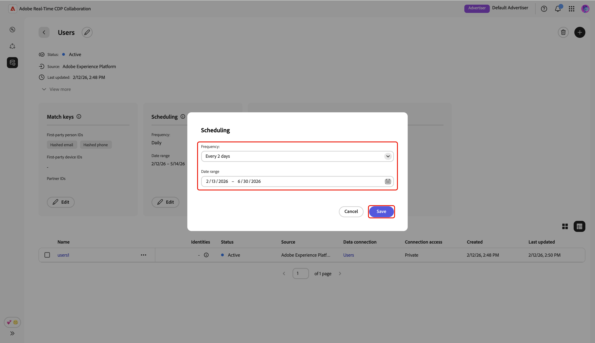

# Datenverbindungen verwalten

{{limited-availability-release-note}}

## Überblick

Verwenden Sie Datenverbindungen in Real-Time CDP Collaboration, um Zielgruppen von verschiedenen Plattformen aus zu beziehen. Erfahren Sie, wie Sie Übereinstimmungsschlüssel verwalten und die Aktualisierung von Daten für Ihre vorhandenen Datenverbindungen planen. Darüber hinaus können Sie Zielgruppen nach verschiedenen Attributen filtern, um detailliertere Einblicke zu erhalten.

>[!NOTE]
>
>Informationen zum Erstellen einer neuen Datenverbindung finden Sie unter [Hinzufügen und Verwalten von Zielgruppen](./onboard-audiences.md).

## Datenverbindungen anzeigen

Um vorhandene Datenverbindungen anzuzeigen, navigieren Sie zu **[!UICONTROL Setup]** und wählen Sie dann die Registerkarte **[!UICONTROL Meine Datenverbindungen]** aus. Es werden alle Ihre aktuellen Verbindungsdaten angezeigt, die jeweils eine kurze Übersicht enthalten. Um eine vollständige Ansicht der Informationen einer Datenverbindung zu erhalten, einschließlich der Übereinstimmungsschlüssel, Zeitplandetails und Zielgruppen, wählen Sie **[!UICONTROL Datenverbindung anzeigen]** für die entsprechende Verbindung aus.

{zoomable="yes"}

### Übereinstimmungsschlüssel {#match-keys}

>[!CONTEXTUALHELP]
>id="rtcdp_collaboration_manage_dataconnections_matchkeys"
>title="Übereinstimmungsschlüssel"
>abstract="Übereinstimmungsschlüssel bestimmen, wie Daten aus verschiedenen Quellen zugeordnet werden. Die unten angezeigten Übereinstimmungsschlüssel sind die Zielfelder, denen Sie Ihre Quellfelder zugeordnet haben."

Übereinstimmungsschlüssel sind die Zielfelder, denen Sie [Ihre Quellfelder zugeordnet haben](./onboard-audiences.md#map-fields). Weitere Informationen zur Funktionsweise von Übereinstimmungsschlüsseln finden Sie im Handbuch [Übereinstimmungsschlüssel](./onboard-account.md#set-up-match-keys) .

{zoomable="yes"}

### Planung {#scheduling}

>[!CONTEXTUALHELP]
>id="rtcdp_collaboration_manage_dataconnections_scheduling"
>title="Planung"
>abstract="Zeigen Sie die Zeitplandetails für Ihre Datenverbindung an und bearbeiten Sie bei Bedarf die Konfigurationen."

Zeigen Sie die Zeitplaneinstellungen für Ihre Datenverbindungen an und verwalten Sie sie. Die Planung bestimmt, wie oft die Zielgruppe aktualisiert wird.

Nachdem eine Datenverbindung erstellt wurde, können Sie ihre Aktualisierungshäufigkeit, ihr Start- und Enddatum direkt im Abschnitt **[!UICONTROL Planung]** des Arbeitsbereichs Datenverbindung aktualisieren.

>[!NOTE]
>
>Beim Bezug von Zielgruppen aus Adobe Experience Platform werden Zielgruppen innerhalb von 24 Stunden nach Herstellung der Datenverbindung verfügbar. Nach der ersten Beschaffung werden die Zielgruppendaten entsprechend der definierten Häufigkeit aktualisiert.

Weitere Informationen zur Planung finden Sie [&#x200B; Abschnitt „Planung](/help/guide/setup/onboard-audiences.md#schedule) im Handbuch zum Konfigurieren von Zielgruppen.

{zoomable="yes"}

## Datenverbindung bearbeiten {#edit-data-connection}

Lesen Sie die folgenden Abschnitte, um zu erfahren, wie Sie die Übereinstimmungsschlüssel und Zeitplaneinstellungen einer vorhandenen Datenverbindung aktualisieren.

### Übereinstimmungsschlüssel bearbeiten {#edit-match-keys}

>[!CONTEXTUALHELP]
>id="rtcdp_collaboration_edit_measurement_data_connection_enrichment"
>title="Anreicherung"
>abstract="Das Deaktivieren der Anreicherung wird nicht unterstützt. Stattdessen können Sie die Join-Schlüssel der Anreicherung ändern."
>additional-url="https://www.adobe.com/go/rtcdp-collaboration-manage-dataconnections" text="Anreicherung"

>[!IMPORTANT]
>
>Beachten Sie Folgendes, bevor Sie die Übereinstimmungsschlüssel für eine Datenverbindung bearbeiten:
>
>* Für Datenverbindungen können nur Übereinstimmungsschlüssel verwendet werden, die für Ihr Konto konfiguriert sind.
>* Derzeit können Sie zusätzliche Übereinstimmungsschlüssel zu einer Datenverbindung hinzufügen, aber sobald ein Übereinstimmungsschlüssel aktiviert ist, kann er nicht mehr entfernt werden.

Wählen **[!UICONTROL Bearbeiten]** im Abschnitt **[!UICONTROL Übereinstimmungsschlüssel]** aus.

{zoomable="yes"}

Es wird ein Bestätigungsdialogfeld angezeigt, in dem erklärt wird, dass alle Änderungen an der Datenverbindung für alle verknüpften Zielgruppen gelten. Klicken **[!UICONTROL zur]** auf OK. Sie können diese Bestätigung später überspringen.

{zoomable="yes"}

Im Dialogfeld **[!UICONTROL Übereinstimmungsschlüssel]** können Sie die vorhandenen Zuordnungen zwischen Quellfeldern und den entsprechenden Zielfeldern (Übereinstimmungsschlüssel) anzeigen. Sie können einen Übereinstimmungsschlüssel bearbeiten, indem Sie das zugeordnete Quellfeld aktualisieren, oder zusätzliche Zuordnungsfeldzeilen hinzufügen, um neue Übereinstimmungsschlüssel auszufüllen.

{zoomable="yes"}

#### Übereinstimmungsschlüssel hinzufügen {#add-match-keys}

Wählen Sie **[!UICONTROL Feld hinzufügen]** aus, um eine neue Feldzeile hinzuzufügen.

{zoomable="yes"}

Wählen Sie anschließend das leere Quellfeld aus. Das Dialogfeld **[!UICONTROL Quellfeld auswählen]** wird mit den Optionen **[!UICONTROL Identity-]** und **[!UICONTROL Profilattribute]** angezeigt. Sie können die Liste filtern und das gewünschte Quellfeld mit der Suchoption finden.

Wählen Sie das gewünschte Quellfeld und dann **[!UICONTROL Auswählen]** aus.

{zoomable="yes"}

Verwenden **[!UICONTROL im Dialogfeld]**&#x200B;Übereinstimmungsschlüssel“ das Dropdown-Menü, um das neue Quellfeld einem Zielfeld zuzuordnen. Alle verfügbaren Zielfelder sind die für Ihr Mitarbeiter-Konto konfigurierten Übereinstimmungsschlüssel. Wenn das gewünschte Zielfeld nicht angezeigt wird, fügen Sie [die Übereinstimmungsschlüssel Ihres Kontos bearbeiten](./onboard-account.md#edit-match-keys) hinzu.

Verwenden Sie die Option **[!UICONTROL Umwandlung anwenden]**, wenn Sie ein nicht gehashtes Feld in ein gehashtes Zielfeld eingeben möchten, z. B. wenn Sie dem Zielfeld **[!UICONTROL gehashte E-Mail]** ein reines Text-E-Mail-Quellfeld zuordnen.

{zoomable="yes"}

After you finish mapping fields, review your updates and select **[!UICONTROL Confirm]** to apply the changes.

{zoomable="yes"}

A confirmation dialog confirms that the match keys were updated successfully.

### Edit scheduling {#edit-scheduling}

Nachdem eine Datenverbindung erstellt wurde, können Sie ihre Aktualisierungshäufigkeit, ihr Start- und Enddatum direkt im Abschnitt **[!UICONTROL Planung]** des Arbeitsbereichs Datenverbindung aktualisieren.

You can edit the frequency of an existing data connection to better control how often audiences are refreshed. To edit the schedule, select **[!UICONTROL Edit]** from within the data connection in the scheduling card.

{zoomable="yes"}

A confirmation dialog appears, explaining that any changes to the data connection will apply to all associated audiences. Select **[!UICONTROL OK]** to confirm. You can choose to skip this confirmation in the future.

{zoomable="yes"}

In the **[!UICONTROL Scheduling]** dialog, select the dropdown menu to update the **[!UICONTROL Frequency]**. Set the refresh frequency to run daily or every two to six days.

{zoomable="yes"}

Next, select **[!UICONTROL Date range]** if you want to update the period during which audiences are populated and refreshed.

{zoomable="yes"}

When you&#39;re done, review the updates and select **[!UICONTROL Save]** to apply your changes.

{zoomable="yes"}

## Datenverbindung löschen

Deleting a data connection will remove all underlying audiences, associated settings, and usage across Collaboration. Diese Aktion kann nicht rückgängig gemacht werden.

To delete an existing data connection, select the delete icon () within an individual data connection&#39;s workspace.

{zoomable="yes"}

A confirmation dialogue will appear. Select **[!UICONTROL Delete]** to finish deleting the data connection.

{zoomable="yes"}

## Verwalten von Zielgruppen {#manage-audiences}

Unten im Arbeitsbereich wird eine Liste von Audiences angezeigt, die mit der Datenverbindung verbunden sind. Die Liste zeigt einen kurzen Überblick über jede Zielgruppe, einschließlich ihres Status, ihrer Quelle und ihres Verbindungszugriffs. Um die Kategorien, den Verbindungszugriff oder die Sichtbarkeit der Metadaten einer Zielgruppe zu bearbeiten, wählen Sie den Namen der Zielgruppe aus. Eine vollständige Anleitung zum Verwalten einer Zielgruppe finden Sie im [Anzeigen einzelner Zielgruppen](./onboard-audiences.md#view-individual-audiences).

{zoomable="yes"}

## Nächste Schritte

Nach der Verwaltung Ihrer Datenverbindungen können Sie [Überschneidungen](/help/guide/collaborate/discover.md) zwischen Ihren Zielgruppen und den Zielgruppen entdecken, die Ihr Mitarbeiter entdeckt hat.
