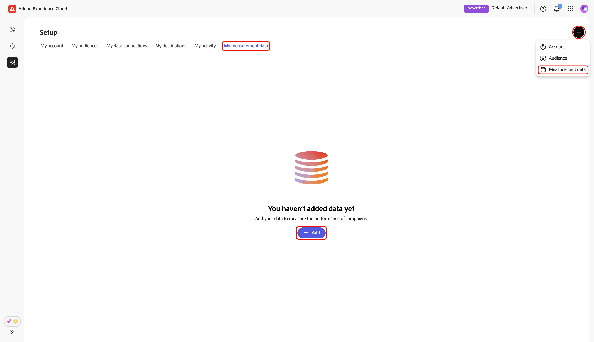
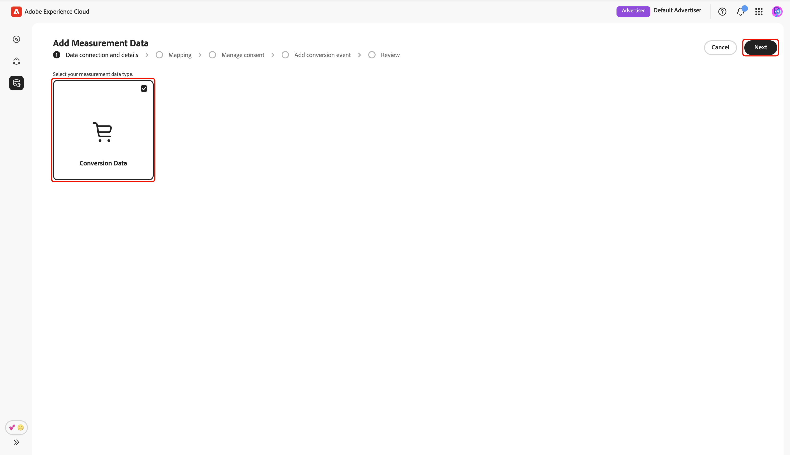
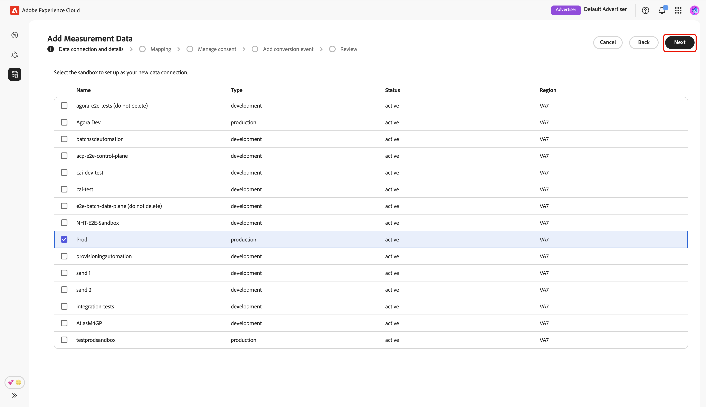
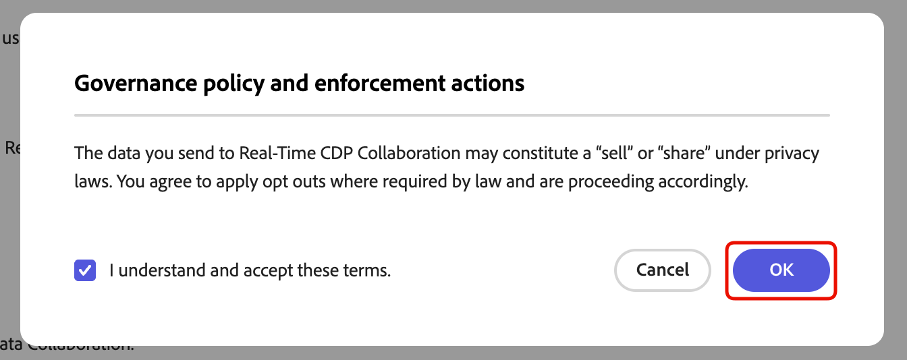
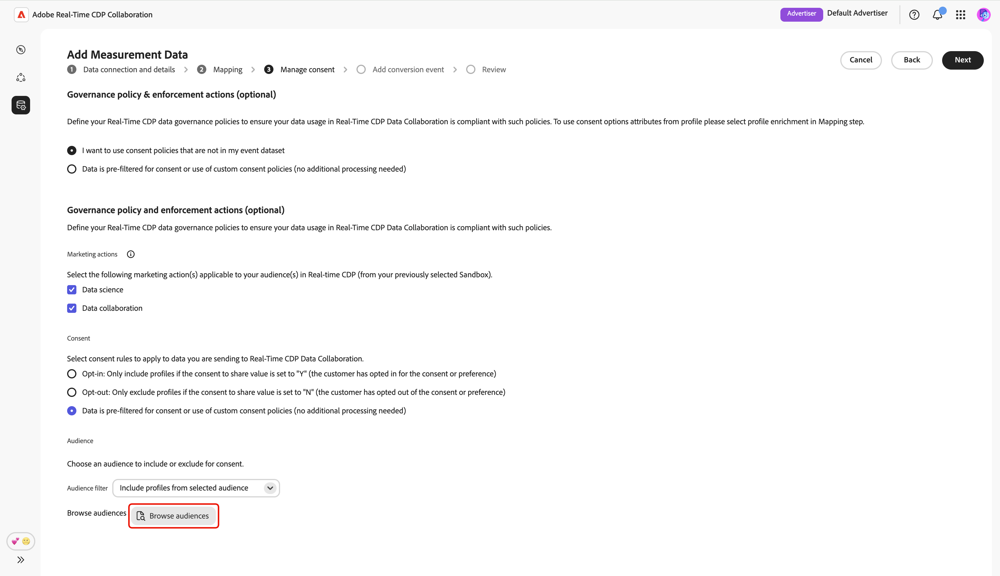
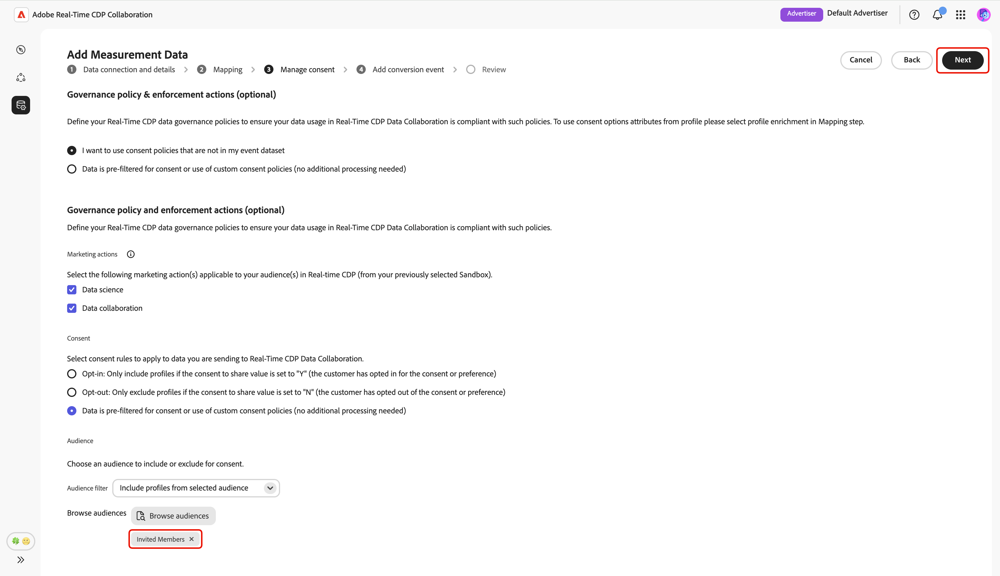
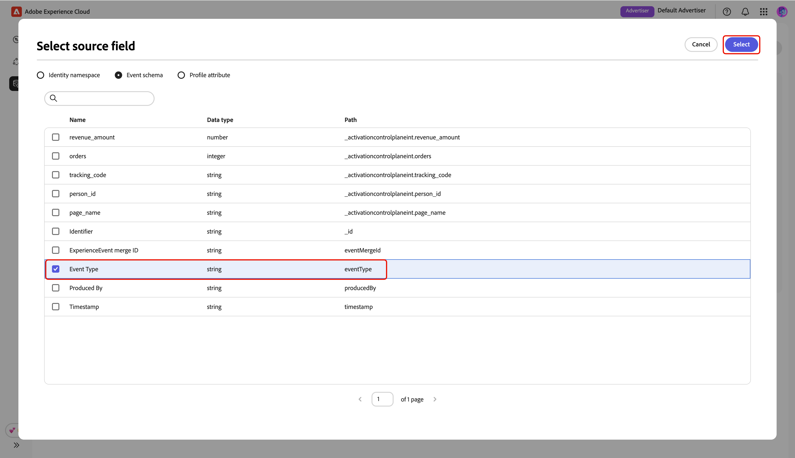
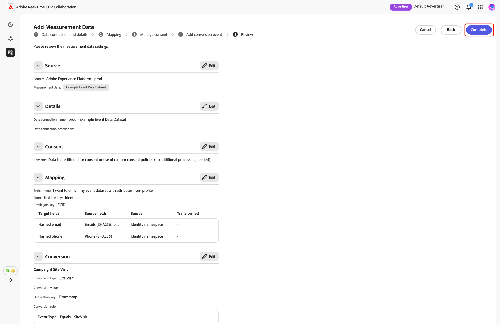

# Hinzufügen und Verwalten von Messdaten {#add-and-manage-measurement-data}

>[!CONTEXTUALHELP]
>id="rtcdp_collaboration_onboard_measurement_data"
>title="Mehr dazu"
>abstract=""

>[!CONTEXTUALHELP]
>id="rtcdp_collaboration_measurement_data_target_fields"
>title="Zielfelder"
>abstract="Platzhalter für Zielfelder von Messungen."

>[!CONTEXTUALHELP]
>id="rtcdp_collaboration_measurement_data_source_fields"
>title="Quellfelder"
>abstract="Platzhalter für Quellfelder von Messungen."

>[!CONTEXTUALHELP]
>id="rtcdp_collaboration_import_measurement_mapping_source_fields"
>title="Zuordnen von Quellfeldern"
>abstract="Platzhalter für Quellfeld-Messzuordnung."

>[!CONTEXTUALHELP]
>id="rtcdp_collaboration_import_measurement_mapping_target_fields"
>title="Zuordnen von Zielfeldern"
>abstract="Platzhalter für Zielfeld-Messzuordnung."

{{limited-availability-release-note}}

In diesem Dokument werden die Schritte zum Hinzufügen von Kampagnenmessdaten zu Adobe Real-Time CDP Collaboration beschrieben. Publisher können mit Adobe-Teams zusammenarbeiten, um Campaign-Messdaten hochzuladen. Nach dem Hochladen und Verarbeiten dieser Daten können sowohl Publisher als auch Advertiser umfassende [Kampagnenmessberichte) &#x200B;](/help/guide/collaborate/measure.md).

## Messdaten hinzufügen {#add-measurement-data}

Als Advertiser können Sie Ihre Messdaten mit Konversionsereignissen zur Verwendung in Kampagnenmessberichten in Collaboration hochladen. Konversionsdaten umfassen in der Regel Felder wie Benutzerkennung (z. B. Hash-E-Mail- oder Geräte-IDs), Zeitstempel des Konversionsereignisses und bestimmte Details des Konversionsereignisses wie Kauf oder Anmeldung.

Um Messdaten zu beziehen, navigieren Sie im Arbeitsbereich **[!UICONTROL Setup]** zur Registerkarte **[!UICONTROL Meine Messdaten]** . Wählen Sie das Symbol zum Hinzufügen aus ) und wählen Sie **[!UICONTROL Messdaten]**.

Wenn dies Ihre ersten Messdaten sind, können Sie auch die Option **[!UICONTROL Hinzufügen]** auswählen.

{zoomable="yes"}

Der Bildschirm **[!UICONTROL Messdaten hinzufügen]** wird angezeigt, der eine Zusammenfassung der Schritte zur Beschaffung der Messdaten enthält. Wählen Sie **[!UICONTROL Onboarding starten]** aus.

{zoomable="yes"}

### Datenverbindung und Details {#data-connection-and-details}

In diesem Schritt müssen Sie Ihre Datenverbindung konfigurieren und die Details für Ihre Messdaten angeben.

#### Messdatentyp auswählen {#select-measurement-data-type}

Der Messdatentyp definiert die Art der Ereignisse, die für die Kampagnenmessung eingebracht werden. Derzeit ist der unterstützte Typ „Konversionsdaten“.

Wählen Sie **[!UICONTROL Konversionsdaten]** als Messdatentyp aus, gefolgt von **[!UICONTROL Weiter]**.

{zoomable="yes"}

#### Auswählen der Datenverbindung {#select-data-connection}

Eine Datenverbindung ist die Quelle, aus der Sie Messdaten in Collaboration beziehen. Nachdem Sie Ihre erste Datenverbindung hergestellt und Ihren ersten Satz von Messdaten bezogen haben, können Sie mit derselben Datenverbindung weitere Messdaten beziehen.

Um eine Datenverbindung hinzuzufügen, wählen Sie **[!UICONTROL Neue Datenverbindung hinzufügen]** und dann **[!UICONTROL Weiter]**.

{zoomable="yes"}

#### Datenquelle auswählen {#select-data-source}

Wählen Sie anschließend die Quelle für Ihre Datenverbindung aus. Derzeit ist Adobe Experience Platform die einzige unterstützte Datenquelle.

Wählen Sie Ihre Datenquelle und dann **[!UICONTROL Weiter]** aus.

{zoomable="yes"}

#### Sandbox auswählen {#select-sandbox}

Wählen Sie die Sandbox aus, die die Messdaten enthält, die Sie für Collaboration Campaign-Messberichte verwenden möchten. Wählen Sie die Sandbox aus der Liste der verfügbaren Sandboxes und dann **[!UICONTROL Weiter]** aus.

{zoomable="yes"}

#### Messdatensatz auswählen {#select-measurement-dataset}

Eine Liste der Datensätze in der ausgewählten Sandbox wird angezeigt. Wählen Sie einen Datensatz als Messdaten aus und klicken Sie dann auf **[!UICONTROL Weiter]**. Sie können die Suchoption verwenden, um den bevorzugten Datensatz zu filtern und zu finden.

{zoomable="yes"}

#### Name und Details angeben {#provide-name-and-details}

Geben Sie als Nächstes einen Namen und eine Beschreibung für Ihre Datenverbindung an. Diese Informationen helfen Ihnen später bei der Identifizierung der Datenverbindung.

{zoomable="yes"}

### Zuordnung {#mapping}

Der nächste Schritt besteht darin, Felder aus Ihren Messdaten den entsprechenden Zielfeldern zuzuordnen, die in Collaboration verwendet werden. Sie können Ihren Ereignisdatensatz auch mit Attributen aus dem Echtzeit-Kundenprofil anreichern, indem Sie Join-Schlüssel zuordnen und diese Attribute zum Aufschlüsseln von Messberichten verwenden.

#### Anreichern von Ereignisdaten {#enrich-event-data}

Um Ihre Ereignisdaten anzureichern, wählen Sie die Option **[!UICONTROL Source-Feld-Zusammenführungsschlüssel]** aus.

{zoomable="yes"}

Wählen Sie im Dialogfeld **[!UICONTROL Source-]**-Schlüssel das Quellfeld und dann **[!UICONTROL Auswählen]** aus.

{zoomable="yes"}

Wählen Sie als Nächstes die Option **[!UICONTROL Profilverbindungsschlüssel]** aus. Wählen Sie **[!UICONTROL Dialogfeld Profilverknüpfungsschlüssel]** das Profilfeld aus der Liste aus. Sie können die Suchoption verwenden, um das gewünschte Feld zu finden. Wählen Sie dann zur Bestätigung **[!UICONTROL Auswählen]** aus.

{zoomable="yes"}

#### Zuordnen von Feldern {#mapping-fields}

Um mit der Zuordnung von Quellfeldern aus Ihren Messdaten zu den Zielfeldern in Collaboration zu beginnen, wählen Sie das leere Quellfeld im Bildschirm **[!UICONTROL Zuordnung]** aus.

{zoomable="yes"}

Das **[!UICONTROL Quellfeld auswählen]** wird angezeigt und zeigt eine Liste der verfügbaren Quellfelder an, die unter Optionen wie **[!UICONTROL Identity-Namespace]** und **[!UICONTROL Ereignisschema]** gruppiert sind. Sie können die Suchoption verwenden, um das Quellfeld aus der Liste zu filtern und zu finden.

Wählen Sie das gewünschte Quellfeld und dann **[!UICONTROL Auswählen]** aus.

{zoomable="yes"}

Ordnen Sie anschließend das ausgewählte Quellfeld mithilfe des Dropdown-Menüs einem entsprechenden Zielfeld zu. Alle verfügbaren Zielfelder sind die [Übereinstimmungsschlüssel, die für Ihr Mitarbeiter-Konto konfiguriert wurden](./onboard-account.md#set-up-match-keys).

{zoomable="yes"}

Sie können bei Bedarf Zuordnungszeilen hinzufügen oder entfernen. Wenn Sie ein nicht-gehashtes Quellfeld einem gehashten Zielfeld zuordnen müssen (z. B. das Zuordnen einer Nur-Text-E-Mail zu [!UICONTROL gehashten E-Mail]), verwenden Sie die Option **[!UICONTROL Umwandlung anwenden]**, um den erforderlichen Hash anzuwenden.

Wenn Sie fertig sind, überprüfen Sie die zugeordneten Felder und fügen Sie die Schlüssel hinzu, wenn die Anreicherung aktiviert ist. Klicken Sie dann auf **[!UICONTROL Weiter]**.

{zoomable="yes"}

### Einverständnisverwaltung {#manage-consent}

Bevor Sie fortfahren, müssen Sie bestätigen, dass Ihre Datennutzung in Collaboration mit Ihren Real-Time CDP-Data-Governance-Richtlinien übereinstimmt. Alle Daten müssen gemäß den Einverständnisanforderungen oder anwendbaren benutzerdefinierten Einverständnisrichtlinien vorgefiltert werden, sodass keine weitere Verarbeitung erforderlich ist.

Um Ihre Bestätigung zu bestätigen, klicken Sie **[!UICONTROL Weiter]**.

{zoomable="yes"}

Wenn Sie [Profilanreicherung während des Zuordnungsschritts aktivieren](#enrich-event-data) können Sie Einverständnisrichtlinien aus einer Liste vordefinierter Optionen konfigurieren. Dazu gehören:

* **Marketing-Aktionen**: Verwenden Sie diese Marketing-Aktionen, um zu steuern, welche Zielgruppendaten aus Experience Platform in Collaboration importiert werden sollen.
* **Einverständnisregeln**: Wählen Sie die Einverständnisregeln aus, die auf Daten angewendet werden sollen, die aus Collaboration bezogen werden.
* **Audience**: Verwenden Sie den Zielgruppenfilter, um Zielgruppenprofile zum Einverständnis ein- oder auszuschließen.

>[!NOTE]
>
>**[!UICONTROL Data Collaboration]** unterstützt Datennutzungsbeschriftungen mit C4, C5 und C9, während **[!UICONTROL Data Science]** nur C9 unterstützt. Weitere Informationen zu Datennutzungskennzeichnungen finden Sie in der Dokumentation zu Experience Platform:
>
>* [Datennutzungs-Labels – Übersicht](https://experienceleague.adobe.com/de/docs/experience-platform/data-governance/labels/overview){target="_blank"}
>* [Glossar](https://experienceleague.adobe.com/de/docs/experience-platform/data-governance/labels/reference){target="_blank"}

Wählen Sie die bevorzugten Einstellungen aus und klicken Sie dann auf **[!UICONTROL Weiter]**.

{zoomable="yes"}

Bevor Sie fortfahren, müssen Sie die Bedingungen im Dialogfeld **[!UICONTROL Governance-Richtlinie und Durchsetzungsaktionen]** bestätigen und akzeptieren. Aktivieren Sie das Kontrollkästchen, gefolgt von **[!UICONTROL OK]**.

{zoomable="yes"}

#### Zielgruppenfilter {#audience-filter}

Um bestimmte Zielgruppenprofile für das Einverständnis ein- oder auszuschließen, verwenden Sie das **[!UICONTROL Zielgruppenfilter]** Dropdown-Menü. Wenn Sie diesen Filter auswählen, wird die Benutzeroberfläche aktualisiert und die Option **[!UICONTROL Zielgruppen durchsuchen]** angezeigt. Wählen Sie **[!UICONTROL Zielgruppen durchsuchen]** aus.

{zoomable="yes"}

Das **[!UICONTROL Audiences auswählen]** wird angezeigt. Wählen Sie eine Audience aus der Liste und dann **[!UICONTROL Auswählen]** aus.

{zoomable="yes"}

Die ausgewählte Zielgruppe wird jetzt angezeigt, mit der Option, sie bei Bedarf zu entfernen. Überprüfen Sie Ihre Einverständniseinstellungen und klicken Sie dann auf **[!UICONTROL Weiter]**.

{zoomable="yes"}

### Konversionsereignis hinzufügen {#add-conversion-event}

Definieren Sie anschließend die Konversionsereignisse, mit denen Sie die Wirkung Ihrer Kampagnen messen möchten, z. B. Site-Besuche, Registrierungen oder abgeschlossene Käufe. Sie können bis zu **3** Konversionsereignisse für die Messung angeben.

Geben Sie den Namen des Konversionsereignisses ein und wählen Sie dann im Dropdown-Menü den Konversionstyp aus.

{zoomable="yes"}

Sie können einen Wert für die Konversion eingeben oder das Feld leer lassen, wenn Sie zu diesem Zeitpunkt keinen Wert zuweisen möchten.

{zoomable="yes"}

Als Nächstes müssen Sie den Duplizierungsschlüssel angeben, um anzugeben, welche Zeilen in Ihrem Ereignisdatensatz zum selben zugrunde liegenden Konversionsereignis gehören (z. B. derselbe Zeitstempel während eines Anmeldevorgangs). Dadurch wird verhindert, dass dieselbe Konversion in Messberichten mehrmals gezählt wird. Wählen Sie dazu **[!UICONTROL Duplizierungsschlüssel]** aus. Suchen Sie im Dialogfeld **[!UICONTROL Duplizierungsschlüssel]** den Schlüssel, wählen Sie ihn aus und dann **[!UICONTROL Auswählen]**.

{zoomable="yes"}

Nach Angabe des Duplizierungsschlüssels können Sie bis zu **5 % Bedingungen hinzufügen** um nur relevante Zeilen aus dem Ereignisdatensatz für die Konvertierung einzuschließen. Wählen Sie alle oder eine dieser Bedingungen aus.

Wählen Sie **[!UICONTROL Bedingung hinzufügen]** und dann die Option Bedingung aus.

{zoomable="yes"}

Suchen Sie im **[!UICONTROL Quellfeld auswählen]** ein Quellfeld für die Bedingungsregel, gefolgt von „Auswählen **[!UICONTROL und wählen Sie es]**.

{zoomable="yes"}

Wählen Sie im Dropdown-Menü einen logischen Operator aus und geben Sie dann den Wert für die Bedingungsregel ein.

{zoomable="yes"}

Um ein weiteres Konversionsereignis hinzuzufügen, wählen Sie **[!UICONTROL Konversion hinzufügen]** aus. Sie können insgesamt bis zu **3** Konversionsereignisse einbeziehen. Überprüfen Sie nach Abschluss die Konvertierungskonfigurationen und wählen Sie **[!UICONTROL Weiter]** aus.

{zoomable="yes"}

### Überprüfung {#review}

Der **[!UICONTROL Review]** wird mit einer Zusammenfassung der Einstellungen der Messdaten angezeigt. Überprüfen und stellen Sie sicher, dass alle Informationen korrekt sind. Wenn Sie einen Bereich ändern müssen, verwenden Sie die Option **[!UICONTROL Bearbeiten]**.

Wählen Sie abschließend **[!UICONTROL Abschließen]**, um das Hinzufügen Ihrer Messdaten abzuschließen.

{zoomable="yes"}

Ein Bestätigungsdialogfeld bestätigt, dass Ihre Messdaten erfolgreich erstellt wurden. Sie können die neuen Konversionsereignisse, die anhand Ihrer Messdaten konfiguriert wurden, im Arbeitsbereich &quot;**[!UICONTROL Messdaten“]**.

{zoomable="yes"}

Wählen Sie in der Rasteransicht oder Tabellenansicht ein Zeilenelement oder die Option **[!UICONTROL Konversion anzeigen]** auf einer Ereigniskarte aus, um einen Überblick über ein bestimmtes Konversionsereignis zu erhalten. Es werden der Status, die Quelle und der Name der Datenverbindung des Ereignisses zusammen mit detaillierten Bedienfeldern für Folgendes angezeigt:

* **[!UICONTROL Konversionsdetails]**: Zeigt wichtige Informationen zur Konversion an, einschließlich des Typs, des zum Identifizieren eindeutiger Ereignisse verwendeten Duplizierungsschlüssels und des zugewiesenen Konversionswerts (falls angegeben).
* **[!UICONTROL Bedingungen]**: Zeigt die auf dieses Konversionsereignis angewendeten Bedingungsregeln an.

{zoomable="yes"}

## Nächste Schritte {#next-steps}

Sie haben die Beschaffung Ihrer Messdaten in Collaboration abgeschlossen. Als Advertiser können Sie jetzt Attributionsberichte erstellen, um zu untersuchen, wie Ihre Kampagnen Konversionen fördern und die Gesamtwirkung messen. Wenn Sie Publisher sind, bitten Sie Ihren Mitarbeiter, einen Attributionsbericht für Ihre Kampagnen zu erstellen. Detaillierte Anweisungen finden Sie im Handbuch [Attributionsbericht erstellen](../collaborate/measure.md#create-attribution-report) .
