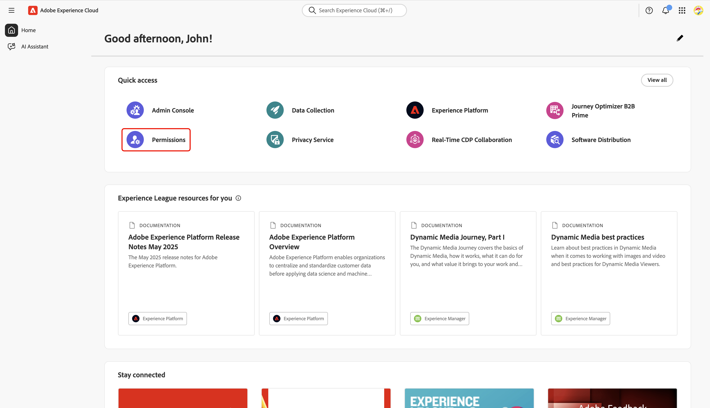
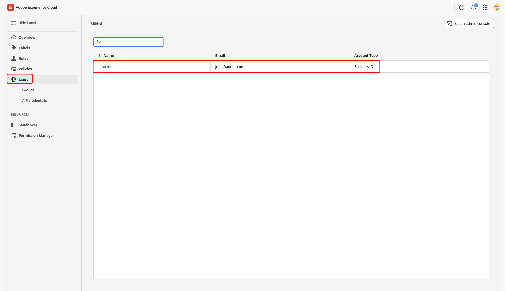

# Konfigurieren von Berechtigungskontrollen für das Onboarding von Collaboration-[!DNL Starter]

Nachdem Sie den Administrator- und Benutzerzugriff auf die Adobe Experience Platform-Produkte eingerichtet haben, müssen Sie sich selbst Rollen mit den entsprechenden Berechtigungen für Real-Time CDP Collaboration zuweisen. Lesen Sie dieses Handbuch, um zu erfahren, wie Sie Ihrem Konto über die Experience Cloud-Benutzeroberfläche „Berechtigungen“ die richtigen Rollen hinzufügen, damit Sie auf die Collaboration-Funktionen zugreifen und den Benutzerzugriff verwalten können.

Weitere Informationen zu Standardrollen und verfügbaren Berechtigungen in der Collaboration-Ressource finden Sie im [Handbuch zum Verwalten von Rollen](../permissions/manage-roles.md).

## Voraussetzungen {#prerequisites}

Stellen Sie sicher, dass Sie sowohl **Administratorrechte** als auch **Benutzerzugriff** auf das Adobe Experience Platform-Produkt haben. Falls Sie diese Zugriffsebenen noch nicht eingerichtet haben, finden Sie [Administratorzugriffshandbuch](./starter-admin-access.md) schrittweise Anleitungen.

## Berechtigungen einrichten {#setup-permissions}

Gehen Sie wie folgt vor, um die für Collaboration erforderlichen Berechtigungen einzurichten. Melden Sie sich zunächst mit Ihren Anmeldeinformationen bei [Adobe Experience &#x200B;](https://experience.adobe.com/)) an.

### Zugriffsberechtigungen {#access-permissions}

Navigieren Sie nach der Anmeldung zum Abschnitt **[!UICONTROL Schnellzugriff]** und wählen Sie &quot;**[!UICONTROL &quot;]**. Dadurch wird das Dashboard „Berechtigungen“ geöffnet, in dem Sie sich die erforderlichen Rollen zuweisen können.

{zoomable="yes"}

### Benutzer auswählen {#select-user}

Wählen **[!UICONTROL im Dashboard]** Berechtigungen **[!UICONTROL im linken Bereich]** Benutzer“ aus. Wählen Sie dann Ihr Konto in der Tabelle Benutzer aus.

>[!NOTE]
>
> Wenn Sie der erste Benutzer Ihres Unternehmens sind, der auf Experience Platform zugreift, sind Sie möglicherweise der einzige Benutzer, der in der Tabelle **Benutzer** aufgeführt ist. Um weitere Team-Mitglieder einzuladen, führen Sie die Schritte im [Handbuch zur Konfiguration des Benutzerzugriffs](../permissions/manage-user-access.md#administrators-configure-user-access-to-experience-platform) aus.

{zoomable="yes"}

### Rollen zuweisen {#assign-roles}

Navigieren Sie im entsprechenden **[!UICONTROL Benutzer]**-Arbeitsbereich zur Registerkarte **[!UICONTROL Rollen]** . Wählen Sie dann **[!UICONTROL Rollen hinzufügen]** aus.

{zoomable="yes"}

Das **[!UICONTROL Rollen hinzufügen]** wird mit einer Tabelle der verfügbaren Rollen angezeigt. Jede Zeile in der Tabelle stellt eine Rolle mit den folgenden Informationen dar:

| **Spalte** | **Beschreibung** |
|---------------|--------------------------------------------------------|
| **Name** | Der Name der Rolle. |
| **Beschreibung** | Eine kurze Zusammenfassung der Funktion der Rolle. Beachten Sie, dass schreibgeschützte Rollen nicht angepasst werden können. |
| **Sandboxes** | Gibt an, auf welche Sandboxes (z. B. `Prod`) die Rolle Zugriff bietet. |
| **Geändert** | Das Datum der letzten Aktualisierung der Rolle. |

{style="table-layout:auto"}

Eine ausführliche Übersicht über eine bestimmte Rolle und die zugehörigen Berechtigungen finden Sie im Handbuch [Verwalten von Berechtigungen für eine Rolle](https://experienceleague.adobe.com/de/docs/experience-platform/access-control/abac/permissions-ui/permissions) .

Überprüfen Sie die Informationen und wählen Sie die Rollen aus, die Sie Ihrem Konto zuweisen möchten. Klicken Sie abschließend auf **[!UICONTROL Speichern]**.

{zoomable="yes"}

Ein Bestätigungsdialogfeld bestätigt, dass neue Rollen erfolgreich hinzugefügt wurden.

Um sicherzustellen, dass Ihre Berechtigungen korrekt eingerichtet sind, kehren Sie zur Startseite von [Experience Cloud](https://experience.adobe.com/) zurück. Wählen Sie **[!UICONTROL Real-Time CDP Collaboration]** in **[!UICONTROL Schnellzugriff]** aus. Sie sollten in der Lage sein, auf Collaboration Workspace zuzugreifen und die Funktionen nutzen, die für Ihr [!DNL Starter]-Konto verfügbar sind.

## Nächste Schritte {#next-steps}

Nachdem Sie Ihre Berechtigungen eingerichtet haben, können Sie auf Collaboration zugreifen. Als Nächstes können Sie:

* [Erstellen Sie benutzerdefinierte Rollen mit bestimmten Berechtigungen zum Verwalten verschiedener Zugriffsebenen](../permissions/manage-roles.md#create-specific-access-roles).
* [Weisen Sie einer Rolle in Berechtigungen mehrere Benutzer zu](../permissions/manage-user-access.md#assign-a-role).
* [Richten Sie ein Collaboration-Konto ein und stellen Sie Verbindungen zu Ihrem einladenden Mitarbeiter her](../overview/starter-overview.md#set-up-connections).
* [Erfahren Sie mehr über die Verwendung von Krediten und deren Nutzung in Collaboration [!DNL Starter]](./starter-credit-usage.md).

Einen vollständigen Überblick über Real-Time CDP Collaboration und seine wichtigsten Funktionen finden Sie im [Übersichtshandbuch](../home.md).
